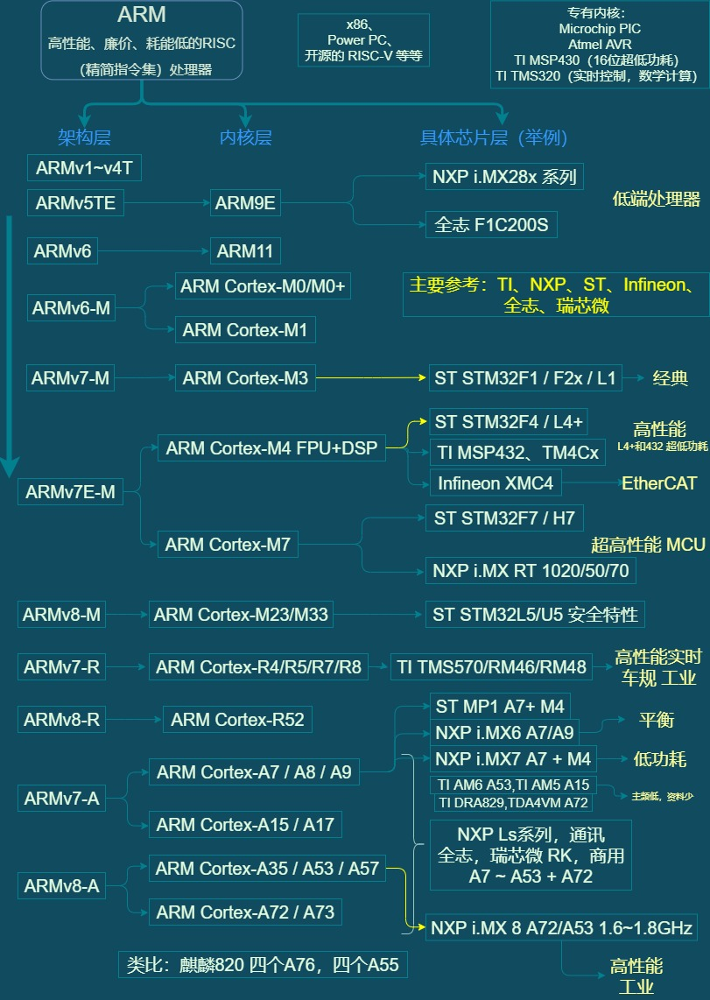
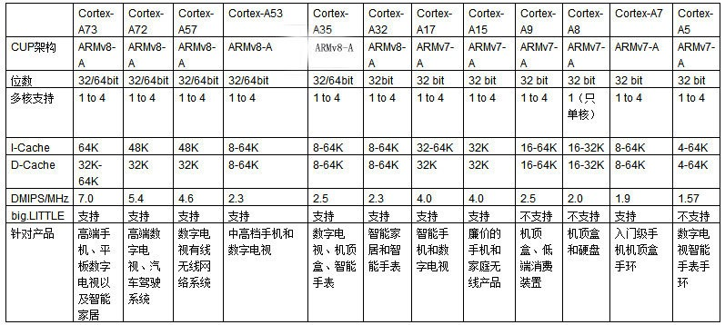

# ARM & SOC 系列快速鸟瞰

编辑整理 By [Staok](https://github.com/Staok)。CC-BY-NC-SA 4.0。

------

## 零 鸟瞰

### ARM Cortex 系列框图

图中包含现今主流处理器架构和内核层，ARM架构处理器的架构层、内核层和具体芯片（举例）三个维度的进化/迭代示意。

### ARM 体系结构的几大分类

- ARM7 处理器；
- ARM9、ARM9E 处理器；
- ARM10E 处理器；
- SecurCore 处理器；
- StrongARM 处理器；
- ARM11 处理器；
- Cortex 系列处理器。

## 一 定位

### ARM Cortex-A 系列对比

更详细的介绍参看：

- [ARM Cortex-A系列处理器性能分类比较ARM处理器排名_ZNDS资讯](https://news.znds.com/article/13324.html)
- [ARM版本系列及家族成员梳理_ 韦东山嵌入式专栏-CSDN博客 _arm系列](https://blog.csdn.net/thisway_diy/article/details/84100076)
- [哪种ARM Cortex内核更适合我的应用：A系列、R系列、还是M系列？_water1730的博客-CSDN博客](https://blog.csdn.net/water1730/article/details/70176661)
- [ARMCortex各系列处理器分类比较 - 百度文库 (baidu.com)](https://wenku.baidu.com/view/732d2dbc6337ee06eff9aef8941ea76e58fa4acd.html)

引用：

> 如图所示，绿色的部分都是v7-A的架构，蓝色的是v8-A架构，基本上绿色都是可以支持到32和64位的，除了A32，只支持到32位。在右边的每个部分，比如说需要高效能的最上面的A15-A73这个部分是最高效的，接下来就是比较注重整个效率的部分了，中间那个部分是比较高效率的，最下面那栏的是效率最好的，在电池的效能方面达到了最好的标准。
>
> 如果非要给他们一个排序的话，从高到低大体上可排序为：Cortex-A73处理器、Cortex-A72处理器、Cortex-A57处理器、Cortex-A53处理器、Cortex-A35处理器、Cortex-A32处理器、Cortex-A17处理器、Cortex-A15处理器、Cortex-A7处理器、Cortex-A9处理器、Cortex-A8处理器、Cortex-A5处理器。

## 二 展望

基于 Linux 系统方案的优势：

- 更高性能，可以运行复杂的算法；
- 高效开发，专注于梳理任务，应用以 APP 形式编写和更新；
- 智能终端，可以外接触摸屏，运行 Qt 上位机做人机界面；
- 协议丰富，使高级接口如网络、USB 等更易于开发；
- 平台通用，开发形式更加固定。