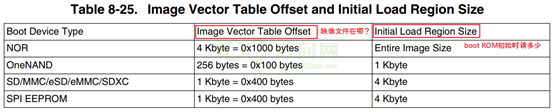
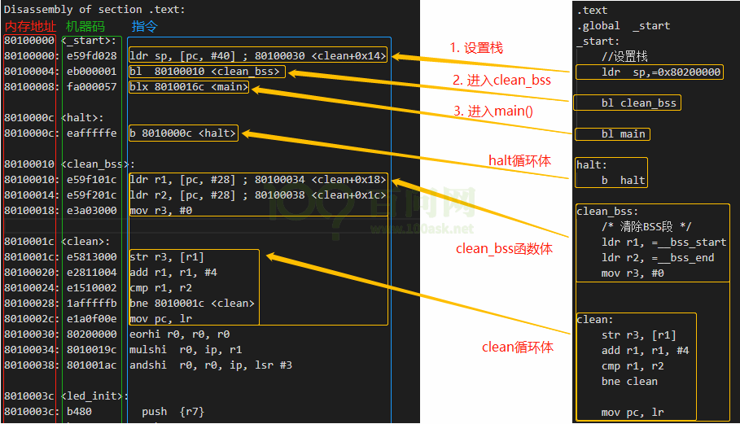
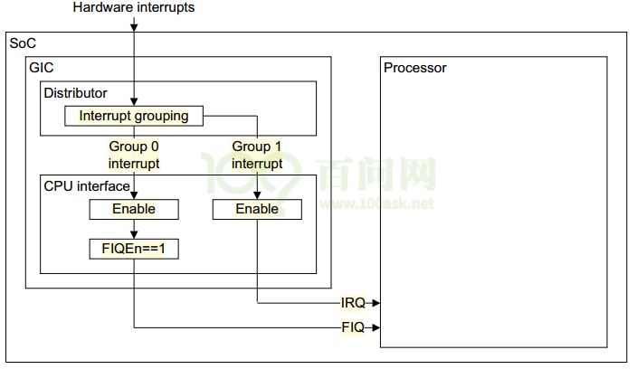

# ARM & i.MX6ULL 基础学习记录

编辑整理 by [Staok](https://github.com/Staok)

本文大部分内容摘自“100ask imx6ull”开发板的配套资料（如《IMX6ULL裸机开发完全手册》等等），侵删。进行了精髓提取，方便日后查阅。过于基础的内容不会在此提及。如有错误恭谢指出！

------

## 目录

[TOC]


------

## ARM & Linux 相关

 *p.s 汇编基本指令和 ARM 的汇编启动代码看 “ARM异常处理 及其模板” 文件夹里的 startup.s 文件。*

### cpsr 寄存器详情

#### 运行模式

Cortex-A7架构的运行模式有9种。运行模式可以通过软件进行任意切换，也可以通过中断或者异常来进行切换。大多数的程序都运行在用户模式，用户模式下是不能访问系统所有资源的，有些资源是受限的，要想访问这些受限的资源就必须进行模式切换。但是用户模式是不能直接进行切换的，用户模式下需要借助异常来完成模式切换，当要切换模式的时候，应用程序可以产生异常，在异常的处理过程中完成处理器模式切换。

| 模式            | 描述                                                   |
| --------------- | ------------------------------------------------------ |
| User            | 用户模式，非特权模式，大部分程序运行的时候就处于此模式 |
| Sys(System)     | 系统模式，用于运行特权级的操作系统任务                 |
| FIQ             | 快速中断模式，进入 FIQ 中断异常                        |
| IRQ             | 一般中断模式                                           |
| ABT(Abort)      | 数据访问终止模式，用于虚拟存储以及存储保护             |
| SVC(Supervisor) | 超级管理员模式，供操作系统使用                         |
| UND(Undef)      | 未定义指令终止模式                                     |
| MON(Monitor)    | 用于安全扩展模式                                       |
| Hyp             | 用于虚拟化扩展                                         |

几点说明：

-   板子上电时，CPU处于SVC模式，它用的是SVC模式下的寄存器。
-   程序运行时发生了中断，CPU进入IRQ模式，它用的IRQ模式下的寄存器。
-   CPU发生某种异常时，比如读取内存出错，它会进入ABT模式，使用ABT模式下的寄存器来处理错误。

#### 每一种模式对应使用的寄存器


几点说明：

-   如果某个程序处于 FIQ 模式下访问寄存器 R13(SP)，那它实际访问的是寄存器 SP_fiq。
-   如果某个程序处于 SVC 模式下访问寄存器 R13(SP)，那它实际访问的是寄存器 SP_svc。
-   除了 FIQ 模式，寄存器 R0~R12 都是通用的，即模式之间切换前这些寄存器的值应该保存。
-   因为ARM处理器是三级流水线：取指->译码->执行，循环执行，所以程序计数器 R15(PC) = 当前执行指令地址 + 4 * 2 个字节。
-   未定义指令异常的个别用法：在某些系统中，代码可能包含用于协处理器（例如VFP协处理器）的指令，但是系统中不存在相应的VFP硬件。另外，VFP硬件有可能无法处理特定指令，而是想调用软件来对其进行仿真。或者，可能会禁用VFP硬件，采用异常处理，以便可以启用它，然后重新执行指令。使用未定义的指令，可以实现一些仿真器。比如在你的芯片中，它并未支持某条硬件除法指令，但是你还可以在代码中使用它。当CPU执行这条指令时会发生异常，在异常处理函数中，你用软件来实现该指令的功能。对于不是特别设置的未定义指令，在异常处理函数中不能处理它时，通常做法是记录适当的调试信息，并杀死对应的应用程序。在某些情况下，未定义指令异常的另一个用途是实现用户断点：调试器去修改代码，替换断点位置的指令为一条未定义指令。
-   SVC异常的个别用法：软中断 swi 指令可以触发此异常，获得 SVC 权限。在Linux中对文件的open/read/write等APP层的系统函数，它的本质都是执行SVC指令，从而进入Linux内核中预设的SVC异常处理函数，在内核里操作文件。可以使用寄存器或者操作码中某个字段将参数传递给SVC处理程序。

#### 程序状态寄存器 cpsr

所有运行模式都共用一个 CPSR 物理寄存器，因此 CPSR 可以在任何模式下被访问。当特定异常中断发生时，备份程序状态寄存器 SPSR 用来保存 CPSR 的值，当异常退出以后可以用 SPSR 中保存的值来恢复 CPSR。


各个位的说明：

-   N(bit31)：当两个有符号整数运算(补码表示)时，结果用N表示，N=1/0 表示 负数/正数。
-   Z(bit30)：对于 CMP 指令，Z=1 表示进行比较的两个数大小相等。
-   C(bit29)：
    -   在加法指令中，当结果产生了进位，则C=1，表示无符号数运算发生上溢，其它情况下 C=0；
    -   在减法指令中，当运算中发生借位，则C=0，表示无符号数运算发生下溢，其它情况下 C=1；
    -   对于包含移位操作的非加/减法运算指令，C 中包含最后一次溢出的位的数值；
    -   对于其它非加/减运算指令，C 位的值通常不受影响。

-   V(bit28)：对于加/减法运算指令，当操作数和运算结果表示为二进制的补码表示的带符号数时，V=1 表示符号位溢出，通常其他位不影响 V 位。

-   Q(bit27)：仅 ARM v5TE_J 架构支持，表示饱和状态，Q=1/0 表示累积饱和/累积不饱和。

-   IT[1:0] (bit26:25) 和 IT[7:2] (bit15:bit10)一起组成 IT[7:0]，作为 IF-THEN 指令执行状态。

-   J(bit24) 和 T(bit5)：控制指令执行状态，表明本指令是ARM指令还是Thumb指令。{J,T} = b00 为 ARM；= b01 为 Thumb；= b11 为 ThumbEE；= b10 为 Jazelle。

-   GE[3:0] (bit19:16)：SIMD 指令有效，大于或等于。

-   E(bit9)：大小端控制位，E=1/0 表示大/小端模式。

-   A(bit8)：禁止异步中断位，A=1 表示禁止异步中断。

-   I(bit7)：I=1/0 代表 禁止/使能 IRQ。

-   F(bit6)：F=1/0 代表 禁止/使能 FIQ。

-   M[4:0]：运行模式控制位，如表

    | M[4:0] | 运行模式            |
    | ------ | ------------------- |
    | 10000  | User 模式           |
    | 10001  | FIQ 模式            |
    | 10010  | IRQ 模式            |
    | 10011  | Supervisor(SVC)模式 |
    | 10110  | Monitor(MON)模式    |
    | 10111  | Abort(ABT)模式      |
    | 11010  | Hyp(HYP)模式        |
    | 11011  | Undef(UND)模式      |
    | 11111  | System(SYS)模式     |

在用户模式下，无法改变处理器模式的M位[4：0]来切换模式和A，I和F位来使能或者禁止异步中止、IRQ和FIQ。

### 大小端模式

-   大端模式（Big-endian），是指数据的高字节保存在内存的低地址中，而数据的低字节保存在内存的高地址中。
-   小端模式（Little-endian），是指数据的高字节保存在内存的高地址中，而数据的低字节保存在内存的低地址中。

### 汇编程序调用 C 程序详情

在 C 程序和 ARM 汇编程序之间相互调用时必须遵守 ATPCS 规则，其是基于 ARM 指令集和 THUMB 指令集过程调用的规范，规定了调用函数如何传递参数，被调用函数如何获取参数，以何种方式传递函数返回值。

1.  寄存器 R0~R15 在 ATPCS 规则的使用
    -   在函数中，通过寄存器 R0~R3 来传递参数，被调用的函数在返回前无需恢复寄存器 R0~R3 的内容。
    -   在函数中，通过寄存器 R4~R11 来保存局部变量。
    -   寄存器 R12 用作函数间 scratch 寄存器。
    -   寄存器 R13 用作栈指针，记作 SP ，在函数中寄存器 R13 不能用做其他用途，寄存器 SP 在进入函数时的值和退出函数时的值必须相等。
    -   寄存器 R14 用作链接寄存器，记作 LR ，它用于保存函数的返回地址，如果在函数中保存了返回地址，则 R14 可用作其它的用途。
    -   寄存器 R15 是程序计数器，记作 PC ，它不能用作其他用途。
2.  汇编程序向 C 程序函数传递参数
    -   当参数小于等于 4 个时，使用寄存器 R0~R3 来进行参数传递。
    -   当参数大于 4 个时，前四个参数按照上面方法传递，剩余参数传送到栈中，入栈的顺序与参数顺序相反，即最后一个参数先入栈。
3.  C 程序函数返回结果给汇编程序
    -   结果为一个 32 位的整数时，通过寄存器 R0 返回。
    -   结果为一个 64 位整数时，通过 R0 和 R1 返回，依此类推。
    -   结果为一个浮点数时，通过浮点运算部件的寄存器 f0，d0 或 s0 返回。
    -   结果为一个复合的浮点数时，通过寄存器 f0-fN 或者 d0~dN 返回。
    -   对于位数更多的结果，通过调用内存来传递。
4.  当 C 程序从一个函数跳转到另一个函数时，会先把源函数的 CPU 的寄存器和函数内的局部变量都入栈，当跳回时再出栈，这一过程的汇编代码是当 C 程序编译成汇编时被编译器自动添加。

### GCC  命令详情

要使用 gcc 等编译器或交叉编译器，应先把编译器的可执行文件放在某个目录，然后给系统环境变量加此路径（Win平台为添加环境变量，Linux为使用EXPORT 命令，或者在 bashrc 文件中添加，具体步骤在此不提），对于 Make 工具同理。

C/C++ 程序文件的整个编译过程图示：


预处理（-E）：`gcc -E main.c -o main.i`

编译（-S）：`gcc -S main.c -o main.s`

汇编（-c）：`gcc -c main.c -o main.o`

完成整个编译（-o filename）：

单文件：`gcc main.c -o main`

多文件：`gcc main.c sub.c add.c -o ouput`，其中 main.c 里面 include 了 sub.h 和 add.h。

输出所有警告（-Wall）：`gcc main.c -Wall -o main.c`

头文件选项：

-   -I dirname：将 dirname 目录加入到头文件搜索目录列表中。当 gcc 在默认的路径中没有找到头文件时，就到本选项指定的目录中去找。例如 main.c 目录中有 Inc 文件夹，里面有 test.h 文件，并且 main.c 中调用了 test.h 文件，则命令为：`gcc main.c -I inc -o main`
-   添加库文件搜索目录（-L dirname），加载库名选项（-l name），静态库选项（-static）等选型略。

代码优化选项：

-   -O 或 -O1：基本优化，使代码执行的更快。
-   -O2 或 -O3：产生尽可能小和快的代码。如无特殊要求，不建议使用 O2 以上的优化。
-   -Os：生成最小的可执行文件，适合用于嵌入式软件。

产生能被 GDB 调试器使用的调试信息：`gcc main.c -g -o main`。GDB 的命令行调试指令详情略（包括运行、单步执行、加删查断点、打印变量等命令）。

### Makefile 简述和模板

解决问题：针对包含超多文件的工程；自动搜索被添加目录中的所有被调用的文件；在第二次全编译时，没有修改的文件只链接而不重复编译节省时间。

基本语法：（注，注释必须单独一行，不能写在语句后面）

#### 基本格式

```
目标（target）：依赖（prerequisites）
[Tab]命令（command）
```

-   target：需要生成的目标文件。
-   prerequisites：生成该 target 所依赖的一些文件。
-   command：生成该目标需要执行的命令。

#### 变量赋值（ =、:=、?=、+= ）

```makefile
# Makefile 中的变量是字符串
PARA = 100ask

# =
# 相当于 PARA 的指针给 CURPARA，之后 PARA 的值变，CURPARA 的值会跟着变
CURPARA = $(PARA)

# :=
# 仅赋值，之后 PARA 的值变，CURPARA 的值不会跟着变
CURPARA := $(PARA)

# ?=
# 使用“?=”给变量设置值时，如果这个变量之前没有被设置过，那么“?=”才会起效果；如果曾经设置过这个变量，那么“?=”不会起效果。

# +=
# 这样的结果是OBJ的值为：”main.o，add.o，sub.o“。说明“+=”用作与变量的追加。
OBJ = main.o add.o
OBJ += sub.o
```

#### 自动变量（ $@、$^、$< ）

```makefile
CC = gcc
OBJ = main.o add.o sub.o
output: $(OBJ)
	$(CC) -o $@ $^
	# $@：表示规则中的目标（target），即 output
	# $^：表示规则中的所有依赖文件（All prerequisites），即 main.o add.o sub.o

main.o: main.c
	$(CC) -c $<
	# $<：表示规则中的第一个依赖文件（The first prerequisites），即 main.o 右边的第一个依赖，即 main.c
add.o: add.c
	$(CC) -c $<
sub.o: sub.c
	$(CC) -c $<

clean:
	rm $(OBJ) output
```

#### 模式规则（ %.x ）

```makefile
CC = gcc
OBJ = main.o add.o sub.o
output: $(OBJ)
	$(CC) -o $@ $^
%.o: %.c
	$(CC) -c $<
# %.o: %.c 表示如下：
# main.o 由 main.c 生成，add.o 由 add.c 生成，sub.o 由 sub.c 生成

clean:
	rm $(OBJ) output
```

#### 伪目标

```makefile
# 在目标和文件名重名时，加上这句指令，便可以正常执行。用于避免执行命令的目标和工作目录下的实际文件出现名字冲突。
.PHONY:clean
clean:
	rm $(OBJ) output
```

#### Makefile 函数

经常使用的 Makefile 函数，主要有两个(wildcard，patsubst)。函数的调用格式 `$(function（空格或tab）arguments)`，这里 function 是函数名， arguments 是该函数的参数。

```makefile
# $(wildcard 指定文件类型) 用于查找指定目录下指定类型的文件
# 这条规则表示，找到目录./src下所有后缀为.c的文件，并赋值给变量SRC。命令执行完，SRC变量的值：./src/ask.c ./src/100.c
SRC = $(wildcard ./src/*.c)

# $(patsubst 原模式, 目标模式, 文件列表)  用于匹配替换
# 这条规则表示，把变量 SRC 中所有后缀为.c的文件替换为.o。 命令执行完，OBJ变量的值：./src/ask.o ./src/100.o
OBJ = $(patsubst %.c, %.o, $(SRC))

# $(subst from,to,text)  字符串替换，在文本`text’中使用`to’替换每一处`from’。
# 结果为‘fEEt on the strEEt’
$(subst ee,EE,feet on the street)

# $(strip string)  去掉前导和结尾空格，并将中间的多个空格压缩为单个空格。
# $(findstring find,in)  在字符串`in’中搜寻`find’，如果找到，则返回值是`find’，否则返回值为空。
# $(filter pattern...,text)   返回在`text’中由空格隔开且匹配格式`pattern...’的字，去除不符合格式`pattern...’的字。
# $(filter-out pattern...,text)  返回在`text’中由空格隔开且不匹配格式`pattern...’的字，去除符合格式`pattern...’的字。它是函数filter的反函数。
# $(sort list)   将‘list’中的字按字母顺序排序，并去掉重复的字。输出由单个空格隔开的字的列表。

# 文件名函数 略
```

#### 一个简易的 Makefile 模板

```
文件夹树形目录
├── inc
│  ├── add.h
│  └── sub.h
├── Makefile
└── src
  ├── add.c
  ├── main.c
  └── sub.c
```

```makefile
# 编译输出文件加尾缀 "_VERSION"
VERSION = 0.0.1
# 源文件 .c 文件的所在的名为 src 的目录
SOURCE = $(wildcard ./src/*.c)
# 增加一个名为 src1 的源文件所在目录
#SOURCE += $(wildcard ./src1/*.c)

# 引用文件 .h 文件的所在的名为 inc 的目录
INCLUEDS = -I ./inc
# 增加一个名为 inc1 的引用文件所在目录
#INCLUEDS += -I ./inc1

# 编译输出目标文件的文件名
TARGET    = output
# 编译输出目标文件所在的文件夹名
OUTPUTDIR = obj
# 编译器全名
CC        = gcc

# 以下都是固定的不用动

CFLAGS  = -Wall -g
OBJECT  = $(patsubst %.c, %.o, $(SOURCE))

$(TARGET): $(OBJECT)
	@mkdir -p $(OUTPUTDIR)/
	$(CC) $^ $(CFLAGES) -o $(OUTPUTDIR)/$(TARGET)_$(VERSION)

%.o: %.c
	$(CC) $(INCLUEDS) $(CFLAGES) -c $< -o $@

.PHONY:clean
clean:
	@rm -rf $(OBJECT) $(OUTPUTDIR)/

```

#### 更加通用的 Makefile 模板

在文件 “general_Makefile.zip” 里。

------

## imx6ull 相关

### 裸机映像文件合成详情

先说原理，看 imx6ull 芯片手册可知，芯片上电时内部的 boot ROM 固化的程序会通过外部引脚确定启动方式（USB\NAND\EMMC\SD等），将应用的二进制数据（app.bin）从存储区（NAND\EMMC\SD等）搬运到内存区（DDR2\3等），然后跳转到内存区的程序处开始执行程序。这个过程是这个芯片自动完成的，但是需要根据规定合成烧录到存储区的映像文件， 在编译得到应用的二进制文件 app.bin 之后，再用 mkimage 工具（gcc-arm-linux-gnueabihf-6.2.1 编译器自带的）根据 imximage.cfg.cfgtmp 这个文件的信息，合成头部信息，再与 app.bin 组合生成 .imx 文件， .imx 的头部再添加 1KB 的数据（可以全为0，也可包含分区表等数据） 组合生成 .img 文件，具体如下：

-   .imx 文件 = 头部信息（ IVT + Boot data + DCD） + app.bin      ->    用于在烧写工具中烧写到 EMMC 中，烧写工具会自动将其烧写到 1KB 偏移处。
-   .img 文件 = 1k.bin + .imx 文件 = 1k.bin + 头部信息（ IVT + Boot data + DCD） + app.bin    ->    用于在烧写工具中烧写到 SD 中，烧写工具会将其烧写到 0 位置处（对与 SD 的烧写，此工具不会自动加 1KB 偏移...）。

头部信息包含了指示 boot ROM 程序要把 app.bin 数据搬运到内存的何处，其大小，以及包含了配置 DDR 的寄存器、引脚等数据等待，具体如下：

-   IVT：Image vector table，含 header（含 tag、length、version，这 3 项，length 表示 IVT 的大小）、entry（指示 app.bin 在内存中的位置，即程序数据被复制到内存哪里）、dcd（指示 DCD数据 在内存中的位置）、boot_data（指示 Boot data 在内存中的位置）、self（指示 IVT 在内存中的位置）等，共占 32*8bit 大小，entry 为 app.bin 要在内存中的目的地址。

-   Boot data：start（映像文件在内存中的地址，为 IVT 在内存中的绝对地址减去 1024 偏移）、length（整个映像文件的长度，含 1k.bin）、plugin，共占 32*3bit 大小。

-   DCD：配 imx6ull 芯片的寄存器，如 DDR 的配置等，可自定，复杂，mkimage 根据 imximage.cfg.cfgtmp 这个文件的信息合成。

    其中，entry（指示 app.bin 在内存中的位置，即程序数据被复制到内存哪里）的地址在 Makefile 中调用 mkimage  工具时是可以指定的，在"重定位"章节会细说。

具体分布：

-   头部数据和偏移区使用 mkimage 工具生成，官方都会提供的。

-   最前面的灰色部分就是偏移数据区，对于EMMC/SD存储区设备是 1KB，对于 NAND 是256B，具体看手册。

    


最终生成的 .img 文件结构：


imx6ull 上电启动过程：

1.  boot Rom 会把 EMMC 或 SD 卡的前 4K 数据读入到芯片内部 RAM 运行

2.  boot Rom 根据 DCD 进行初始化 DDR。

3.  boot Rom 根据 IVT，从 EMMC 或 SD 卡中将 app.bin 读到 DDR 的 0x80100000 地址（IVT 的 entry）。

4.  跳转到 DDR 的 0x80100000 地址执行，即 CPU 开始从内存 0x80100000 地址开始执行机器码。

    以上步骤执行完之后的 DDR 内存图示：（这是反汇编产生的 .dis 文件内容）

    

### 重定位、启动和编译

#### 各段数据重排序

每一个汇编成机器码的 .o 文件都会分为这几个数据段：

-   代码段(.text)：存放代码指令
-   只读数据段(.rodata)：存放有初始值并且const修饰的全局类变量（const 修饰的变量）
-   数据段(.data)：存放有初始值的全局类变量（有非零初始值的变量，如 char A = 'A';）
-   零初始化段(.bss)：存放没有初始值或初始值为0的全局类变量（如 int g_intA = 0;int g_intB;，这些存放在 .bss 段）
-   注释段(.comment)：存放注释

在 Makefile 文件中，在链接步骤，通过 LD 工具，把各个 .o 文件的各个数据段，按照 imx6ull.lds 定义的顺序安放，即各段数据重排序，最后合成一个二进制文件 app.bin，其中的代码段(.text)、只读数据段(.rodata)和数据段(.data)等都来自于前面各个 .o 文件，每个段前后的顺序按照  imx6ull.lds 安放。

链接脚本 imx6ull.lds 解析（一体式链接脚本格式）：

```
SECTIONS {
    . = 0x80100000;                      //设定链接地址为0x80100000

    . = ALIGN(4);                        //将当前地址以4字节为标准对齐
    .text      :                         //创建段，其名称为 .text
    {                                    //.text包含的内容为所有链接文件的数据段
        *(.text)                         // *：表示所有文件
    }

    . = ALIGN(4);                        //将当前地址以4字节为标准对齐
    .rodata : { *(.rodata) }             //.rodata存放在.text之后,包含所有链接文件的只读数据段

    . = ALIGN(4);
    .data : { *(.data) }                 //.data存放在.rodata之后，包含所有链接文件的只读数据段

    . = ALIGN(4);
    __bss_start = .;                     //将当前地址的值存储为变量__bss_start
    .bss : { *(.bss) *(.COMMON) }        //.bss存放在.data段之后, 包含所有文件的bss段和注释段
    __bss_end = .;                       //将当前地址的值存储为变量__bss_end
}

```

同时 imx6ull.lds 文件给出 .bss 段的头、尾地址标识：_ _bss_start 和 _ _bss_end。

#### 启动文件程序

以最简单的裸机点灯程序的启动文件 start.S 为例。仅为示例，过于简单，完整示例可看 "ARM异常处理 及其模板"内的 startup.s 文件。

```assembly
.text
.global  _start
_start: 				
    /* 设置栈地址 */
	ldr  sp,=0x80200000
	bl main

halt:
	b  halt
```

#### Makefile 文件解析

以最简单的裸机点灯程序的 makefile 为例。

```makefile
PREFIX=arm-linux-gnueabihf-
CC=$(PREFIX)gcc
LD=$(PREFIX)ld
AR=$(PREFIX)ar
OBJCOPY=$(PREFIX)objcopy
OBJDUMP=$(PREFIX)objdump

led.img : start.S  led.c main.c
	$(CC) -nostdlib -g -c -o start.o start.S                 # 把启动文件 .s 和各个 .c 文件都汇编为机器码文件 .o
	$(CC) -nostdlib -g -c -o led.o led.c	
	$(CC) -nostdlib -g -c -o main.o main.c	
	
	$(LD) -T imx6ull.lds -g start.o led.o main.o -o led.elf  # 链接，按照 imx6ull.lds 定义的格式，各段数据重排序，把各个 .o 文件组成 .elf 文件
	
	$(OBJCOPY) -O binary -S led.elf  led.bin                 # .elf 转为 .bin 二进制文件，应用二进制文件
	$(OBJDUMP) -D -m arm  led.elf  > led.dis	
	mkimage -n ./tools/imximage.cfg.cfgtmp -T imximage -e 0x80100000 -d led.bin led.imx
	                                                         # 使用 mkimage 生成 头部数据，并与 .bin 组合，产生 .imx 文件
	dd if=/dev/zero of=1k.bin bs=1024 count=1                # 创建一个 1KB 的空文件 1k.bin
	cat 1k.bin led.imx > led.img                             # 把 1k.bin 放在 .imx 前头，组合成 .img 文件

clean:
	rm -f led.dis  led.bin led.elf led.imx led.img *.o

```

#### 清零 bss 段

此部分理解为主，可以不做。

在 启动文件 汇编程序中，用 .bss 段的头、尾地址（_ _bss_start 和 _ _bss_end）来对此区域清零，让 C 程序中未定义初始值或零初始值的变量在初始化时都为零值，而非随机值。

附程序：

```assembly
clean_bss:
    ldr r1, =__bss_start    @ 将链接脚本变量__bss_start变量保存于r1
    ldr r2, =__bss_end      @ 将链接脚本变量__bss_end变量保存于r2
    mov r3, #0
clean:
    strb r3, [r1]           @ 将当前地址下的数据清零
    add r1, r1, #1          @ 将r1内存储的地址+1
    cmp r1, r2              @ 相等：清零操作结束；否则继续执行clean函数清零bss段
    bne clean
    
    mov pc, lr
```

并在进入主函数前调用 `bl clean_bss  /* 清零bss段 */`

#### 数据段再单独重定位

此部分理解为主，可以不做。

事出有因，想要把 .data 段的数据放到 片内内存中以加快访问速度，参考芯片手册得到片内RAM的地址为：0x900000 ~ 0x91FFFF，共128KB（当然不会很大，也就裸机下的编一编、学一学行，Linux 系统等的大型工程就不适合了），所以我们将 .data 段重定位后的地址设置为0x900000。

第一步：把链接脚本 imx6ull.lds 中的 `.data : { *(.data) }`换成下面的：

```
     data_load_addr = .;					
     .data 0x900000 : AT(data_load_addr) 
     {
       data_start = . ;                  //addr = 0x900000
       *(.data)
       data_end = . ;                    //addr = 0x900000 + SIZEOF(.data)
     }
```

第二步：在启动文件中，复制 data 段数据到片内内存 data_start

```assembly
 copy_data:
      /* 重定位data段 */
      ldr r1, =data_load_addr	  /* data段的加载地址, 从链接脚本中得到, 0x8010xxxx */
      ldr r2, =data_start		 /* data段重定位地址, 从链接脚本中得到, 0x900000 */
      ldr r3, =data_end		     /* data段结束地址, 从链接脚本中得到,0x90xxxx */
 cpy:
      ldr r4, [r1]		        /* 从r1读到r4 */
      str r4, [r2]		        /* r4存放到r2 */
      add r1, r1, #4		   /* r1+1 */
      add r2, r2, #4		   /* r2+1 */
      cmp r2, r3		       /* r2 r3比较 */
      bne cpy			       /* 如果不等则继续拷贝 */

      mov pc, lr		       /* 跳转回调用copy_data函数之前的地址 */
```

并在进入主函数前调用 `bl copy_data  /* 复制 data 段数据到片内内存 data_start */`

100ask imx6ull 的 《IMX6ULL裸机开发完全手册》中的 "9.4.3 总结:如何在C函数中使用链接脚本变量"章节讲了如何在 C 程序中调用链接脚本中的表示地址的变量，从而可以在 C 程序中实现 "清零 bss 段"和"数据段搬运到片内内存"，而不用在启动代码里完成这些操作。

100ask imx6ull 的 《IMX6ULL裸机开发完全手册》中的 "9.5 重定位全部代码"章节讲了将全部应用的二进制数据搬到芯片的内部内存（128KB），并在其内运行，并且使用 C 程序实现 bss 段清零。其步骤是：第一步，修改链接脚本，段顶位置加上 `. = 0x900000;`，并加上头、尾的地址标识字符；第二步，在 C 程序中利用头、尾的地址标识字符将其间的数据搬运到芯片内部内存地址；第三步，修改启动文件汇编程序，跳转到内部内存的应用数据处执行。

#### 修改应用在内存中的存放地址

此部分理解为主，可以不做。

IVT 中的 entry（指示 app.bin 在内存中的位置，即程序数据被复制到内存哪里）的地址在 Makefile 中调用 mkimage  工具时是可以指定，需要改相关联的几个地方如下：

假设应用的二进制数据（app.bin）原来是要存放在内存的 0x80100000 位置，现在要改为 app_address 处。

1.  Makefile 文件中修改 -e 选项后的地址 `mkimage -n ./tools/imximage.cfg.cfgtmp -T imximage -e 0x80100000 -d relocate.bin relocate.imx`。
2.  链接脚本 imx6ull.lds 中 `SECTIONS { . = 0x80100000;...` 此处改为 app_address 。
3.  启动文件 start.S 内，要修改栈地址 sp，`ldr sp,=0x80200000` 此处根据 app_address 与 0x80100000 的偏移相应修改，对于小的裸机程序，可以至少比 app_address  大 0x00100000。

### 100ASK IMX6ULL Flashing Tool 工具使用

-   通过 USB 运行裸机程序（不需要烧写，通过u-boot直接在内存中运行）：

    板子设到 USB 启动，在 100ask_imx6ull_flashing_tool  工具中的“专业版”界面，打开 .imx 文件，直接点运行。

-   通过 USB 烧写裸机程序：

    板子设到 USB 启动，在 Tool 中的“基础版”界面，若选 EMMC ，则用 .imx 文件，若选 SD ，则用 .img 文件。成功后，断电，切到 EMMC 或 SD 启动模式，再上电。

    或者在 win 上，用 win disk imager 工具，把 .img 文件写到 SD 卡。

-   基础版界面详情：

| 按钮         | 作用                                                         |
| ------------ | :----------------------------------------------------------- |
| 烧写整个系统 | “选择设备”为EMMC时，把emmc.img烧到EMMC上；  “选择设备”为SD/TF时，把sdcard.img烧到SD/TF卡上；  “选择设备”为NAND时，把rootfs.ubi烧到Nand Flash上；  并且会烧写对应的U-Boot，请看下面的“更新Uboot”按钮说明。 |
| 更新内核     | 把zImage上传到根文件系统的/boot目录  (对于Nand，是直接烧到内核分区) |
| 更新设备树   | 把100ask_imx6ull-14x14.dtb上传到根文件系统的/boot目录  (对于Nand，是直接烧到设备树分区) |
| 更新Uboot    | 对于IMX6ULL全功能版：  ①“选择设备”为EMMC时，把u-boot-dtb.imx烧写到EMMC  ②“选择设备”为SD/TF时，把u-boot-dtb.imx烧写到SD/TF卡  对于IMX6ULL mini nand版：  ①“选择设备”为NAND时，把u-boot-dtb_nand.imx烧写到Nand Flash  ②“选择设备”为SD/TF时，把u-boot-dtb_nandsd.imx烧写到SD/TF卡 |
| 烧写裸机     | 把所选裸机文件，烧写到EMMC、SD/TF卡或Nand  Flash             |
| 上传文件     | 把所选用户文件，上传到根文件系统的/目录  对于imx6ull mini nand版，无法上传文件(只支持ext4文件系统，而它不是) |

### 异常与GIC介绍

#### GIC概念

念课本（以下内容都是针对"通用中断控制器（GIC）"而言，直接摘录的，有的地方可能不符人类的表达方式）：

通用中断控制器（GIC）架构提供了严格的规范，不同厂商的中断控制器之间具有很高的一致性；该控制器包括一组用于管理单核或多核系统中的中断的硬件资源。GIC提供了内存映射寄存器，可用于管理中断源和行为，以及（在多核系统中）用于将中断路由到各个CPU核。它使软件能够屏蔽，启用和禁用来自各个中断源的中断，以（在硬件中）对各个中断源进行优先级排序和生成软件触发中断。它还提供对TrustZone安全性扩展的支持。GIC接受系统级别中断的产生，并可以发信号通知给它所连接的每个内核，从而有可能导致IRQ或FIQ异常发生。

通用中断控制器的工作流程。GIC分为两部分：分发器（Distributor）和CPU接口（CPU interface）。系统中的所有中断源都连接到分发器。可以通过仲裁单元的寄存器来控制各个中断源的属性，例如优先级、状态、安全性、触发方式和使能状态。中断的优先级和可接收中断的核都在分发器中配置。分发器把中断输出到“CPU接口单元”，后者决定将哪个中断转发给CPU核。CPU接口单元寄存器用于屏蔽、识别和控制转发到CPU核的中断的状态。系统中的每个CPU核心都有一个单独的CPU接口，一个CPU核不可能访问另一个CPU核的CPU接口。中断处理详情请看下面的"处理中断"部分。

GIC作为内存映射的外围设备，被软件访问。所有内核都可以访问公共的 GIC的分发器 单元。

中断在软件中由一个称为中断ID的数字标识。中断ID唯一对应于一个中断源。软件可以使用中断ID来识别中断源并调用相应的处理程序来处理中断。呈现给软件的中断ID由系统设计确定，一般在SOC的数据手册有记录。

中断可以有多种不同的类型：

-   软件触发中断（SGI，Software Generated Interrupt）。这是由软件通过写入专用仲裁单元的寄存器即软件触发中断寄存器（ICDSGIR）显式生成的。它最常用于CPU核间通信。SGI既可以发给所有的核，也可以发送给系统中选定的一组核心。中断号0-15保留用于SGI的中断号。用于通信的确切中断号由软件决定。
-   私有外设中断（PPI，Private Peripheral Interrupt）这是由单个CPU核私有的外设生成的。PPI的中断号为16-31。它们标识CPU核私有的中断源，并且独立于另一个内核上的相同中断源，比如，每个核的计时器。
-   共享外设中断（SPI，Shared Peripheral Interrupt）。这是由外设生成的，中断控制器可以将其路由到多个核。中断号为32-1020。SPI用于从整个系统可访问的各种外围设备发出中断信号。

GIC分发器 拥有许多寄存器，可以通过它们配置各个中断的属性。这些可配置属性是：

-   中断优先级：GIC分发器使用它来确定接下来将哪个中断转发到CPU接口。
-   中断配置：这确定中断是对电平触发还是边沿触发。
-   中断目标：这确定了可以将中断发给哪些CPU核。
-   中断启用或禁用状态：只有GIC分发器中启用的那些中断变为挂起状态时，才有资格转发。
-   中断安全性：确定将中断分配给Secure还是Normal world软件。
-   中断状态。中断标志位需要软件清除。
-   GIC分发器还提供优先级屏蔽，可防止低于某个优先级的中断发送给CPU核。

#### 处理中断流程

众多的中断源，汇集于中断管理器，由中断管理器选择优先级最高的中断并通知CPU。CPU会根据中断的类型到跳转到不同的地址处理中断。当CPU核接收到中断时，它会跳转到异常向量表执行。顶层中断处理程序读取CPU接口模块的Interrupt Acknowledge Register，以获取中断ID。除了返回中断ID之外，读取操作还会使该中断在GIC分发器中标记为active状态。一旦知道了中断ID（标识中断源），顶层处理程序就可以根据中断ID来执行相应的处理任务。

当特定于设备的处理程序完成执行时，顶级处理程序将相同的中断ID写入CPU interface模块中的End of Interrupt register中断结束寄存器，指示中断处理结束。除了把当前中断移除active状态之外，这将使最终中断状态变为inactive或pending（如果状态为inactive and pending），这将使CPU interface能够将更多待处理pending的中断转发给CPU核。这样就结束了单个中断的处理。

同一CPU核上可能有多个中断等待服务，但是CPU interface一次只能发出一个中断信号。顶层中断处理程序重复上述顺序，直到读取特殊的中断ID值1023，表明该内核不再有任何待处理的中断。这个特殊的中断ID被称为伪中断ID（spurious interrupt ID），伪中断ID是保留值，不能分配给系统中的任何设备。



再讲一遍，中断信号先到达分发器，分发器根据该中断所设定的CPU，把中断发送到CPU对应的CPU interface上；在CPU interface里判断该中断的优先级是否足够高，能否抢断或打断当前的中断处理，如果可以，CPU interface就会发送一个物理的信号到CPU的IRQ（或FIQ）线上；CPU接收到中断信号，转到中断处理地址进行处理。

#### 初始化流程

复位后，必须初始化GIC，中断才能生效。在初始化中断时，要初始化这4部分：产生中断的源头(GPIO模块或UART模块等)、GIC(内部有Distributor或CPU interface)、CPU本身(设置CPSR寄存器)。


最后提一句，相关的初始化和处理的代码，芯片官方会提供裸机编程的框架，提供基本的所有寄存器及其结构体的 .h 文件，以及相关使用例程代码，用时看懂就行。

------

## ARM异常处理 & 启动文件的示例

```assembly
	@ 本程序仅仅是一个示例
	@ 不同ARM内核的中断向量表不同，具体看手册
	@ 现在的微处理器寄存器结构非常复杂，不建议硬刚芯片手册手写配置代码，直接参考厂家和网络高手的例子特别省事
	@ 一些基础的、不变的、规律性的则必须要会
	
	@ 中断的保存、恢复现场，以及分辨中断号和调用相应中断函数，Cortex M3/M4 是硬件完成的， Cortex A7 是软件实现的
	
	.text					@ 代码段(.text)，表示代码段
							@ 其他段介绍：
							@ 只读数据段(.rodata)：存放有初始值并且const修饰的全局类变量（全局变量或static修饰的局部变量）
							@ 数据段(.data)：存放有初始值的全局类变量
							@ 注释段(.comment)：存放注释，注释段里面的机器码是用来表示文字的
							@ 零初始化段(.bss)：存放没有初始值或初始值为0的全局类变量
							@ 注：bss段和注释段不保存在bin/elf文件中，
							@ 所以如果bss段的数据没有清0的话，没有初始值的变量在初始化时会是随机的，但个人觉得清不清0不是特别重要。
	
	.global start			@ .global 表示 start 是一个全局符号
	
start:						@ 程序入口
	@异常向量表
	b	reset				@ 0x00 reset
	ldr pc,=_undef			@ 0x04 undef 未定义指令异常
	ldr pc,=_swi_handler	@ 0x08 swi 软中断入口 （如果用 mov 指令有32M地址大小限制）
	ldr pc,=_pre_fetch		@ 0x0c prefetch abort
	ldr pc,=_data_abort		@ 0x10 data abort
	nop						@ 0x14 reserved
	ldr pc,=_irq			@ 0x18 irq
	ldr pc,=_fiq			@ 0x1c fiq
	
_undef:			.word		_undef
_swi_handler:	.word		_swi_handler
_pre_fetch:		.word		_pre_fetch
_data_abort:	.word		_data_abort
_irq:			.word		_irq
_fiq:			.word		_fiq


_swi_handler:
	stmfd sp!,{r0-r12,lr}	@ 把 r0-r12 和 lr 寄存器内容进栈，即保护现场
	sub r0,lr,#4			@ 软中断号被保存到 lr 寄存器的上一个指令地址，将其临时保存到 r0
	ldr r0,[r0]				@ 取 r0 保存的地址所指向的值
	bic r0,#0xff000000		@ 根据手册，软中断号被保存在低 24 位，则把高八位内容清 0
	bl swi_user_handle		@ 跳转到 swi_user_handle 软中断用户处理程序，并把下一指令的地址保存到 lr 中
	ldmfd sp!,{r0-r12,pc}^	@ 从栈恢复 r0-r12 寄存器内容，并把原来的 lr 内容 恢复到 pc 中，
							@ 并从 spsr（cpsr的影子寄存器）恢复到 cpsr，即恢复现场
swi_user_handle:
	@... 软中断的用户应用程序，可以调用 c 函数
	
	cmp r0,#2				@ 判断软中断号是否为2，是则执行后面尾缀带eq的指令
	moveq r7,#2
	
	cmp r0,#5				@ 判断软中断号是否为5，是则执行后面尾缀带eq的指令
	moveq r7,#5
	
	cmp r0,#7				@ 判断软中断号是否为7，是则执行后面尾缀带eq的指令
	moveq r7,#7
	
	ldr pc,lr				@ 跳回
	
_irq:
	sub lr,lr,#4
	stmfd sp!,{r0-r12,lr}
	bl irq_user_handle
	ldmfd sp!,{r0-r12,pc}^
	
irq_user_handle:
	@... 外中断的用户应用程序，可以调用 c 函数
	@并在用户程序中，从中断控制器的寄存器中读出当前的中断号，做相应的相应，然后清中断标志位
	@现在的微处理器寄存器结构非常复杂，不建议硬刚芯片手册手写配置代码，直接参考厂家和网络高手的例子特别省事
	
	ldr pc,lr

reset:
	ldr sp,=stack_base		@ 分配栈地址到 sp 寄存器
	msr cpsr,#0x10			@ 切换到 user 模式
	
	@... 用户应用程序，可以调用 c 函数
	
	swi 2					@ 触发软中断，自动跳转到软中断程序入口
							@ 并自动把返回地址（下一个指令的地址）保存到 LR 寄存器
							@ 并自动切换到 SVC（超级用户） 模式
	nop
	nop
	
	
	swi 5
	nop
	nop
	
	
	swi 7
	nop
	nop
	
	/*
		@ 这一段是调用 c 程序里面的 void print_test_string(unsigned int cpsr, char *str) 函数
		@ 给它传入的两个实参为 r0 和 r1
		@ 这时 ARM-THUMB procedure call standard（ARM-Thumb过程调用标准）所规定的
		mrs r0, cpsr
		ldr r1, =test_string
		bl print_test_string
	*/
	
	b reset					@ 返回 reset 地址，大循环

/*
		test_string:
			.string "test_string"	
*/
	
	@ 定义栈空间和地址，buf 为栈的开头地址，stack_base 为栈的尾地址，中间有 32 个 word 空间
	@ 我们使用进出栈的指令是 stmfd 和 ldmfd
	@ 这两个指令，为从 stack_base 开始向上递进存，向下递进取的顺序，与这里定义的顺序一致
	
	/*
		ldr sp,=0x80200000
		stmfd sp!, {r0-r2} @ 入栈
		ldmfd sp!, {r0-r2} @ 出栈
		
		结果：
				0x00000000
				...
				0x801FFFF4	-> 	R0
							   R1
				0x80200000	-> 	R2	sp指针的移动方向：存向上，取向下
		
		也可以用下面指令，效果一样
		push {r0-r2} @ 入栈
		pop {r0-r2}  @ 出栈

	*/
	
	/*
		栈的存取方式
		栈的存取方式，为后进先出（LIFO），是由于进出栈指令的作用方式决定的，数据在栈指针处入栈时，
		如 stmfd sp!,{r0-r12,lr}，根据这个指令的含义，栈指针sp会根据数据存放的方向自增或自减，出栈的时候过程相反，
		在外界看来，这种方式就是只能在头部进出数据的线性表，从算法上来说是一种特殊的线性表，这种
		方式是由汇编指令和硬件的易实现性所决定的。
		
		堆是一块空闲空间，使用 malloc 函数来管理它，malloc 函数可以自己写
		
		"stack_base:" 这种带冒号的标签表示地址位置，通过其得到指令/数据地址
	*/
	.data					
buf:
	.space 32
stack_base:
	
	
	
	.end

```

