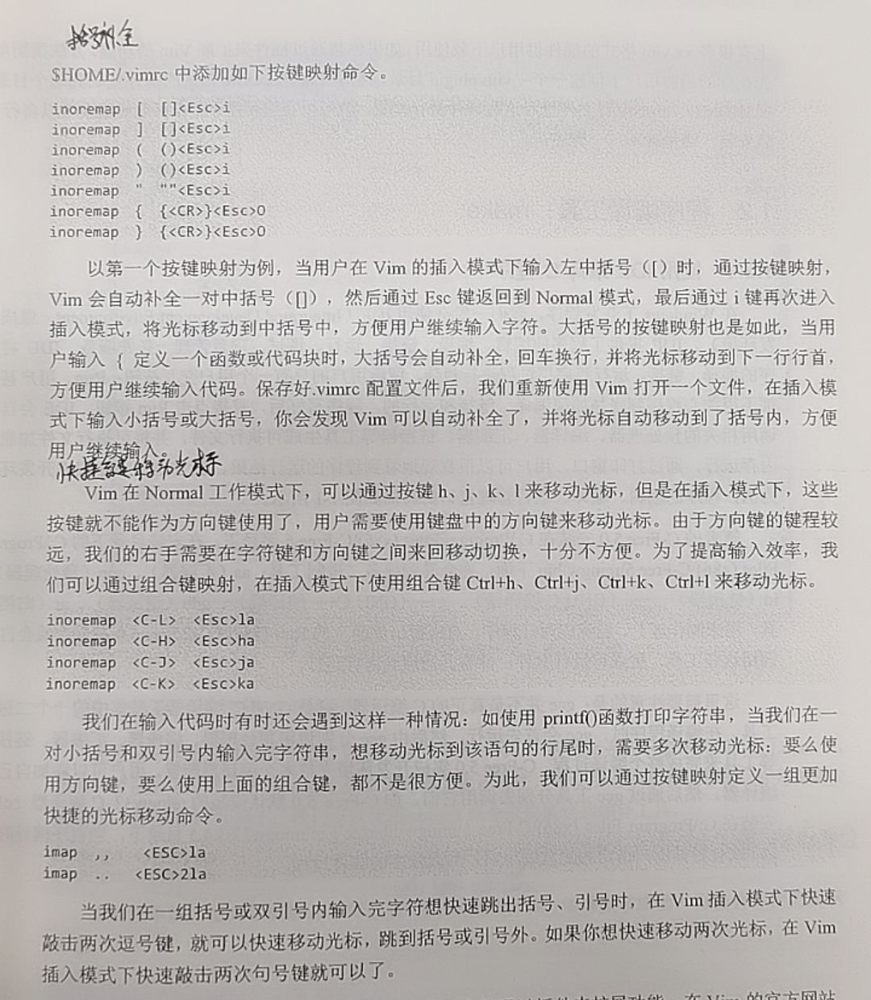

# ARM & Linux 基础学习记录

编辑整理 by [Staok](https://github.com/Staok)。

本文部分内容摘自 “100ask imx6ull” 开发板的配套资料（如 百问网的《嵌入式Linux应用开发完全手册》，在 [百问网 imx6ull pro 开发板 页面](http://download.100ask.net/boards/Nxp/100ask_imx6ull_pro/index.html) 中的《2.1 100ASK_IMX6ULL_PRO：开发板资料》或《2.2 全系列Linux教程：在线视频与配套资料》里面可以下载到），还有参考 菜鸟教程、C语言中文网、红联的等等等等，比较广泛，侵删。进行了精髓提取，方便日后查阅。过于基础的内容不会在此提及。如有错误恭谢指出！

注：[在 Github 上的原版文章日后可能会更新](https://github.com/Staok/ARM-Linux-Study)，但这里不会跟进。[文章的 Gitee 仓库地址，Gitee 访问更流畅](https://gitee.com/staok/ARM-Linux-Study)。

------

## 目录

[TOC]

------

## Linux 一般开发步骤

*p.s 本应放在最后，刻意写在前头。*

Bootloader、Linux 内核、根文件系统、APP 等等软件，需要在 Ubuntu 中编译；但是阅读、修改这些源码时，在 Windows 下会比较方便。

所以工作日常开发流程如下：

PC 端，使用 source insight 编、改源码 —>传—> Ubuntu 端，对修改好的源码进行编译、制作 —>下载—> 嵌入式板端，在 Linux 板子上运行、测试。

分步来说就是：

1.  在 Windows 上阅读、研究、修改，修改后，上传（推荐 FileZilla）到 Ubuntu ；
2.  在 Ubuntu 上编译、制作（推荐使用 MobaXterm 通过 SSH 远程登陆 Ubuntu）；
3.  把制作好的可执行程序下载到开发板上运行、测试。

u-boot、Linux内核，在 Windows 和 Ubuntu 各存一份。根文件系统使用 buildroot （或 Busybox 或 Yocto）制作，它无需放在 Windows 上。

## Linux OS 相关

*p.s 关于在 VM 虚拟机中安装 Linux 发行版系统和在 PC上安装 Linux 发行版系统，用时再在网上随用随查。*

*p.s 若仅用于开发或者只使用命令行的形式，一般在 MobaXterm 或者 Xshell 中使用 SSH 连接 Linux 系统（如 Ubuntu）来进行系统操作。*

*p.s 鼠标退出 VM ，按 ctrl + alt。*

参考网搜教程的总目录 [Linux 教程 | 菜鸟教程 (runoob.com)](https://www.runoob.com/linux/linux-tutorial.html)，[Linux学习教程，Linux入门教程（超详细） (biancheng.net)](http://c.biancheng.net/linux_tutorial/)。[Linux 系统启动过程 | 菜鸟教程 (runoob.com)](https://www.runoob.com/linux/linux-system-boot.html)。

VM 虚拟机推荐安装 Ubuntu-18.04，网搜教程很多，安装好之后，要再执行结果必要的步骤：

```bash
# 安装 vim
sudo apt-get install vim

# 换源
# 参考本文 “Ubuntu 下的包管理” 一节

# 安装 net-tools，可以使用 ifconfig 命令来查看 本机 ip 地址
sudo apt-get install net-tools

# 安装 SSH 服务
sudo apt-get  install openssh-server

# 推荐使用 MobaXterm 通过 SSH 远程登陆 虚拟机里面的 Ubuntu-18.04
```

### Linux 文件系统

#### 文件目录

Ubuntu 中的目录遵循 FHS 标准(Filesystem Hierarchy Standard， 文件系统层次标准)。它定义了文件系统中目录、文件分类存放的原则、定义了系统运行所需的最小文件、目录的集合，并列举了不遵循这些原则的例外情况及其原因。 FHS 并不是一个强制的标准，但是大多的 Linux、 Unix 发行版本遵循 FHS。  

这些目录简单介绍如下。


- [Linux 系统目录结构 | 菜鸟教程 (runoob.com)](https://www.runoob.com/linux/linux-system-contents.html)。[Linux文件系统的层次结构 (biancheng.net)](http://c.biancheng.net/view/3546.html)。
- [Linux绝对路径和相对路径详解 (biancheng.net)](http://c.biancheng.net/view/5862.html)，[Linux文件（目录）命名规则 (biancheng.net)](http://c.biancheng.net/view/3608.html)。

#### 文件属性

终端中执行 "ls -al" 命令则给出每个文件完整属性信息。文件属性示意图如下 。


-   第一个字符表示“文件类型”，文件类型可以是目录、文件或链接文件等。如下表所示。

| d    | 目录                                     |
| ---- | ---------------------------------------- |
| -    | 文件                                     |
| l    | 链接文件                                 |
| b    | 设备文件里的可供存储的接口设备           |
| c    | 设备文件里的串行端口设备，如鼠标、键盘等 |

-   文件类型后面的 9 个字符以 3 个为一组：

    1.  第一组表示 “文件所有者的权限”；
    2.   第二组表示 “用户组的权限”；
    3.   第三组表示 “其他非本用户组的权限”，即其它所有人的权限。

    每组都是 rwx 的组合， 其中 r 代表可读， w 代表可写， x 代表可执行； 如果没有对应的权限，就会出现减号`-`。

-   连接数： 表示有多少文件名连接到此节点。

-   文件所有者：表示这个文件的 “所有者的账号”。

-   文件所属用户组。

-   文件大小：表示这个文件的大小，默认单位是 B(字节)。

-   文件最后被修改的时间： 这个文件的创建文件日期或者是最近的修改日期。

-   文件名：对应文件的文件名。

文件/目录管理 和 更改文件属性/权限 等 参看`文件/目录 & 文件权限 & 用户管理`一节。

### Linux 系统相关概念

- [Linux 系统启动过程 | 菜鸟教程 (runoob.com)](https://www.runoob.com/linux/linux-system-boot.html)。
- [Linux系统相关的基础问题（空间、内存、库、链接、环境变量）_~青萍之末~的博客-CSDN博客](https://blog.csdn.net/daaikuaichuan/article/details/82729483)。
- [Linux系统调用_~青萍之末~的博客-CSDN博客_linux系统调用](https://blog.csdn.net/daaikuaichuan/article/details/82902407)。[【第4篇】嵌入式Linux应用开发基础知识_哔哩哔哩_bilibili](https://www.bilibili.com/video/BV1kk4y117Tu?p=13)，其中 `4-2_ 文件IO _系统接口` 这一个节讲解 系统调用怎么进入内核。
- [Linux内核的五大模块_~青萍之末~的博客-CSDN博客_linux内核模块](https://blog.csdn.net/daaikuaichuan/article/details/82957655)，进程调度，进程间通信模块（包括管道、命名管道、消息队列、信号量和共享内存等），内存管理模块，文件系统模块，网络接口模块。
- etc.

### Linux Shell

#### 概况

Shell 的意思是“外壳”，在 Linux 中它是一个程序，比如 /bin/sh、 /bin/bash 等。它负责接收用户的输入，根据用户的输入找到其他程序并运行。比如我们输入“ ls”并回车时， shell 程序找到“ ls”程序并运行，再把结果打印出来。Shell 有很多种实现，我们常用 bash。

命令提示符如下图。


根目录： "/" ；家目录： "~" ；上一级目录： ".." ；当前目录： "." ；上一次目录："-"。执行当前目录的  "app" 应用程序： "./app" 。 

绝对路径从 根目录 "/" 开始写起，相对目录从当前所在目录 “.” 开始写起。

#### 常用命令

- **Linux 命令查询，当字典用**。
  - [Linux 命令大全 - 菜鸟教程](https://www.runoob.com/linux/linux-command-manual.html)。
  - [Linux命令搜索引擎 命令，Linux Linux命令搜索引擎 命令详解：最专业的Linux命令大全，内容包含Linux命令手册、详解、学习，值得收藏的Linux命令速查手册。 - Linux 命令搜索引擎 (wangchujiang.com)](https://wangchujiang.com/linux-command/)，开源地址 [jaywcjlove/linux-command: Linux命令大全搜索工具，内容包含Linux命令手册、详解、学习、搜集。https://git.io/linux (github.com)](https://github.com/jaywcjlove/linux-command)。
  - 本地离线文档资料 Linux 命令速查：`【1 Linux 命令 & Linux 命令速查 & Shell 相关 & Vim 相关】\Linux 命令速查`。
  - [Linux大神都是怎么记住这么多命令的？ - 知乎 (zhihu.com)](https://www.zhihu.com/question/452895041/answer/1822141892)。
- [Shell 教程 - 菜鸟教程](https://www.runoob.com/linux/linux-shell.html)，[Shell脚本：Linux Shell脚本学习指南（超详细） (biancheng.net)](http://c.biancheng.net/shell/)。

##### 快捷键 / 通配符 / 流重定向 / 管道

- Linux 图形界面中（比如 Ubuntu 图形界面中），按下 `Ctrl + Alt + t` 打开终端。

- 命令的 惯例选项 的含义：以下命令的多个选项可以任意按需组合。

  - -a 表含隐藏文件；
  - -r 表文件夹内遍历所有文件；
  - -h 容量以方便识别的形式打印（如容量大小以 K/M/G 单位显示）；
  - -i 执行例外操作前会询问，加上比较保险；
  - -v 显示版本；
  - --help 显示帮助；
  - 等等。

- 快捷键：

  - ctrl + c，结束当前进程。
  - ctrl + z，暂停当前进程，可使用 `fg` 命令 恢复，详见 "任务后台执行 / 任务&进程查看" 一节。
  - ctrl + a，使光标移动到命令行的最前，对于长命令可以快速定位到最前。
  - ctrl + e，使光标移动到命令行的最后。
  - ctrl + d，退出当前终端，关闭，作用与 `exit` 一样。

- 多个命令写在一行并自动逐个执行，命令之间加 && 符号。

- tab 键自动补全命令和文件或目录的全名。输入路径全名的中途，按两下 tab 键显示当前目录下的内容。

- 各种通配符：

  - *：任何字符和字符串。

  - ?：一个任意字符。
  - [abc...]： [ ] 内的任意一个字符。 [abc]表示 a、 b、 c 任一个字符；有时候也表示范围，如 [a-x] ，表示 a 到 x 的任一个字符； [1-9] 表示 1 到 9 的任一数字。
  - [!abc...]：和上面的相反，表示除 [ ] 内的字符外的任意一个字符。  

  例 `rm -f 1[!1]*.txt`  删除名字中第一个字符是 “1” 而第二个字符不是为 “1” 的所有文件。

- 流控制，输入输出重定向（< / <<，> / >>）：[Shell 输入/输出重定向 | 菜鸟教程 (runoob.com)](https://www.runoob.com/linux/linux-shell-io-redirections.html)。

  - `command > file`，将输出重定向到 file（一个文件），即将 stdout 重定向到 file，将 command 的打印内容覆盖输入到文件 file 里；`command >> file`，将输出以追加的方式重定向到 file，追加输入到文件 file。

  - `command < file`，将输入重定向到 file，即将 stdin 重定向到 file，本来需要从键盘获取输入的命令会转移到读取文件内容。

  - 注意 输出重定向是大于号(>)，输入重定向是小于号(<)。

  - 错误信息重定向：

    一般情况下，每个 Unix/Linux 命令运行时都会打开三个文件：

    - 标准输入文件(stdin)：stdin 的文件描述符为 0，Unix 程序默认从 stdin 读取数据。
  - 标准输出文件(stdout)：stdout 的文件描述符为 1，Unix 程序默认向 stdout 输出数据。
    - 标准错误文件(stderr)：stderr 的文件描述符为 2，Unix 程序会向 stderr 流中写入错误信息。
  
    `command 2 >> file` 让执行命令后的错误信息 stderr 追加到 file 文件末尾。

- 管道（ | ）：

  `command1 | command2`，当在两个 命令/应用/进程 之间设置管道时，管道符`|`左边命令的输出就变成了右边命令的输入（管道 即进程间通讯的一种）。

  这里需要注意，command1 必须有正确输出，而 command2 必须可以处理 command1 的输出结果； command2 只能处理 command1 的正确输出结果，不能处理 command1 的错误信息。

  例：查看指定程序的进程运行状态，并将输出重定向到文件中。

  ```bash
  ps aux | grep httpd > /tmp/ps.output && cat /tmp/ps.output
  ```

##### 基本命令 / 文件&目录管理

**基本命令**

`pwd`、`cd`、`mkdir`（**-p** 选项指示连续创建目录及其子目录，如`mkdir -p test1/test2/test3/test4`）、`rmdir`（不能删除非空目录，-p 选项可以一次删除多级空目录）、`touch`、`clear`、`echo`（往文件写内容 `echo none > /sys/class/leds/cpu/trigger`）。

**文件与目录管理**

[Linux 文件与目录管理 | 菜鸟教程 (runoob.com)](https://www.runoob.com/linux/linux-file-content-manage.html)。

> - ls（英文全拼：list files）: 列出目录及文件名
> - cd（英文全拼：change directory）：切换目录
> - pwd（英文全拼：print work directory）：显示目前的目录
> - mkdir（英文全拼：make directory）：创建一个新的目录
> - rmdir（英文全拼：remove directory）：删除一个空的目录
> - cp（英文全拼：copy file）: 复制文件或目录
> - rm（英文全拼：remove）: 删除文件或目录
> - mv（英文全拼：move file）: 移动文件与目录，或修改文件与目录的名称

**显示目录文件和文件夹：ls**

-l 显示完整属性信息；-a 显示隐藏文件；-h 文件和文件夹大小以 K/M/G 单位显示；-i参数显示文件的inode节点信息。一个例子如图。


**统计目录每个文件大小：du**

统计指定目录内每个文件和文件夹大小：`du -ah ~/Videos`。-a 表显示隐藏文件，-h 表大小以 K/M/G 单位显示。

显示指定文件所占空间：

```bash
# du log2012.log 
300     log2012.log
```

**复制 文件或文件夹：cp**

-   -r 表示递归目录下所有文件。
-   -d 如果源文件为链接文件，只复制链接文件而不是实际文件。
-   -i 增加特殊情况的讯问，如同名时会询问是否覆盖等（个人建议常用）。
-   -f 强制覆盖。

额外选项：

- -l：进行**硬连结**(hard link)的连结档创建，而非复制文件本身。
- -s：复制成为**符号连结**档 (symbolic link)，亦即 快捷方式文件。
- -p：连同文件的属性一起复制过去，而非使用默认属性(备份常用)。
- **-a：**相当於 -pdr，递归复制，并将文件属性和链接文件一同复制过去。

例子：

-   拷贝 dir1 目录内所有文件到 dir2 目录：`cp dir1/* dir2` 或者 `cp -r dir1/ dir2/`。
-   复制 整个目录 到 另一个目录 时常用：`cp -rid dir_a dir_b`。

**关于 硬链接 和 符号链接：**

> 引自：[Linux 文件与目录管理 | 菜鸟教程 (runoob.com)](https://www.runoob.com/linux/linux-file-content-manage.html)。
>
>  Linux 链接分两种，一种被称为硬链接（Hard Link），另一种被称为符号链接（Symbolic Link）。默认情况下，**ln** 命令产生硬链接。
>
> **硬连接**
>
> 硬连接指通过索引节点来进行连接。在 Linux 的文件系统中，保存在磁盘分区中的文件不管是什么类型都给它分配一个编号，称为索引节点号(Inode Index)。在 Linux 中，多个文件名指向同一索引节点是存在的。比如：A 是 B 的硬链接（A 和 B 都是文件名），则 A 的目录项中的 inode 节点号与 B 的目录项中的 inode 节点号相同，即一个 inode 节点对应两个不同的文件名，两个文件名指向同一个文件，A 和 B 对文件系统来说是完全平等的。删除其中任何一个都不会影响另外一个的访问。
>
> 硬连接的作用是允许一个文件拥有多个有效路径名，这样用户就可以建立硬连接到重要文件，以防止“误删”的功能。其原因如上所述，因为对应该目录的索引节点有一个以上的连接。只删除一个连接并不影响索引节点本身和其它的连接，只有当最后一个连接被删除后，文件的数据块及目录的连接才会被释放。也就是说，文件真正删除的条件是与之相关的所有硬连接文件均被删除。
>
> **软连接**
>
> 另外一种连接称之为符号连接（Symbolic Link），也叫软连接。软链接文件有类似于 Windows 的快捷方式。它实际上是一个特殊的文件。在符号连接中，文件实际上是一个文本文件，其中包含的有另一文件的位置信息。比如：A 是 B 的软链接（A 和 B 都是文件名），A 的目录项中的 inode 节点号与 B 的目录项中的 inode 节点号不相同，A 和 B 指向的是两个不同的 inode，继而指向两块不同的数据块。但是 A 的数据块中存放的只是 B 的路径名（可以根据这个找到 B 的目录项）。A 和 B 之间是“主从”关系，如果 B 被删除了，A 仍然存在（因为两个是不同的文件），但指向的是一个无效的链接。
>
> **实验**
>
> ```bash
> touch f1          #创建一个测试文件f1
> ln f1 f2          #创建f1的一个硬连接文件f2
> ln -s f1 f3       #创建f1的一个符号连接文件f3
> ls -li            # -i参数显示文件的inode节点信息
> ```
>
> 从上面的结果中可以看出，硬连接文件 f2 与原文件 f1 的 inode 节点相同，均为 9797648，然而符号连接文件的 inode 节点不同。
>
> 可以得到以下预期与测试的结果：
>
> -  1).删除符号连接f3，对f1、f2无影响；
> -  2).删除硬连接f2，对f1、f3也无影响；
> -  3).删除原文件f1，对硬连接f2没有影响，导致符号连接f3失效；
> -  4).同时删除原文件f1，硬连接f2，整个文件会真正的被删除。

**移动/重命名 文件/文件夹：mv**

- -f 强制；-i 询问（个人建议常用）。

直接举例：

-   `mv file1 dir1 dir2`，将文件 file1 和 目录 dir1 移动到目录 dir2 里面。
-   `mv file1 file_1`，将文件 file1 重命名为 file_1。

**删除 文件或文件夹：rm**

-   -r 递归；-f 强制；-i 询问（个人建议常用）。
-   删除目录：`rm -r dir_a`。
-   喜闻乐见的删库跑路（新手要理解其意思）：`rm -rf /*`。

**文件内容查看**

> Linux系统中使用以下命令来查看文件的内容：
>
> - cat 由第一行开始显示文件内容
> - tac 从最后一行开始显示，可以看出 tac 是 cat 的倒着写！
> - nl  显示的时候，顺道输出行号！
> - more 一页一页的显示文件内容
> - less 与 more 类似，但是比 more 更好的是，他可以往前翻页！
> - head 只看头几行
> - tail 只看尾巴几行

查看长文件 `less`：`less install.log`，最下面显示的是这个文件的名称，我们可以使用 “PageUp” 和 “PageDown” 可以进行上一页和下一页的翻页。如果要知道具体的控制键，我们可以按下 “H” 键，可以显示 less 命令的所有控制键，如果想结束，可以按 “q” 键。

以上每个命令的选项，可用时再查（上面 “Linux 命令查询” 处给出了一些在线查询 Linux 命令 的网站），用的多了就 内化 / 记住了。

##### 文件权限 & 用户管理 & 密码管理

**文件权限/属性管理**

这里面讲的更详细 [Linux 文件基本属性 | 菜鸟教程 (runoob.com)](https://www.runoob.com/linux/linux-file-attr-permission.html)，[Linux权限管理详解 (biancheng.net)](http://c.biancheng.net/linux_tutorial/70/)。

一句话明白：对于一个文件，通过 chown 来授权某个用户所有该文件，通过 chmod 为该用户设置可以操作（读/写/执行）该文件的权限。

-   改变文件所属用户组 ：chgrp

    将 install.log 文件的用户组改为 hy 用户组：`chgrp hy install.log`。注意 hy 用户组必须要在/etc/group 文件内存在才可以。  

    -R : 进行递归的持续更改，也连同子目录下的所有文件、目录都更新成为这个用户组之意。常常用在更改某一目录内所有文件的情况。  

-   改变文件的所有者：chown

    例子：`chown bin install.log`、`chown book:book install.log`，改变 install.log 文件的所有者为 bin，改变 install.log 文件的所有者和用户组为 book 和 book。

    改变文件所有者和用户组的这两个命令的应用场景：复制文件，由于复制行为会复制执行者的属性和权限，因此复制后需要改变文件所属用户、用户组等。  

    -R：也是递归子目录。

-   改变文件权限：chmod

    使用 u、 g、 o 三个字母代表 user、 group、 others 3 中身份；此外 a 代表 all，即所有身份。范例：`chmod u=rwx,go=rx .bashrc`，即对于 .bashrc 文件，用户有 rwx 权限，用户组和其它用户有 rx 权限。

    也可以增加或去除某种权限，“ +”表示添加权限，“ -”表示去除权限：  `chmod a+w .bashrc`、`chmod a-x .bashrc`、`chmod +x app`。

    数字的方式就不细说了：用 4 代表 r 权限，2 代表 w 权限，1 代表 x 权限；owner = rwx = 4+2+1 = 7；例子：`chmod 777 .bashrc`。

**用户与用户组管理**

[Linux 用户和用户组管理 | 菜鸟教程 (runoob.com)](https://www.runoob.com/linux/linux-user-manage.html)，[Linux用户和用户组管理详解 (biancheng.net)](http://c.biancheng.net/linux_tutorial/60/)。

对于用户与用户组的阐释：

- [Linux用户和用户组（包含两者之间的关系） (biancheng.net)](http://c.biancheng.net/view/3038.html)。
- [linux用户和用户组相关概念、理解、操作_森狗道格的博客-CSDN博客_linux用户和组的作用](https://blog.csdn.net/qq_37141978/article/details/106010346)。

主要有这些命令：

> - Linux系统添加新用户（useradd命令）
> - Linux修改系统用户密码（passwd命令）
> - Linux修改系统用户信息（usermod命令）
> - Linux强制系统用户登陆时修改密码（chage命令）
> - Linux删除系统用户（userdel命令）
> - Linux查看用户的UID和GID（id命令）
> - Linux临时切换用户身份（su命令）
> - Linux whoami和who am i命令
> - Linux添加用户组（groupadd命令）
> - Linux修改用户组（groupmod命令）
> - Linux删除用户组（groupdel命令）
> - Linux将系统用户加入或移除群组（gpasswd命令）
> - Linux切换用户的有效群组（newgrp命令）

-   增加用户：`useradd user1`，表增加一个用户 user1 ，并接着提示设置密码；只有 root 可以修改所有用户的密码，普通用户只能修改自己的密码，修改自己的密码 `passwd uesr1`。

-   删除用户：`userdel`，慎用，可删除用户帐号与相关的文件。若不加 -f 参数，则仅删除用户帐号，而不删除相关文件，加上则会删除用户登入目录以及目录中所有文件。

-   修改用户信息：usermod，选项：

    - -c <备注>，修改用户帐号的备注文字。 
    - -d 登入目录>，修改用户登入时的目录。 
    - -e <有效期限>，修改帐号的有效期限。 
    - -f <缓冲天数>，修改在密码过期后多少天即关闭该帐号。 
    - -g <群组>，修改用户所属的群组。 
    - -G <群组>，修改用户所属的附加群组。 
    - -l <帐号名称>，修改用户帐号名称。 
    - -L，锁定用户密码，使密码无效。 
    - -s <shell>，修改用户登入后所使用的shell。 
    - -u <uid>，修改用户ID。 
    - -U，解除密码锁定。

- 普通用户 与 超级用户 之间切换：

  切换为 root 超级用户的命令为：`sudo su`；切换普通用户的命令为：`su <username>`，也可以用 `exit` 来退出超级用户。

**密码管理**

- 给 root 用户设置密码，并在用户间切换：
  1. `sudo passwd root` 给 root 设置密码；
  2. `输入 当前用户（book）密码`；
  3. `输入 root 新设置的密码，两次`；
  4. 成功；
  5. `su root` 切换到 root 用户；`su`用来切换用户；
  6. `su book` 切回。
- [Linux 忘记密码解决方法 | 菜鸟教程 (runoob.com)](https://www.runoob.com/linux/linux-forget-password.html)。

##### 获取命令帮助： --help/man

命令后加 --help 选项，获取此命令的所有选项和其释义。详情如下图。


命令的完整手册，命令前加 man，提供命令、API、概念、配置文件等帮助信息。详情如下。

man 手册一共有 9 册，每一册专注一个方面。如下表。

| **section** | **名称**                 | **说明**                   |
| ----------- | ------------------------ | -------------------------- |
| 1           | 用户命令                 | 用户可操作的命令           |
| 2           | 系统调用                 | 内核提供的函数(查头文件)   |
| 3           | 库调用                   | 常用的函数库               |
| 4           | 特殊文件                 | 设备文件(/dev下)和特殊文件 |
| 5           | 文件格式和约定           | 对一些文件进行解释         |
| 6           | 游戏程序                 | 游戏程序                   |
| 7           | 杂项                     | 包括宏包和约定等           |
| 8           | 系统管理员使用的管理命令 | 通常只有系统管理员可以使用 |
| 9           | 内核相关                 | Linux内核相关文件          |

每一册都细分为语法说明、详细说明、作者说明、版权信息等章节。如下表。

| **段名**       | **主要内容**                     |
| -------------- | -------------------------------- |
| NAME           | 命令、数据名称的简短说明         |
| SYNOPSIS       | 简短的命令语法说明               |
| DESCRIPTION    | 最为权威和全面的使用说明         |
| EXAMPLES       | 使用本命令或数据的一些参考示例   |
| AUTHOR         | 作者                             |
| REPORTING BUGS | 报告相关的错误信息               |
| COPYRIGHT      | 版权                             |
| SEE ALSO       | 与本命令或数据相关的其他参考说明 |


##### 连接流 / 取文件内容：cat

- -n 或 --number：由 1 开始对所有输出的行数编号。
- -b 或 --number-nonblank：和 -n 相似，只不过对于空白行不编号。
- -s 或 --squeeze-blank：当遇到有连续两行以上的空白行，就代换为一行的空白行。

例子：

```bash
# 将一个字符串输入到一个文件
echo "难凉热血瞰百易" > users

# 把 textfile1 的文档内容加上行号后覆盖输入 textfile2 这个文档里
cat -n textfile1 > textfile2

# 把 textfile1 和 textfile2 的文档内容加上行号（空白行不加）之后将内容 追加 到 textfile3 文档里
cat -b textfile1 textfile2 >> textfile3

# 清空 /etc/test.txt 文档内容
cat /dev/null > /etc/test.txt
```

##### 比较文件差异：diff

diff 以逐行的方式，比较文本文件的异同处。如果指定要比较目录，则 diff 会比较目录中相同文件名的文件，但不会比较其中子目录。

[Linux diff命令](https://www.runoob.com/linux/linux-comm-diff.html)

```bash
diff log2014.log log2013.log 
3c3
< 2014-03
---
> 2013-03
8c8
< 2013-07
---
> 2013-08
11,12d10
< 2013-11
< 2013-12
# 上面的 "3c3" 和 "8c8" 表示 log2014.log 和 log20143log 文件在 3 行和第 8 行内容有所不同；"11,12d10" 表示第一个文件比第二个文件多了第 11 和 12 行。
```

- -a，只会逐行比较文本文件。
- -c，显示全部内文，并标出不同之处。
- -B，不检查空白行。
- -r，比较子目录中的文件。
- -y，以并列的方式显示文件的异同之处，其中：
  - "|"表示前后2个文件内容有不同。
  - "<"表示后面文件比前面文件少了1行内容。
  - ">"表示后面文件比前面文件多了1行内容。
- -u，以合并的方式来显示文件内容的不同。
- -H，比较大文件时，可加快速度。

常用 `diff -yB <文件1> <文件2>`。

##### 常用 find / grep / sed / awk

可参考 [四个强大的linux文本处理工具（find、grep、sed、awk）_~青萍之末~的博客-CSDN博客_linux 文本处理 查找](https://blog.csdn.net/daaikuaichuan/article/details/82288634)。

**查找/搜索：find**

-   格式：`find 目录名 选项 查找条件`；如果没有指定目录，则为当前目录查找
-   举例，在某目录用名字查找名为 test1.txt 的文件：`find /home/book/dira/ -name "test1.txt"`；按格式查找：`-name " *.txt "`；
-   其他高级用法很多，这里举例，查找 x 天内有变动的文件：`find /home/book -mtime -2`，查找 /home 目录下两天内有变动的文件。  

**文件内搜索：grep**

-   格式：`grep [选项] [查找模式] [文件名]`；
-   `grep -rn "字符串" 文件名`。字符串：要查找的字符串；文件名：要查找的目标文件，如果是 * 符号则表示查找当前目录下的所有文件和目录；r(recursive) 递归查找；n(number) 显示目标位置的行号；-w 全字匹配；
-   在 test1.txt 中查找字符串abc： `grep -n "abc" test1.txt`，在当前目录递归查找字符串abc：`grep -rn "abc" *`；
-   第一个命令的结果传入第二个命令，即在 grep 的结果中再次执行 grep 搜索：`grep “ABC” * -nR | grep “ \.h”`，搜索包含有 "ABC" 的头文件。

**计算字数：wc**

-  各个选项：`-c` 只显示 Bytes 数； -l 只显示列数； -w 只显示字数。

**数据替换：sed**

- 用时现查。

**文本处理：awk**

- 用时现查。

##### 压缩打包：gzip、bzip2、tar、7z

[Linux打包（归档）和压缩详解 (biancheng.net)](http://c.biancheng.net/linux_tutorial/bale_compress/)。

**单文件压缩、解压：gzip、bzip2**

-   小文件：gzip （.gz）
-   大文件（压缩比高）：bzip2 （.bz2）

上述两个的选项：-l (list) 列出压缩文件内容；-k (keep) 保留压缩或解压的源文件；-d (decompress) 解压压缩文件。

例子：

-   查看：`gzip -l pwd.1.gz`；
-   压缩：`gzip -k guesswhat.iso`；
-   解压：`gzip -kd pwd.1.gz`。

注：不加 -k 选项，在操作完后不会保留源文件；都只能压缩单文件。

**多文件、目录的压缩和解压：tar**

-   -c (create)：表示创建用来生成文件包 。压缩。
-   -x：表示提取，从文件包中提取文件。解压。
-   -t：可以查看压缩的文件。查看。
-   -z：使用 gzip 方式进行处理，它与”c“ 结合就表示压缩，与”x“ 结合就表示解压缩。
-   -j：使用 bzip2 方式进行处理，它与”c“ 结合就表示压缩，与”x“ 结合就表示解压缩。
-   -v (verbose)：详细报告 tar 处理的信息。
-   -f (file)：表示文件，后面接着一个文件名。
-   -C <指定目录> 解压到指定目录。  

例子：（选项前可以不加 "-"，以下还是加上的）

- 查看：`tar -tvf dira.tar.gz`；

- 压缩（目录）：`tar -czvf dira.tar.gz dira`；或者 `tar -cjvf dira.tar.bz2 dira`；前者使用 gzip （czvf），后者使用 bzip2 （cjvf）；

  tar 打包、 bzip2 压缩：`tar -cjvf dira.tar.bz2 dira`，把目录 dira 压缩、打包为 dira.tar.bz2 文件；

- 解压：`tar -xzvf dira.tar.gz -C /home/book`，加 -C 指定目录，不加就是解压到当前目录，使用 gzip。

总之：

- 查看：`tar tvf <压缩文件>`；
- 压缩（用 bzip2）：`tar cjvf /<目标位置>/xxx.tar.bz2 <要压缩的文件夹或文件>`；
- 解压（用 bzip2）：`tar xjvf xxx.tar.bz2 -C <目标目录>`。

注意：要进入到被解压的目录下面，然后进行压缩命令，而不是输入压缩文件的全路径名，这样会连带把目录结构一同压缩！

**高压工具：7z**

-   工具安装：`sudo apt-get install p7zip`。
-   解压：`7z x <压缩包名.7z>` 解压到压缩包命名的目录下。
-   压缩：`7z a pack.7z 1.jpg dir1` 将 1.jpg 和 文件夹 dir1 压缩成一个 7z 包 pack.7z。

**zip、rar**

- `rar a jpg.rar *.jpg` rar 格式的压缩，需要先下载 rar for linux；`unrar e file.rar` 解压 rar；

- `zip jpg.zip *.jpg` zip 格式的压缩，需要先下载 zip for linux；`unzip file.zip` 解压 zip。

  zip 详细：

  压缩并指定目录，举例：`zip -r /home/kms/kms.zip /home/kms/server/kms`；

  解压并指定目录，举例：`unzip /home/kms/kms.zip -d /home/kms/server/kms`；

  删除压缩文件中 smart.txt 文件：`zip -d myfile.zip smart.txt`；

  向压缩文件中添加 rpm_info.txt 文件：`zip -m myfile.zip ./rpm_info.txt`。

##### 网络命令：ifconfig /netstat

- `ifconfig`：查看当前正在使用的网卡，及其 IP；-a 查看所有网卡。修改相应网卡的 IP 地址：`ifconfig <网卡名> 192.168.1.123` 。
- 测试路由：`ping 8.8.8.8`。测试 DNS 服务：`ping www.baidu.com`。DNS 的设置比较简单，8.8.8.8 是好记好用的 DNS 服务器，修改 Ubuntu 中的 `/etc/resolv.conf` 文件，内容如下：`nameserver 8.8.8.8`。
- 图形画界面的网络配置工具：`netconfig`，修改好后 `OK` 退出，还需要 `service network restart` 重新启动网络服务才会生效。 所有网络配置信息保存在 `ls /etc/sysconfig/network-scripts/` 里面，重启网络服务就是加载这个里面的文件信息。
- `netstat`：查看网络状况。`netstat -lnp | head -n 30`，打印当前系统启动了哪些端口，显示前 30 行信息。`netstat -an | head -n 20`，打印网络连接状况，显示前 20 行信息。

##### 查看文件类型：file/readelf

`file <文件名>`确定其机器码是适合 x86 平台的，还是 arm 平台的。举例：

```bash
file ~/.bashrc     为 ASCII 编码的 text 类型
file ~/.vimrc      为 UTF-8 Unicode 编码的 text 类型
file ~/Pictures/*  如图形文件 JPEG/PNG/BMP 格式
file ~             为 directory 表明这是一个目录
file /bin/pwd      出现 ELF 64-bit LSB executable，即为 ELF 格式的可执行文件
file /dev/*        出现 character special (字符设备文件)、 block special (块设备文件) 等

readelf -a <elf 文件> 解析并显示 elf 的 arm 可执行文件的详情
```

##### 定位文件：locate

全局查找文件，打印其位置：`locate install.log`。

因为这个命令是从数据库中来搜索文件，这个数据库的更新速度是7天更新一次。  新建不久的文件搜索不到，需要更新一下数据库：

```bash
touch 001.txt
locate 001.txt   # 找不到

updatedb         # 立即更新数据库，需要一段时间
locate 001.txt   # 找到了
```

更多选项 [Linux locate 命令](https://www.runoob.com/linux/linux-comm-locate.html)。

##### 查找应用程序位置：which

`which pwd` 定位到 /bin/pwd；`which gcc` 定位到 /user/bin/gcc。

`whereis pwd` 可得到可执行程序的位置和手册页的位置。

##### 任务后台执行 / 任务&进程查看

前置知识：每个进程有个 ID（The task's unique process ID），为 PID（Process ID），同一个进程下的线程的 PID 均相同。LWP 即轻量级进程，就是线程了。

-   在命令的最后，加一个 & 符号，即可放到后台运行，

    常用任务管理命令：

    `jobs` 查看任务，返回任务编号 n 和进程号

    `bg %n` 将编号为 n 的任务转后台，并运行

    `fg %n` 将编号为 n 的任务转前台，并运行

    `ctrl+z` 挂起当前任务

    `ctrl+c` 结束当前任务

    例如：更多操作详情看[这里](https://blog.csdn.net/zxh2075/article/details/52932885)。

    执行 `ping www.baidu.com &`，再按 ctrl + z，显示 `[1]+  Stopped    ping www.baidu.com`，表示此任务编号为 [ 1 ]，接着键入 `bg %1`，让此任务继续执行并转入后台执行，再键入 `fg %1`，将其转入前台执行，然后 ctrl + c 结束此任务。

- `kill -9 <进程 ID>` 结束进程指定进程 ID 的进程。

- 显示系统内存使用情况：`free -h`。

- 查看 CPU 状况有很多方法，还有：`cat /proc/cpuinfo`。

- 命令 `w` 查看系统整理负载，可显示更细节的命令 `vmstat`，后者可以查看到内存、磁盘的负载情况，[ Linux vmstat命令实战详解_浮生忆梦的博客-CSDN博客_vmstat](https://blog.csdn.net/m0_38110132/article/details/84190319)。

- `ps -aux` 查看当前哪些任务在后台执行。详情如下图。

  

  `ps -xH`，这样可以查看所有存在的线程，也可以使用 grep 作进一步的过滤。

  `ps -mq PID`，这样可以看到指定的进程产生的线程数目。

- 动态的显示系统进程信息（相当于任务管理器界面）：`top -d  2`，-d 表示刷新时间，单位秒。详情如下图。

  

  `top -H`，加上 -H 这个选项，top 的每一行就不是显示一个进程，而是一个线程。

  top 命令详解 [linux top命令查看内存及多核CPU的使用讲述 - tamatama - 博客园 (cnblogs.com)](https://www.cnblogs.com/tamatama/p/13044402.html)。

- 进程、信号、ps 和 top 详解：[关于Linux下进程的详解【进程查看与管理】 - AshJo - 博客园 (cnblogs.com)](https://www.cnblogs.com/ashjo009/p/11912563.html)。

##### 磁盘管理：df / du / fdisk

[Linux 磁盘管理 | 菜鸟教程 (runoob.com)](https://www.runoob.com/linux/linux-filesystem.html)。

**文件系统挂载查看：df**

`df -Th` 列出文件系统类型、容量和哪个硬盘挂载在这里的情况。

第一列指文件系统的名称，第二列指1KB为单位的总容量，第三列指以使用空间，第四列指剩余空间，最后一栏是磁盘挂载所在目录。

```bash
$ df
Filesystem     1K-blocks    Used      Available Use% Mounted on 
/dev/sda6       29640780    4320600   23814492  16%       / 
...
```

**分区查看和设置：fdisk**

用时现学，网上资料足多。

`fdisk -l`，列出系统中所有存储设备，并显示其分区结构。设备名从 `/dev/sda` 、 `/dev/sdb` 开始延续。

##### 文件系统挂载：mount

mount 命令用来挂载各种支持的文件系统协议到某个目录下。[Linux mount 命令-菜鸟教程](https://www.runoob.com/linux/linux-comm-mount.html)

举例：

-   将 /dev/hda1 挂在 /mnt 之下 `mount /dev/hda1 /mnt`。
-   将 /dev/hda1 用唯读模式挂在 /mnt 之下 `mount -o ro /dev/hda1 /mnt`。
-   将 /tmp/image.iso 这个光碟的 image 档使用 loop 模式挂在 /mnt/cdrom之下。用这种方法可以将一般网络上可以找到的 Linux 光 碟 ISO 档在不烧录成光碟的情况下检视其内容 `mount -o loop /tmp/image.iso /mnt/cdrom`。
-   卸载挂载 `umount /mnt`。

##### 内核模块管理：kmod

Linux 有许多功能是通过模块的方式，你可以将这些功能编译成一个个单独的模块，待用时再分别载入它们到 kernel。这类可载入的模块，通常是设备驱动程序。

-   `lsmod` 列出已安装系统的模块。
-   `insmod kmod.ko` 用于手动安装模块；-f 强制（不检查目前 kernel 版本与模块编译时的 kernel 版本是否一致），更多命令：
    -   -f 　不检查目前kernel版本与模块编译时的kernel版本是否一致，强制将模块载入。
    -   -k 　将模块设置为自动卸除。
    -   -m 　输出模块的载入信息。
    -   -o <模块名称> 　指定模块的名称，可使用模块文件的文件名。
    -   -p 　测试模块是否能正确地载入kernel。
    -   -s 　将所有信息记录在系统记录文件中。
    -   -v 　执行时显示详细的信息。
    -   -x 　不要汇出模块的外部符号。
    -   -X 　汇出模块所有的外部符号，此为预设置。
-   `rmmod` 卸载某个已安装的模块。
-   `modinfo` 查看某个模块的详细信息。
-   `modprobe` 自动安装模块，并自动尝试解决依赖，比 insmod 聪明；-f 强制安装，-r 卸载模块，更多命令：
    -   -a或--all 　载入全部的模块。
    -   -c或--show-conf 　显示所有模块的设置信息。
    -   -d或--debug 　使用排错模式。
    -   -l或--list 　显示可用的模块。
    -   -r或--remove 　模块闲置不用时，即自动卸载模块。
    -   -t或--type 　指定模块类型。
    -   -v或--verbose 　执行时（载入或者卸载）显示详细的信息。
    -   -V或--version 　显示版本信息。
    -   -help 　显示帮助。

##### 系统管理 / 杂项 / 日常

以下命令可用时现查。

- who，显示登录到本地的用户。
- w，显示登录到本地的用户，并显示他们在做什么。
- whoami，显示当前用户的登录名。
- id，查看用户 id 和其它信息。
- last，查看最近登陆本机的用户。
- uname -a，显示本机和系统信息。
- uptime，查询 linux 系统的运行时间、当前用户数等信息。


- dmesg，查看开机信息。
- umask，控制新创建文件的默认权限。
- ulimit，查看和控制用户的资源限制。
- env，查看当前用户的环境变量。


-   显示日期、日历：`data`，`cal`。打印程序执行时间：`time ./可执行程序`。
-   查看 CPU 信息：`cat /proc/cpuinfo`。
-   关闭驱动程序的 printk 打印信息：`echo "1 4 1 7" > /proc/sys/kernel/printk`。


-   关机相关：

    -   将存于 buffer 中的资料强制写入硬盘中：`sync`。Linux 系统中欲写入硬盘的资料有的时候为了效率起见，会写到 filesystem buffer 中，这个 buffer 是一块缓存空间，如果欲写入硬盘的资料存于此 buffer 中，而系统又突然断电的话，那么资料就会流失了，`sync` 指令会将存于 buffer 中的资料强制写入硬盘中。`sync` 命令在关闭 Linux 系统前使用。

    -   在关机前，可使用 `ps -aux` 查看还有哪些后台进程。

    -   关机：`halt` 停止机器；`halt -p` 关闭机器、关闭电源。

    -   重启：`reboot`。

    - 延时关机：`shutdown -t 10`，关机，-t 表示关机倒计时，单位秒。`shutdown` 更多例子：常用 `shutdown -h now` 来立即关机。

      

- ~~图形化系统设置工具，调整运行状态，运行 `setup` 这个综合工具。包括如图所示的五项：认证方式、防火墙配置、鼠标配置、网络配置、系统服务等。这里包含了各种系统服务。~~  

- 有趣的命令：

  -   hollywood 和 cmatrix：安装 `sudo apt-get install hollywood cmatrix`，效果执行后见。
  -   sl：为从右到左跑一遍字符画火车。安装同样使用 apt 工具。
  -   figlet：命令为字符画生成，详看 [Linux终端也能玩出新境界：Figlet 和 Toilet命令_Linux教程_Linux公社-Linux系统门户网站 (linuxidc.com)](https://www.linuxidc.com/Linux/2018-12/155871.htm)。


## Linux 下的开发

- **代码编辑：Vim、gedit（ubuntu 下）。**
- **编译工具：gcc，make，cmake（生成 makefile，网搜教程，本篇不涉及）。**
- **项目管理：git（网搜教程，本篇不涉及）。**

### Vim 编辑器

功能：打开、新建和保存文件；文本编辑；多行、列间复制、粘贴和删除；查找和替换。

意义：开发中，尤其对于大型项目并不常用，但是在需要临时修改、现场调试和没有 GUI 形式的编辑器等等的时候，可以快速进行一些简单文本编辑。

[Linux vi/vim | 菜鸟教程 (runoob.com)](https://www.runoob.com/linux/linux-vim.html)。

##### 一图以蔽之


- 一般模式/普通模式：用于按各种快捷键进行光标移动、复制、粘贴和删除等。
- 编辑模式/插入模式：用于敲字符输入/编辑。
- 命令行模式：用于输入保存、退出、查找和替换 等 控制命令，在 一般模式 打一个冒号再输入命令。

注：当不知道处于何种模式时，按 ESC 键返回到 一般模式。可以在 Ubuntu 中安装中文输入法。

更多可参考 [vim命令大全 - 知乎 (zhihu.com)](https://zhuanlan.zhihu.com/p/61515833)。

##### 在 一般模式 的快捷键

-   i/a，在光标处的前/后进入 编辑模式。dw，删除一个单词；dd，删除光标所在行(d:delete) 。
-   单击 o （字母 o）键，在当前光标所在行的下方新建一行，并进入编辑模式。
-   单击 0（数字零） 光标移至当前行行首；$，光标移至当前行行末；%，在括号`（）、[]、{}`间移动。
-   gg，跳到第一行，（xgg 就是跳到第x行的行首）；G，跳到文件结尾。
-   ctrl + u/d 进行 半屏的前后滚动；ctrl + f/b 进行 全屏的 上下翻页。
-   使用 v 进入可视模式，移动光标来 选定文本块内容；用 y 复制选定块到缓冲区，用 d 剪切选定块到缓冲区，用 p 粘贴缓冲区中的内容。
-   u，撤销上一步操作；ctrl + r，恢复，回退到前一个命令。
-   针对 Ubuntu 界面来说，ctrl + "-" ，减小字号；ctrl + shift + "+"，增大字号。

##### 在 命令行模式 的命令

-   保存，`:w`；退出，`:q`；强制执行，在命令后加`!`；前面的命令可以组合。文件另存为，`:w <filename>`。重命名当前文件，`:f <filename>`。
-   查找，`:/pattern` 从光标开始处向文件尾搜索字符串 "pattern"，后按 n （在同一个方向重复上一次搜索命令）或 N （在反方向重复上一次搜索命令）；从当前光标位置开始搜索，若光标在文件开头，则为全文搜索。
-   替换，`:%s/p1/p2/g` 将文件中所有的 p1 均用 p2 替换；`:%s/p1/p2/gc` 替换时需要确认。释义，“ s“ 全称： substitute 替换；“ g“ 全称： global 全局；“ c“ 全称： confirm， 确认。
-   纵向分屏 来 新打开一个文件 `:sp <file>` 或 横向分屏 `:vsp <file>`，此时会同屏新增一个窗口；切换这多个窗口的方法（循环移动）：`ctrl + w，w`（先按 ctrl + w，再按键 w），在多文件编程时，切换不同的窗口很实用。让鼠标可以在多个屏幕间切换：`:set mouse=a`；在某个窗口输入`:q`，为退出此窗口。
-   跳转到第 n 行，`:n`。打印当前文件名和行数，`:f` 。
-   从 a 到 b 行的内容写入 <filename> 文件，`:a,bw <filename>`。
-   在 Vim 命令行执行 Shell 命令，`:！+ shell 命令`。

一日，一人，代码前坐禅，贤者模式，顿悟，曰：整个键盘，都是 Vim 的快捷键。

##### 恢复文件

vi 在编辑某一个文件时，会生成一个临时文件，这个文件以 . 开头并以 .swp 结尾。正常退出该文件自动删除，如果意外退出例如忽然断电，该文件不会删除，我们在下次编辑时可以选择一下命令处理：

- O 只读打开，不改变文件内容。
- E 继续编辑文件，不恢复 .swp 文件保存的内容。
- R 将恢复上次编辑以后未保存文件内容。
- Q 退出 vi。
- D 删除 .swp 文件。
- 使用 `vi －r <filename>` 来恢复 filename 这个文件上次关闭前未保存的内容。

##### vim 命令行中的 选项

- -d，Diff 模式 (同 "vimdiff", 可迅速比较两文件不同处)。

- -R，只读模式 (同 "view")。
- -b，二进制模式。

- -r <filename>，恢复上次崩溃的文件 filename (Recover crashed session)。

##### vim 编辑器的配置

命令行键入`vim -version`可以看到几个 vim 的配置文件在哪，包括 系统级配置文件（对所有用户有效）system vimrc file 一般在 `/etc/vim/vimrc`，用户级配置文件（对当前用户有效）user vimrc file 一般在 `~/.vimrc`。

```
部分摘自 100ask，部分摘自 《嵌入式C语言的自我修养》
vim ~/.vimrc
在其中（选择性）加入如下内容：

" color scheme
colorscheme molokai

" disply incomplete commands
set showcmd

" set fileencodings 
set fileencodings=ucs-bom,utf-8,cp936,gb2312,gb18030,big5
set background=dark
set encoding=utf-8
set fenc=utf-8
set smartindent
set autoindent
set cul
set linespace=2
set showmatch
set lines=47 columns=90

" font and size
" set guifont=Andale Mono:h14
" set guifont=Monaco:hll
set guifont=Menlo:h14

" Softtabs, 4 spaces
" 编辑时 backspace 键设置为2个空格
set backspace=2
" 编辑时 tab 键设置为4个空格
set tabstop=4
" 设置自动对齐为4个空格
set shiftwidth=4
set shiftround
set softtabstop=4
set expandtab
set smarttab

" Highlight current line
au Winleave * set nocursorline
au WinEnter * set cursorline
set cursorline

" 底部显示光标所在行和列
set ruler

" 显示行号
set number
" 关闭行号为 set nonumber，即 "option" 前面加 "un" 前缀表失能此功能

" 搜索时不区分大小写
set ignorecase

" 搜索时高亮显示
set hlsearch

" 关闭兼容功能
set nocompatible
```

vim配置通过按键映射实现括号补全：



在 Vim 官网还有 很多 vim 扩展功能 .vim 文件 提供下载，放到`~/.vim/plugin`目录，再在`~/.vimrc`中对其进行配置即可使用。

更多 Vim 配置和插件可参考 [Vim编辑器_~青萍之末~的博客-CSDN博客](https://blog.csdn.net/daaikuaichuan/article/details/82288744)。

### GCC  命令详情

#### 编译流程

gcc 编译器可以通过 apt-get 安装 或者 在 GNU 官网下载。

要使用 gcc 等编译器或交叉编译器，应先把编译器的可执行文件放在某个目录，然后给系统环境变量加此路径（Win平台为添加环境变量，Linux 为使用 export 命令，或者在 bashrc 文件中添加，具体步骤在 “换源 和 添加系统变量” 一节 里面的 “添加系统变量” 处），对于 Make 工具同理。可以在 命令行运行 `gcc -v` 即可使用。

C/C++ 程序文件的编译过程图示：


#### gcc 基本命令

- 预处理（-E）：`gcc -E main.c -o main.i`，仅预处理。（通过重定向）输出到指定文件：`gcc -E main.c > main.i`。
- 编译（-S）：`gcc -S main.c -o main.s`，编译到汇编文件。

- 汇编（-c）：`gcc -c main.c -o main.o`，只生成目标文件（机器码），不进行链接。

**完成整个编译（-o filename）**

- 单文件：`gcc main.c -o main`，编译输出最终可执行文件，`-o` 后面要紧跟 输出文件名。
- 多文件：`gcc main.c sub.c add.c -o ouput`，其中 main.c 里面 #include 了 sub.h 和 add.h。
- 输出所有警告：加上 `-W` 或 `-Wall` 选项。

**文件编码指定**

- 程序文件在保存的时候就选好编码（有 ANSI、GB2312、UNICODE，和很常用的并推荐的 UTF-8），使用 记事本 或者 notepad 可以选择和转换。
- 使用 gcc 编译器，器对于 程序文件 和 编译出的 二进制可执行程序 都默认为 UTF-8 编码。
- 若 程序文件 的编码 不为 UTF-8 编码，则应该指定：`-finput-charset=GB2312` 等。
- 对于编译出来的可执行程序，可以指定它里面的字符是以什么方式编码：`-fexec-charset=GB2312` 等。注意，是指定/告知 而 不是转换的意思， gcc 不能转换编码。
- 例子：`gcc -finput-charset=GB2312 -fexec-charset=UTF-8 -o test_charset_ansi test_charset_ansi.c`。告知 编译器 .c 文件为 GB2312 编码，编译出的程序应为 UTF-8 编码。
- 在代码中使用汉字这类非 ASCII 码 字符 时，要特别留意编码格式。

**头文件选项**

-   对于 `#include <...>` 的头文件（一般都是 标准库的头文件，比如 stdio.h、stdlib.h、string.h 等） 编译器在编译时会去 gcc 默认的路径中（编译器目录里面的 include 文件夹里）寻找头文件。可以通过 `echo 'main(){}'| arm-linux-gnueabihf-gcc -E -v -` 命令来 列出头文件目录、库目录（LIBRARY_PATH）。
-   对于 `#include "..."` 的头文件去 `-I <dirname>` 这个选项所指定的目录（dirname 目录）中去找（如果不加 `-I` 选项则默认搜 当前目录），`-I <dirname>` 即是将 dirname 目录加入到头文件搜索目录列表中，用户引用除了 上面 的标准库头文件 而是 自己的头文件，就用这种方式。例如 main.c 目录中有 inc 文件夹，里面有 test.h 文件，并且 main.c 中通过 `#include "test.h"` 调用了 test.h 文件，则命令为：`gcc main.c -I inc -o main`。
-   编译时寻找库文件：
    -   默认的系统目录：就是交叉编译工具链里的某个 lib 目录。
    -   自己指定添加库文件搜索目录：链接时（-L dirname）。
    -   自己指定添加某一个具体的库文件：加载库名选项（-l name），比如想链接 libabc.so，那链接时加上 `-labc`。
    -   静态库选项（-static）等选型 略。

-   运行时寻找库文件：（程序运行时不需要再加载头文件，因为编译时已经编译进去了）
    -   系统目录：就是板子上的 /lib、/usr/lib 目录。
    -   自己指定：用环境变量 `LD_LIBRARY_PATH` 指定，比如 `export  LD_LIBRARY_PATH=/xxx_dir  ;  ./test` 或 `LD_LIBRARY_PATH=/xxx_dir  ./test`。


**代码优化选项**

-   -O 或 -O1：基本优化，使代码执行的更快。
-   -O2 或 -O3：产生尽可能小和快的代码。如无特殊要求，不建议使用 O2 以上的优化。
-   -Os：生成最小的可执行文件，适合用于嵌入式软件。

**调试模式选项**

- 输出带调试信息，可以用于 GDB 单步调试来 debug：加上`-g`选项。
- 产生能被 GDB 调试器使用的调试信息：`gcc main.c -g -o main`。
- GDB 的命令行调试指令详情略（包括运行、单步执行、加删查断点、打印变量等命令）。

### Makefile 简述和模板

解决问题：针对包含超多文件的工程；自动搜索被添加目录中的所有被调用的文件；在第二次全编译时，没有修改的文件只链接而不重复编译节省时间；等等。

#### 基本格式

```
目标（target）：依赖（prerequisites）
[Tab]命令（command）
```

-   target：需要生成的目标文件。
-   prerequisites：生成该 target 所依赖的一些文件。
-   command：生成该目标需要执行的 命令行的命令。

在命令前加 "@" 符号，在 make 时不显示此条命令的执行过程，只显示结果。

举一个例子：

```makefile
# 在命令行执行 make 或者 make all 即执行这里，这里是执行 hello，其描述在下面
all:hello

# 这是一个规则，包含 目标、依赖 和 命令
# 表示 执行 hello 命令/目标 ，所用到的 文件/原材料 有 main.o sum.o，要执行的命令为 gcc -o hello main.o sum.o
# 从 多个 源文件 来组合 生成 执行文件
hello:main.o sum.o
	gcc -o hello main.o sum.o

# 上面所依赖的 目标 main.o 要进行的命令
main.o:main.c
	gcc -c main.c

sum.o:sum.c
	gcc -c sum.c

# 清理，命令行键入 make clean 即可执行此
clean:
	rm -f main.o sun.o hello
```

#### 变量赋值（ =、:=、?=、+= ）

```makefile
# Makefile 中的变量是字符串。
PARA = 100ask

# 注，注释必须单独一行，不能写在语句后面

# =
# 相当于 PARA 的指针给 CURPARA，之后 PARA 的值变，CURPARA 的值会跟着变。
CURPARA = $(PARA)

# :=
# 仅赋值，之后 PARA 的值变，CURPARA 的值不会跟着变。
CURPARA := $(PARA)

# ?=
# 使用“?=”给变量设置值时，如果这个变量之前没有被设置过，那么“?=”才会起效果；如果曾经设置过这个变量，那么“?=”不会起效果。相当于函数定义时的 weak 修饰符。

# +=
# 这样的结果是OBJ的值为：”main.o，add.o，sub.o“。说明“+=”用作与变量的追加。
OBJ = main.o add.o
OBJ += sub.o
```

#### 自动变量（ $@、$^、$< ）

```makefile
CC = gcc
OBJ = main.o add.o sub.o
output: $(OBJ)
	$(CC) -o $@ $^
	# $@：表示规则中的目标（target），即 output
	# $^：表示规则中的所有依赖文件（All prerequisites），即 main.o add.o sub.o

main.o: main.c
	$(CC) -c $<
	# $<：表示规则中的第一个依赖文件（The first prerequisites），即 main.o 右边的第一个依赖，即 main.c
add.o: add.c
	$(CC) -c $<
sub.o: sub.c
	$(CC) -c $<

clean:
	rm $(OBJ) output
```

#### 模式规则（ %.x ）

```makefile
CC = gcc
OBJ = main.o add.o sub.o
output: $(OBJ)
	$(CC) -o $@ $^
%.o: %.c
	$(CC) -c $<
# %.o: %.c 表示如下：
# main.o 由 main.c 生成，add.o 由 add.c 生成，sub.o 由 sub.c 生成

clean:
	rm $(OBJ) output
```

#### 伪目标

```makefile
# 在目标和文件名重名时，加上这句指令，便可以正常执行。用于避免执行命令的目标和工作目录下的实际文件出现名字冲突。
.PHONY:clean
clean:
	rm $(OBJ) output
```

#### Makefile 函数

经常使用的 Makefile 函数，主要有两个(wildcard，patsubst)。函数的调用格式 `$(function（空格或tab）arguments)`，这里 function 是函数名， arguments 是该函数的参数。

```makefile
# $(wildcard 指定文件类型) 用于查找指定目录下指定类型的文件
# 这条规则表示，找到目录./src下所有后缀为.c的文件，并赋值给变量SRC。命令执行完，SRC变量的值：./src/ask.c ./src/100.c
SRC = $(wildcard ./src/*.c)

# $(patsubst 原模式, 目标模式, 文件列表)  用于匹配替换
# 这条规则表示，把变量 SRC 中所有后缀为.c的文件替换为.o。 命令执行完，OBJ变量的值：./src/ask.o ./src/100.o
OBJ = $(patsubst %.c, %.o, $(SRC))

# $(subst from,to,text)  字符串替换，在文本`text’中使用`to’替换每一处`from’。
# 结果为‘fEEt on the strEEt’
$(subst ee,EE,feet on the street)

# $(strip string)  去掉前导和结尾空格，并将中间的多个空格压缩为单个空格。
# $(findstring find,in)  在字符串`in’中搜寻`find’，如果找到，则返回值是`find’，否则返回值为空。
# $(filter pattern...,text)   返回在`text’中由空格隔开且匹配格式`pattern...’的字，去除不符合格式`pattern...’的字。
# $(filter-out pattern...,text)  返回在`text’中由空格隔开且不匹配格式`pattern...’的字，去除符合格式`pattern...’的字。它是函数filter的反函数。
# $(sort list)   将‘list’中的字按字母顺序排序，并去掉重复的字。输出由单个空格隔开的字的列表。

# 文件名函数 略
```

#### 一个简易的 Makefile 模板

```
该 Makefile 模板 针对的 文件夹 的 树形目录结构
├── inc
│  ├── add.h
│  └── sub.h
├── Makefile
└── src
  ├── add.c
  ├── main.c
  └── sub.c
```

```makefile
# 编译输出文件加尾缀 "_VERSION"
VERSION = 0.0.1
# 源文件 .c 文件的所在的名为 src 的目录
SOURCE = $(wildcard ./src/*.c)
# 增加一个名为 src1 的源文件所在目录
#SOURCE += $(wildcard ./src1/*.c)

# 引用文件 .h 文件的所在的名为 inc 的目录
INCLUEDS = -I ./inc
# 增加一个名为 inc1 的引用文件所在目录
#INCLUEDS += -I ./inc1

# 编译输出目标文件的文件名
TARGET    = output
# 编译输出目标文件所在的文件夹名
OUTPUTDIR = obj
# 编译器全名
CC        = gcc

# 以下都是固定的不用动

CFLAGS  = -Wall -g
OBJECT  = $(patsubst %.c, %.o, $(SOURCE))

$(TARGET): $(OBJECT)
	@mkdir -p $(OUTPUTDIR)/
	$(CC) $^ $(CFLAGES) -o $(OUTPUTDIR)/$(TARGET)_$(VERSION)

%.o: %.c
	$(CC) $(INCLUEDS) $(CFLAGES) -c $< -o $@

.PHONY:clean
clean:
	@rm -rf $(OBJECT) $(OUTPUTDIR)/

```

#### 更加通用的 Makefile 模板

在文件 `【1 Makefile CMake 教程 及其模板】\general_Makefile.zip` 里。

### Ubuntu 下的包管理 / apt工具

包管理系统的功能和优点大致相同，但打包格式和工具会因平台（不同的 Linux 发行版）而异，如下表所示。

| 操作系统 | 格式        | 工具                          |
| -------- | ----------- | ----------------------------- |
| Debian   | .deb        | apt, apt-cache, apt-get, dpkg |
| Ubuntu   | .deb        | apt, apt-cache, apt-get, dpkg |
| CentOS   | .rpm        | yum                           |
| Fedora   | .rpm        | dnf                           |
| FreeBSD  | Ports, .txz | make, pkg                     |

一般来说 Ubuntu 下很多软件是需要先自行提供源码，使用源码自行编译，编译完成以后使用命令 “install” 来安装到系统中。当然 Ubuntu 下也有其它的软件安装方法，使用得最多的方法就是自行编译源码后进行安装，尤其是嵌入式 Linux 开发。

自行对软件源码编译的一个好处是可以针对不同平台进行编译和部署。

我们利用软件包管理系统可以直接下载并安装所有通过认证的软件，其中 Ubuntu 下我们用的最多的下载工具： APT 下载工具， APT 下载工具可以实现软件自动下载、配置、安装二进制或者源码的功能。  在我们使用 APT 工具下载安装或者更新软件的时候，首先会在下载列表中与本机软件进行对比，看一下需要下载哪些软件，或者升级哪些软件，默认情况下 APT 会下载并安装最新的软件包，被安装的软件包所依赖的其它软件也会被下载安装或者更新，非常智能省心。  

#### 包管理工具 apt

[Linux apt 命令 | 菜鸟教程 (runoob.com)](https://www.runoob.com/linux/linux-comm-apt.html)。

```bash
# "package" 替换为 包名。
sudo apt-get update                         更新源
sudo apt-get install package                安装包
sudo apt-get remove package                 删除包
sudo apt-cache search package               搜索软件包
sudo apt-cache show package                 获取包的相关信息，例如说明、大小、脚本等
sudo apt-get install package --reinstall    重新安装包
sudo apt-get -f install                     修复安装
sudo apt-get remove package --purge         删除包，包括配置文件等
sudo apt-get build-dep package              安装相关的编译环境
sudo apt-get upgrade                        更新已安装的包
sudo apt-get dist-upgrade                   升级系统
sudo apt-cache depends package              了解使用该包依赖那些包
sudo apt-cache rdepends package             查看该包被那些包依赖
sudo apt-get source package                 下载该包的源代码
```

#### 换源 和 添加系统变量

**换源**

[Ubuntu Ports更换成阿里云镜像源-阿里云开发者社区 (aliyun.com)](https://developer.aliyun.com/article/873082)。

1.  首先备份源列表：`sudo cp /etc/apt/sources.list /etc/apt/sources.list_backup`；

2.  编辑 `/etc/apt/sources.list` 文件，在文件最前面添加镜像源：

    ```bash
    # 阿里源
    deb https://mirrors.aliyun.com/ubuntu-ports/ xenial main restricted universe multiverse
    deb https://mirrors.aliyun.com/ubuntu-ports/ xenial-updates main restricted universe multiverse
    deb https://mirrors.aliyun.com/ubuntu-ports/ xenial-backports main restricted universe multiverse
    deb https://mirrors.aliyun.com/ubuntu-ports/ xenial-security main restricted universe multiverse
    # deb http://mirrors.aliyun.com/ubuntu/ bionic main restricted universe multiverse
    # deb http://mirrors.aliyun.com/ubuntu/ bionic-security main restricted universe multiverse
    # deb http://mirrors.aliyun.com/ubuntu/ bionic-updates main restricted universe multiverse
    # deb http://mirrors.aliyun.com/ubuntu/ bionic-proposed main restricted universe multiverse
    # deb http://mirrors.aliyun.com/ubuntu/ bionic-backports main restricted universe multiverse
    # deb-src http://mirrors.aliyun.com/ubuntu/ bionic main restricted universe multiverse
    # deb-src http://mirrors.aliyun.com/ubuntu/ bionic-security main restricted universe multiverse
    # deb-src http://mirrors.aliyun.com/ubuntu/ bionic-updates main restricted universe multiverse
    # deb-src http://mirrors.aliyun.com/ubuntu/ bionic-proposed main restricted universe multiverse
    # deb-src http://mirrors.aliyun.com/ubuntu/ bionic-backports main restricted universe multiverse
    
    # 清华源
    deb https://mirrors.tuna.tsinghua.edu.cn/ubuntu/ bionic main restricted universe multiverse
    deb https://mirrors.tuna.tsinghua.edu.cn/ubuntu/ bionic-updates main restricted universe multiverse
    deb https://mirrors.tuna.tsinghua.edu.cn/ubuntu/ bionic-backports main restricted universe multiverse
    deb https://mirrors.tuna.tsinghua.edu.cn/ubuntu/ bionic-security main restricted universe multiverse
    deb https://mirrors.tuna.tsinghua.edu.cn/ubuntu/ bionic-proposed main restricted universe multiverse
    deb-src https://mirrors.tuna.tsinghua.edu.cn/ubuntu/ bionic main restricted universe multiverse
    deb-src https://mirrors.tuna.tsinghua.edu.cn/ubuntu/ bionic-updates main restricted universe multiverse
    deb-src https://mirrors.tuna.tsinghua.edu.cn/ubuntu/ bionic-backports main restricted universe multiverse
    deb-src https://mirrors.tuna.tsinghua.edu.cn/ubuntu/ bionic-security main restricted universe multiverse
    deb-src https://mirrors.tuna.tsinghua.edu.cn/ubuntu/ bionic-proposed main restricted universe multiverse
     
    # 中科大源
    deb https://mirrors.ustc.edu.cn/ubuntu/ bionic main restricted universe multiverse
    deb https://mirrors.ustc.edu.cn/ubuntu/ bionic-updates main restricted universe multiverse
    deb https://mirrors.ustc.edu.cn/ubuntu/ bionic-backports main restricted universe multiverse
    deb https://mirrors.ustc.edu.cn/ubuntu/ bionic-security main restricted universe multiverse
    deb https://mirrors.ustc.edu.cn/ubuntu/ bionic-proposed main restricted universe multiverse
    deb-src https://mirrors.ustc.edu.cn/ubuntu/ bionic main restricted universe multiverse
    deb-src https://mirrors.ustc.edu.cn/ubuntu/ bionic-updates main restricted universe multiverse
    deb-src https://mirrors.ustc.edu.cn/ubuntu/ bionic-backports main restricted universe multiverse
    deb-src https://mirrors.ustc.edu.cn/ubuntu/ bionic-security main restricted universe multiverse
    deb-src https://mirrors.ustc.edu.cn/ubuntu/ bionic-proposed main restricted universe multiverse
    
    # 163源
    deb http://mirrors.163.com/ubuntu/ bionic main restricted universe multiverse
    deb http://mirrors.163.com/ubuntu/ bionic-security main restricted universe multiverse
    deb http://mirrors.163.com/ubuntu/ bionic-updates main restricted universe multiverse
    deb http://mirrors.163.com/ubuntu/ bionic-proposed main restricted universe multiverse
    deb http://mirrors.163.com/ubuntu/ bionic-backports main restricted universe multiverse
    deb-src http://mirrors.163.com/ubuntu/ bionic main restricted universe multiverse
    deb-src http://mirrors.163.com/ubuntu/ bionic-security main restricted universe multiverse
    deb-src http://mirrors.163.com/ubuntu/ bionic-updates main restricted universe multiverse
    deb-src http://mirrors.163.com/ubuntu/ bionic-proposed main restricted universe multiverse
    deb-src http://mirrors.163.com/ubuntu/ bionic-backports main restricted universe multiverse
    ```
    
3. 更新源：

   ```shell
   sudo apt update
   sudo apt upgrade
   ```

**添加系统变量**

-   临时：终端中键入 `export PATH=$PATH:<目录/要添加的系统变量>`，重启后丢失。
-   永久（只对当前用户有效）：改 ~/.bashrc 文件，在行尾添加 `export PATH=$PATH:<目录/要添加的系统变量>`，然后终端键入 `source ~/.bashrc` 使之生效，即可。

#### Ubuntu 下的卸载包

Ubuntu GUI 界面操作：

- 使用 Synaptic 软件包管理器进行卸载。系统里面若没有 Synaptic Pack Manager 软件，则在终端安装 `sudo apt-get install synaptic`；[具体使用方法](https://zh.wikihow.com/%E5%8D%B8%E8%BD%BDUbuntu%E8%BD%AF%E4%BB%B6)。

- 使用 Ubuntu 的软件中心进行卸载。略。


Ubuntu 终端里操作：

- 列出所有软件包，以可翻页的形式：`dpkg --list | less`；以搜索特定包名的形式：`dpkg --list | grep -n "python"`；还可以加通配符，很灵活。
- 卸载程序和所有配置文件：`sudo apt-get --purge remove <package-name>`。
- 只卸载程序但保留配置文件：`sudo apt-get remove <package-name>`。
- 删除没用的依赖包：`sudo apt-get autoremove <package-name>`，加上 `--purge` 选项就是程序和配置文件都删除。资源不紧张时，此条慎用。

## Linux 驱动和应用的体验

### Ubuntu 主机 的配置工作

-   首先换源，参考前面 “换源 和 添加系统变量” 一节。

-   配置 100ask Ubuntu 主机 的环境，执行：

    ```bash
    wget --no-check-certificate -O Configuring_ubuntu.sh https://weidongshan.coding.net/p/DevelopmentEnvConf/d/DevelopmentEnvConf/git/raw/master/Configuring_ubuntu.sh && sudo chmod +x Configuring_ubuntu.sh && sudo ./Configuring_ubuntu.sh
    ```

    这个会配置/安装一些基本应用如 NFS/TFTP 等，还建立 /home/book 目录，book 用户 等，具体看其 shell 程序。 

- 百问网的 imx6ull pro 开发板的 SDK包（包括 Linux、uboot、buildroot 等源码和工具链，**这个需要 windows 电脑 和 虚拟机 ubuntu 各存一份，前者用来阅读，后者用来编译**）两个下载途径：
  1. 本地拷贝法：[百问网 imx6ull pro 开发板 页面](http://download.100ask.net/boards/Nxp/100ask_imx6ull_pro/index.html)，找到 100ask_imx6ull_pro_2020.02.29_v2.0（这个很大，网盘下载），里面有固件、SDK包、原理图（底板+核心板）、应用例程、工具软件等等。其中 SDK包（包括 Linux、uboot、buildroot 等源码和工具链）在 07_Bsp_sdk (系统源码，包含uboot kernel rootfs 工具链 测试代码等)) 里面，自行拷贝到虚拟机 ubuntu 里面并解压。但是这是本地拷贝的不是最新的，最新的可以git下载（注意很大），看下面 “在线下载&更新法”。
  
  2. 在线下载&更新法：参考 百问网的《嵌入式Linux应用开发完全手册》里面 第二篇 的 《8.2 使用repo获取内核及工具链等》 里面的 《8.2.2 在线下载》。
  
     1. 配置 Git 邮箱和用户名：`git config --global user.email "user@100ask.com"`、`git config --global user.name "100ask"`。
  
     2. 执行四条命令：
  
        ```bash
        git clone https://e.coding.net/codebug8/repo.git
        
        mkdir -p 100ask_imx6ull-sdk && cd 100ask_imx6ull-sdk
        
        ../repo/repo init -u https://gitee.com/weidongshan/manifests.git -b linux-sdk -m imx6ull/100ask_imx6ull_linux4.9.88_release.xml --no-repo-verify
        
        ../repo/repo sync -j4
        ```
  
     3. 今后可以直接在 `100ask_imx6ull-sdk` 目录下执行 `../repo/repo sync -c` 进行同步更新最新代码！
  
- 推荐在 windows 端 使用 Source Insight 来阅读 Linux 内核源码，详见 百问网的《嵌入式Linux应用开发完全手册》里面 第二篇 的《8.4 使用Source Insight阅读Linux内核源码》。

### 获取交叉编译工具链

这里提供三个获取方式。

#### 用开发板厂家提供的 SDK 里的工具链

这里是 百问网的 imx6ull pro 开发板 的 SDK 中的工具链，在 `/.../100ask_imx6ull-sdk/ToolChain/arm-buildroot-linux-gnueabihf_sdk-buildroot/bin` 里面，使用 Vim 工具编辑 `~/.bashrc` 文件，在最后添加：

```bash
export ARCH=arm
export CROSS_COMPILE=arm-buildroot-linux-gnueabihf-
export PATH=$PATH:/.../100ask_imx6ull-sdk/ToolChain/arm-buildroot-linux-gnueabihf_sdk-buildroot/bin
```

并在终端键入 `source ~/.bashrc` 使其生效。

然后在终端测试一下 `arm-buildroot-linux-gnueabihf-gcc -v`。

#### ARM 官网下载 合适的工具链

1. ARM GUN-A 官方编译器下载页面： [GNU Toolchain | GNU-A Downloads – Arm Developer](https://developer.arm.com/tools-and-software/open-source-software/developer-tools/gnu-toolchain/gnu-a/downloads)。下面几个连接是对各个编译器命名的说明，必看。

   - [arm-linux-gnueabihf、aarch64-linux-gnu等ARM交叉编译GCC的区别_Namcodream521的博客-CSDN博客](https://blog.csdn.net/Namcodream521/article/details/88379307)。
   - [转：ARM交叉编译工具链分类说明 arm-linux-gnueabi和arm-linux-gnueabihf 的区别_Beyoungbehappy的博客-CSDN博客](https://blog.csdn.net/Beyoungbehappy/article/details/80005573)。
   - [arm交叉编译器gnueabi、none-eabi、arm-eabi、gnueabihf等的区别 - 涛少& - 博客园 (cnblogs.com)](https://www.cnblogs.com/deng-tao/p/6432578.html)。
   - 带有 “bare-metal” 的为不支持操作系统的。
2. 在 `x86_64 Linux hosted cross compilers`下面找到 `AArch32 target with hard float (arm-none-linux-gnueabihf)`（i.mx6ull 为 A7 内核，即为 32 位的 armv7 指令集），并下载；（`AArch64 Linux hosted cross compilers`下的编译器可以运行在 64位的 嵌入式板子 SoC 的 Linux 上）；
3. 使用 `tar xvf` 命令解压。

最后，添加环境变量。使用 Vim 工具编辑 `~/.bashrc` 文件，在最后添加：

```bash
export ARCH=arm
export CROSS_COMPILE=arm-none-linux-gnueabihf-     # 添加名为 CROSS_COMPILE、ARCH 环境变量，写 makefile 用 make 工具编译的时候会用到
export PATH=$PATH:/<交叉编译器工具链的目录>/bin       # 交叉编译器工具链的 路径，可以直接在 shell 中 打编译器的名字来 执行编译器 bin 应用
```

并在终端键入 `source ~/.bashrc` 使其生效。

然后在终端测试一下 `arm-none-linux-gnueabihf-gcc -v`。

使用交叉编译工具链编译程序产生 固件/应用 后，通过 “PC 与 嵌入式板 传输文件的方式汇总” 一节提供的方法，传给 嵌入式 linux 开发板，再执行，也许需要添加执行的权限：`chmod +x <应用>`。

#### 使用 Linaro GCC 编译器

*p.s 这里作者没有试验，只是把说明放在这里。*

正点原子的文章`【正点原子】I.MX6U嵌入式Linux驱动开发指南V1.5.1`在 `4.3.1.2 小节`里说到个别版本能编译通过但是不能运行，多换换版本试试。

到 [Linaro Releases](https://releases.linaro.org/components/toolchain/binaries/) 下载适合的编译器，使用方法与上面类似。Linaro 的编译器对应的名字为 `arm-linux-gnueabihf-`。

### 第一个应用

略，略略略~。（在 [百问网 imx6ull pro 开发板 页面](http://download.100ask.net/boards/Nxp/100ask_imx6ull_pro/index.html) 中的《2.2 全系列Linux教程：在线视频与配套资料》里面的 `\01_all_series_quickstart\04_嵌入式Linux应用开发基础知识\source` 里面）

### 第一个驱动

注意：

-   驱动程序用到 Linux 内核的 API，编译驱动程序之前要先编译内核。
-   编译驱动时用的内核和嵌入式板子上运行的内核，要一致（不一致的话，不能正常安装 .ko 模块，强装会有意想不到的问题）。
-   板子使用新编译出来的内核时，板子上原来的其他驱动也要更换为新编译出来的。

#### 编译内核

不同的开发板对应不同的配置文件，配置文件位于内核源码 `arch/arm/configs/` 目录。

在 Linux 源码目录里执行：

```bash
make mrproper
make xxx_imx6ull_defconfig
make zImage -j4
make dtbs
```

释义：

-   make mrproper 命令会删除所有的编译生成文件、内核配置文件(.config文件)和各种备份文件，所以几乎只在第一次执行内核编译前才用这条命令。make clean 命令则是用于删除大多数的编译生成文件，但是会保留内核的配置文件.config，还有足够的编译支持来建立扩展模块。所以你若只想删除前一次编译过程的残留数据，只需执行 make clean 命令。总而言之，make mrproper删除的范围比 make clean 大，实际上，make mrproper 在具体执行时第一步就是调用 make clean。

得到 内核文件 和 设备树文件 这两个文件：

```bash
arch/arm/boot/zImage
arch/arm/boot/dts/100ask_imx6ull-14x14.dtb
```

#### 编译内核模块

在 Linux 源码目录里执行：

```bash
make ARCH=arm CROSS_COMPILE=<选择一个编译器，比如 Linaro 的 arm-linux-gnueabihf-> modules
sudo make ARCH=arm INSTALL_MOD_PATH=/home/book/nfs_rootfs modules_install # 编译出的模块 都装存到 /home/book/nfs_rootfs 下，自行更换
```

释义：

-   第一条，如果设置好了 ARCH 和 CROSS_COMPILE 环境变量，直接键入 `make modules` 也可。
-   第二条命令是把模块安装到 `/home/book/nfs_rootfs` 目录下备用 ， 会得到 `/home/book/nfs_rootfs/lib/modules` 目录。

#### 更新目标板

有很多种方式传输文件，详见 "PC 与 嵌入式板 传输文件的方式汇总" 章节。将 zImage 、100ask_imx6ull-14x14.dtb 和 内核模块的 lib 目录 这三者 分别放到嵌入式板子的 /boot 、 /boot 和 /lib 目录，比如使用方便的 nfs 文件系统；然后存储 `sync`，重启 `reboot`。

#### 编写、编译驱动

按照驱动程序的编写规则，写好驱动程序（hello_drv.c）和 对其进行编译的 Makefile 文件，以及 相应的 应用程序/测试程序（hello_drv_test.c）。

举例 Makefile 文件（这里面也同时将 测试程序 给编译了）：

```makefile
# 修改为 Linux 内核所在目录
KERN_DIR = /home/book/100ask_roc-rk3399-pc/linux-4.4

all:
	make -C $(KERN_DIR) M=`pwd` modules 
	$(CROSS_COMPILE)gcc -o hello_drv_test hello_drv_test.c # 这里就用到 环境变量 CROSS_COMPILE 了

clean:
	make -C $(KERN_DIR) M=`pwd` modules clean
	rm -rf modules.order
	rm -f hello_drv_test

obj-m	+= hello_drv.o
```

确保三个环境变量 ARCH、CROSS_COMPILE 和 PATH（交叉编译器的 /bin 目录）都以就绪。

1. 执行 `make` 或 `make all`。产生 驱动程序的内核模块（hello_drv.ko）和 测试程序 ARM 端的二进制可执行文件，共两个文件，转移其到 嵌入式目标板子上。
2. 在嵌入式 Linux 开发板上 安装驱动程序模块 `insmod hello_drv.ko`。
3. 在 `lsmod` 命令下可以看到 `hello_drv` 模块；执行 `cat /proc/devices` 可以看到 对应的设备及其主设备号；执行 `ls -l /dev/<设备名称>` 可以看到此设备的主、此设备号等更多信息。
4. 执行测试程序进行验证。

### 学至此的一点启示

芯片厂家（大概）应该都会提供完整的 U-boot、 Linux 内核、芯片上硬件资源的驱动程序。

看韦东山的 imx6ull 板子的裸机开发源码，可以得知，启动文件 .s 文件需要看懂，都大同小异，然后官网会提供所有寄存器的 .h 文件及其结构体，然后每个外设似乎还会提供初始化、配置的代码（因为韦的源码里面，外设底层配置代码为英文注释的，99%的概率是官方提供的），这样就好了嘛，外设的底层驱动可以都扒官方例程。

### 构建系统简约步骤

这里只简约说明编译步骤，并非详细使用说明（以后的系列文章可能会有）。

#### 每个部分单独手动简约步骤

以下工作进行前，先配置好环境变量和开发链工具等工作，详见 "准备交叉编译工具链" 章节。

1、编译 u-boot，配置文件位于 u-boot 源码的 configs/ 目录，生成 u-boot 启动镜像 u-boot-dtb.imx。在 Uboot 目录下执行：

```bash
make distclean
make mx6ull_14x14_evk_defconfig
make
```

2、编译内核，配置文件位于内核源码 arch/arm/configs/ 目录，生成 arch/arm/boot/zImage 内核文件 和 arch/arm/boot/dts/xxx_imx6ull-14x14.dtb 设备树文件。在 Linux 内核目录下执行：

```bash
Linux-4.9.88$ make mrproper
Linux-4.9.88$ make xxx_imx6ull_defconfig
Linux-4.9.88$ make zImage -j4
Linux-4.9.88$ make dtbs
```

3、编译内核模块，并把模块文件导入 /home/book/nfs_rootfs/lib/modules 目录。在 Linux 内核目录下执行：

```bash
make ARCH=arm CROSS_COMPILE=arm-linux-gnueabihf- modules
sudo make ARCH=arm INSTALL_MOD_PATH=/home/book/nfs_rootfs modules_install
```

#### 使用 Buildroot 构建系统简约步骤

Linux 平台上有许多开源的嵌入式 linux 系统构建框架，这些框架极大的方便了开发者进行嵌入式系统的定制化构建，目前比较常见的有 OpenWrt, Buildroot, Yocto 等等。其中 Buildroot 功能强大，使用简单，而且采用了类似于 linux kernel 的配置和编译框架。

制作根文件系统方法比较：

-   Busybox。Busybox 本身包含了很了 Linux 命令，但是要编译其他程序的话需要手工下载、编译，如果它需要某些依赖库，你还需要手工下载、编译这些依赖库。如果想做一个极简的文件系统，可以使用 Busybox 手工制作。  
-   Buildroot。它是一个自动化程序很高的系统，可以在里面配置、编译内核，配置编译 u-boot、配置编译根文件系统。在编译某些APP时，它会自动去下载源码、下载它的依赖库，自动编译这些程序。Buildroot 的语法跟一般的 Makefile 语法类似，很容易掌握。  
-   Yocto。NXP、 ST 等公司的官方开发包是使用 Yocto，Yocto 语法复杂，容量大（10GB 以上），编译时间长。

Buildroot 是一组 Makefile 和补丁，可简化并自动化地为嵌入式系统构建完整的、可启动的 Linux 环境（包括 bootloader、 Linux 内核、包含各种 APP 的文件系统）。 Buildroot 运行于 Linux 平台，可以使用交叉编译工具为多个目标板构建嵌入式 Linux 平台。 Buildroot 可以自动构建所需的交叉编译工具链，创建根文件系统，编译 Linux 内核映像，并生成引导加载程序用于目标嵌入式系统，或者它可以执行这些步骤的任何独立组合。例如，可以单独使用已安装的交叉编译工具链，而 Buildroot 仅创建根文件系统。  

[学习更多关于 Buildroot 知识请参考这里](http://wiki.100ask.org/Buildroot)。

扩展学习：

-   buildroot 下进入 menuconfig 包选择配置配置界面 `make menuconfig`。
-   buildroot 下单独编译 u-boot `make uboot-rebuild`。
-   buildroot 下进入内核 make menuconfig 配置选项界面 `make linux-menuconfig`。
-   buildroot 下单独编译某个软件包 `make <pkg>-rebuild`。
-   buildroot 下进入 busybox 配置界面 `make busybox-menuconfig`。
-   buildroot 下生成系统 sdk，最后生成的目录在 output/images/ 目录下 `make sdk`。

构建根文件系统：

在 Buildroot 目录下执行：

```bash
make clean
make xxx_imx6ull_defconfig
make all
```

漫长长长（2~6个小时，视电脑性能）的等待后编译完成。

可以配置多个不同的配置文件 xxx_imx6ull_defconfig，比如有的带 qt5 ，有的用于构建最精简的文件系统，有的用于另一块板子等待。

编译成功后文件输出路径为 output/images：

```
buildroot 20xx.xx
├── output
    ├── images
        ├── xxx_imx6ull-14x14.dtb             <--设备树文件
        ├── rootfs.ext2                       <--ext2 格式根文件系统
        ├── rootfs.ext4 -> rootfs.ext2        <--ext2 格式根文件系统
        ├── rootfs.tar
        ├── rootfs.tar.bz2                    <--打包并压缩的根文件系统，用于 NFSROOT 启动
        ├── sdcard.img                        <--完整的 SD 卡系统镜像
        ├── u-boot-dtb.imx                    <--u-boot 镜像
        └── zImage                            <--内核镜像
```

对应的文件更新到嵌入式板子的对应位置，或者使用 sdcard.img 或者 emmc.img 完整系统映像文件烧入 sd卡 或 emmc。

## PC 与 嵌入式板 传输文件的方式汇总（日常补充）

### 网络传输：ETH/WiFi

通过网络的方式来进行 登陆/操作/传递文件等 为最常用的。SSH、NFS、tftp

#### SSH

使用 MobaXterm 或 FileZilla 等等，通过 SSH 连接 Linux 板，进行文件传输（可以使用拖拽上传）。比较基础，具体方法略。

#### NFS

NFS 将服务端的文件系统目录树映射到客户端，而在客户端访问该目录树与访问本地文件系统没有任何差别。

**在 Ubuntu 中安装、配置 NFS**

- 确保安装：`sudo apt-get install nfs-kernel-server`。

- 设定目录，例如允许开发板通过 NFS 访问 Ubuntu 的 `/home/book` 目录，则在 `/etc/exports` 文件中添加以下内容：

  ```bash
  /home/book  *(rw,nohide,insecure,no_subtree_check,async,no_root_squash)
  ```

- 重启 NFS 服务：`sudo service nfs-kernel-server restart`。

- 可以在 Ubuntu 上通过 NFS 挂载自己，验证一下 NFS 可用：

  ```bash
  sudo mount -t nfs -o nolock,vers=3 127.0.0.1:/home/book /mnt
  ls  /mnt
  ```

**NFS 使用**

如果你使用的是 VMware NAT 方式，假设 Windows IP 为192.168.1.100，在嵌入式 Linux 板子上执行以下命令(注意：必须指定 port 为2049、 mountport 为9999)：

```bash
mount -t nfs -o nolock,vers=3,port=2049,mountport=9999 192.168.1.100:/home/book/nfs_rootfs /mnt
```

如果你使用的是 VMware 桥接方式，假设 Ubuntu IP 为192.168.1.100，确保 嵌入式 Linux 板子 能 ping 通 ubuntu 后，在嵌入式 Linux 板子上执行以下命令：

```bash
mount -t nfs -o nolock,vers=3 192.168.1.100:/home/book/nfs_rootfs /mnt
```

mount 成功之后 ， 嵌入式 Linux 板子在 /mnt 目录下读写文件时， 实际上访问的就是 Ubuntu 中的 /home/book/nfs_rootfs 目录，可以在 Ubuntu 上把文件放到 /home/book/nfs_rootfs 目录中，在开发板上可以从 /mnt 目录中访问该文件。所以嵌入式 Linux 板子和 Ubuntu 之间通过 NFS 可以很方便地共享文件。

#### tftp

- 在 Ubuntu 启动 TFTP 服务，开发板通过 tftp 命令和 Ubuntu 互传文件。
- 在 Windows 启动 TFTP 服务，开发板通过 tftp 命令和 Windows 互传文件。

**Ubuntu 安装 TFTP 服务**

- 确保·安装：`sudo apt-get install tftp-hpa tftpd-hpa`。

- 创建 TFTP 服务器工作目录，并打开 TFTP 服务配置文件，如下：

  ```bash
  mkdir -p /home/book/tftpboot
  sudo chmod 777 /home/book/tftpboot
  sudo vim /etc/default/tftpd-hpa
  ```

- 在配置文件`/etc/default/tftpd-hpa`中，添加以下字段：

  ```bash
  TFTP_DIRECTORY="/home/book/tftpboot"
  TFTP_OPTIONS="-l -c -s"
  ```

- 重启 TFTP 服务：`sudo service tftpd-hpa restart`。

- 查看 TFTP 服务是否在运行：`ps -aux | grep “tftp”`。

在 Windows 安装 TFTP 服务 可用时再看（百问网的《嵌入式Linux应用开发完全手册》的 `7.4.3 在Windows安装TFTP服务` 一节、`7.6.2 开发板通过tftp传输Ubuntu文件` 一节）。

### USB 传输

最 低效 的方法 U 盘拷贝。

NXP 公司给 IMX6ULL 提供了烧写工具： mfgtools。或者对于 imx6ull 使用 100ask 开发的 `100ask_imx6ull_flashing_tool`（详看 百问网的《嵌入式Linux应用开发完全手册》）。

### 串口传输：rz/sz 命令

在 “工地” 现场上 网口、USB 口 统统没有，那我们还可以使用串口。

这里使用的上位机是 MobaXterm，要先设置 MobaXterm 取消 “右击粘贴”，这样鼠标右击的时候才会出现菜单。

注意： rz/sz 命令不稳定，不可靠，在没有其他办法的情况下再用它。 rz/sz 命令传输速率太小，适合传输小文件，不适合大文件。 

#### 上位机往板子发：rz

在 MobaXterm 里面通过串口连接并登录 嵌入式 Linux 板子，然后输入 `rz` 命令，此时终端会提示等待接收，此时在 MobaXterm 里面鼠标右键会弹出一个选择框，点击 `Send file using Z-modem` 来选择要传输文件。

#### 板子往上位机发：sz

嵌入式 Linux 板子启动进入 Linux 后，在串口中执行命令 `sz <要发送的文件>`，然后按住 shift 键的同时，用鼠标右键点击串口界面，选择 `Receive file using Z-modem`，最后在弹出的文件框保存文件。

