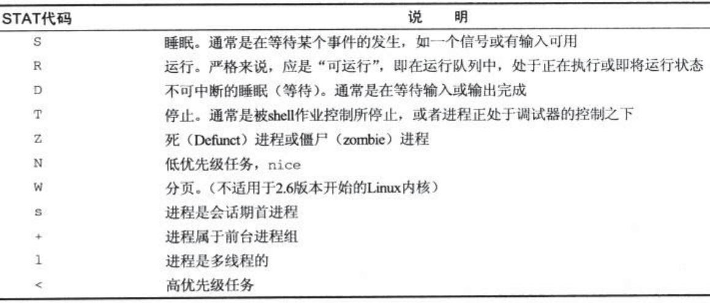

# Linux 进程 和 线程 的基本 编程、通讯 和 例程

*注：【杂记】系列为日常网搜资料的堆砌而积累成之。如有错误恭谢指出。标识为“原创”其实不完全是，只是多引用再整理和加上自己的理解，进行记录备查，大都引自网络，侵删！*

大量参考 100ask、网络文章等资料（参考源均以给出，侵删），这里参考网络文章和官方文档并做多处横向对比，形成系统性 一文全解，给出保姆级别的参考，则避免 同质化（不完全是直接引用，我整理了很好、很漂亮的格式，还为了 句子流畅、整理标点符号 和 补充说明（中文语境的名词混乱、口水话输出等等，你懂的） 做了很多 整理、修改和补充）。

注：[在 Github 上的原版文章日后可能会更新](https://github.com/Staok/ARM-Linux-Study)，但这里不会跟进。[文章的 Gitee 仓库地址，Gitee 访问更流畅](https://gitee.com/staok/ARM-Linux-Study)。

## 查看进程/线程/系统运行状况等的命令

- [主线剧情02-ARM-Linux基础学习记录_Real-Staok的博客-CSDN博客](https://blog.csdn.net/Staokgo/article/details/123693110#t6) 里面的 `Linux Shell` 一节 的 **任务后台执行 / 任务&进程查看** 部分。
- [关于Linux下进程的详解【进程查看与管理】 - AshJo - 博客园 (cnblogs.com)](https://www.cnblogs.com/ashjo009/p/11912563.html)。
- [linux top命令查看内存及多核CPU的使用讲述 - tamatama - 博客园 (cnblogs.com)](https://www.cnblogs.com/tamatama/p/13044402.html)。
- [Linux vmstat命令实战详解_浮生忆梦的博客-CSDN博客_vmstat](https://blog.csdn.net/m0_38110132/article/details/84190319)。
- etc.

## 前置了解和其他

这里仅仅是将我随机看到的放在这里，网搜会有更多/更好的文章，广泛的看看。这里也是本文的参考源之一。

- [进程 & 线程相关知识 - blcblc - 博客园 (cnblogs.com)](https://www.cnblogs.com/charlesblc/p/6135666.html)，基本概念 和其 异同 的介绍。
- [ linux基础——linux进程与线程的区别与联系_yexz的博客-CSDN博客](https://blog.csdn.net/a987073381/article/details/52054875)。
- [操作系统基础知识复习总结_loserChen.的博客-CSDN博客_操作系统基础知识](https://blog.csdn.net/qq_35564813/article/details/80651259)、[操作系统基础_wang德华的博客-CSDN博客](https://blog.csdn.net/weixin_43823756/article/details/108260982)、[操作系统基础知识整理_零分分分分的博客-CSDN博客_操作系统基础知识](https://blog.csdn.net/qq_33399567/article/details/106022913)、[操作系统基础知识总结整理_EasyChill的博客-CSDN博客_操作系统基础知识总结](https://blog.csdn.net/Song_JiangTao/article/details/79670805)。
- etc.

## 一些进程/线程调试经验

设计模式 / 分配策略 相关：

- [【杂记】进程和线程的分配策略_Real-Staok的博客-CSDN博客_资源在进程和线程上如何分配](https://blog.csdn.net/Staokgo/article/details/122829580) 里面的 “启发任务分配的规则” 和 “进程 和 线程 设计经验参考” 一节。
- [从内核角度分析：当linux多线程遭遇Linux多进程 - 知乎 (zhihu.com)](https://zhuanlan.zhihu.com/p/366187163)。
- 一些 线程池 编写经验 [linux基础——经典线程同步问题解析及编程实现_yexz的博客-CSDN博客](https://blog.csdn.net/a987073381/article/details/52081857)。
- 设计模式 [POSIX多线程程序设计（第4章：使用线程的几种方式）_瓦釜苑-CSDN博客_posix多线程程序设计](https://blog.csdn.net/lincoln_2012/article/details/47979675)。
- etc.

调试相关：

- [Linux进程崩溃原调试_guotianqing的博客-CSDN博客](https://blog.csdn.net/guotianqing/article/details/108409878)。
- etc.

## Linux 进程

参考：

- [「linux操作系统」进程的切换与控制·到底有啥关系？ - 知乎 (zhihu.com)](https://zhuanlan.zhihu.com/p/494058976)，[Linux进程解析_deep_explore的博客-CSDN博客](https://blog.csdn.net/deep_explore/article/details/6301044)，[腾讯面试：进程的那些数据结构 - 知乎 (zhihu.com)](https://zhuanlan.zhihu.com/p/470433349)，[如何在Linux下的进行多进程编程（初步） - 知乎 (zhihu.com)](https://zhuanlan.zhihu.com/p/90476128)，[彻底搞定面试官，linux的进程里面的一些细节 - 知乎 (zhihu.com)](https://zhuanlan.zhihu.com/p/478233844)，[操作系统进程的概念，进程的状态及状态转换，进程控制_程小智的博客-CSDN博客_进程的状态及其转换](https://blog.csdn.net/sinat_22055459/article/details/51083036)。
- [Linux 进程详解 - 程序员大本营 (pianshen.com)](https://www.pianshen.com/article/3385597611/)。[Linux进程基础教程详解_Linux_脚本之家 (jb51.net)](https://www.jb51.net/article/111091.htm)。
- [【Linux】Linux进程的创建与管理_Yngz_Miao的博客-CSDN博客_linux 创建进程](https://blog.csdn.net/qq_38410730/article/details/81193118)。
- 《Linux System Prorgrammin》，Linux系统编程 _ 中文版 _ by _ 哈工大（翻译）-第五章-进程管理。
- Linux 操作系统 C 语言编程入门。

### 进程基础概念

> **程序与进程**
>
> 通俗的讲程序是一个包含可以执行代码的文件，是一个静态的文件。而进程是一个开始执行但是还没有结束的程序的实例。就是可执行文 
> 件的具体实现。一个程序可能有许多进程，而每一个进程又可以有许多子进程。

#### 进程状态

> 1. 创建态：进程正在被创建，尚未转到就绪态。
> 2. 就绪态：进程获得了除处理机以外的一切所需资源，一旦得到处理机便可立即运行。
>    - 状态特点：处理机（或者理解为调度器）资源：只缺处理机。资源获得：已获得所需资源。当获得处理机时：立即运行。
>    - 状态转换：就绪态——>运行态：处于就绪态的进程被调度后，获得处理机资源，于是进程由就绪态切换为运行态。
> 3. 运行态：进程正在处理机上运行；对于单处理机，同一时刻只有一个进程处于运行态。
>    - 状态转换：运行态——>就绪态：情况1：处于运行态的进程在时间片用完后，不得不让出处理机，进而转换为就绪态。情况2：在可剥夺的操作系统中，当有更高优先级的进程就绪时，调度程序将正在执行的进程转换为就绪态，让更高优先级的进程执行。
>    - 状态转换：运行态——>阻塞态（主动行为）：进程请求某一资源（如外设）的使用或等待某一事件的发生（如I/O操作的完成）时，它就从运行态转换为阻塞态。进程以系统调用的形式请求操作系统提供服务，这是一种特殊的，由用户态程序调用操作系统内核过程的形式。
> 4. 阻塞态：又称等待态，进程正在等待某一事件而暂停运行/休眠，如等待某资源或IO完成，即使处理机空闲，该进程也不能运行。
>    - 状态特点：处理机（或者理解为调度器）资源：可能缺；也可能不缺。资源获得：等待某资源可用或等待一件事情完成。当获得处理机时：即使处理机空闲，当等待的事情没有完成，仍无法运行。
>    - 状态转换：阻塞态——>就绪态（被动行为，需要其他相关进程的协助）：进程等待的事件到来，如I/O操作结束或中断结束时，中断处理程序必须把相应进程的状态由阻塞态转换为就绪态。
> 5. 终止态：进程正从系统中消失，可能是进程正常结束或其他原因退出运行。
>
> 

对应到 Linux 内核中，各个进程状态的标志：

> - `TASK_RUNNING` 说明进程已经准备好了，就看操作系统给不给分时间片在 CPU 上执行了，进程获得了时间片，就是执行状态，不分配时间片就是就绪状态。代表状态的字段又不用变。
>
>   - 其实 `TASK_RUNING` 这个字段既对应了进程的就绪态又对应了进程的运行态。
>   - 只有在该状态的进程才可能在 CPU上运行。而同 一时刻可能有多个进程处于可执行状态，这些进程的 task_struct结构（进程控制块）被放入对应 CPU的可执行队列中（一个进程最多只能出现在一个 CPU的可执行队列中）。进程调度器的任务就是从各个 CPU的可执行队列中分别选择一个进程在该 CPU 上运行。
>   - 只要可执行队列不为空，其对应的 CPU就不能偷懒，就要执行其中某个进程。一般称此时的 CPU“忙碌”。对应的， CPU“空闲”就是指其对应的可执行队列为空，以致于 CPU无事可做。
>   - 很多操作系统教科书将正在 CPU上执行的进程定义为 RUNNING状态、而将可执行但是尚未被调度执行的进程定义为 READY状态，这两种状态在 linux下统一为 TASK_RUNNING状态。
>
> - `TASK_INTERRUPTIBLE` 和 `TASK_UNINTERRUPTIBLE` 是两种睡眠状态，对应上面的阻塞状态。`TASK_INTERRUPTIBLE` 可以再被信号唤醒，`TASK_UNINTERRUPTIBLE` 不可被信号唤醒。
>
>   - TASK_INTERRUPTIBLE，可中断的睡眠状态。处于这个状态的进程因为等待某某事件的发生（比如等待 socket连接、等待信号量），而被挂起。这些进程的 task_struct结构被放入对应事件的等待队列中。当这些事件发生时（由外部中断触发、或由其他 进程触发），对应的等待队列中的一个或多个进程将被唤醒。通过 ps命令我们会看到，一般情况下，进程列表中的绝大多数进程都处于 TASK_INTERRUPTIBLE状态（除非机器的负载很高）。
>
>   - TASK_UNINTERRUPTIBLE，不可中断的睡眠状态。与 TASK_INTERRUPTIBLE状态类似，进程处于睡眠状态，但是此刻进程是不可中断的。不可中断，指的并不是 CPU不响应外部硬件的中断，而是指进程不响应异步信号。即  kill -9 无法 关掉/杀死 这种进程。TASK_UNINTERRUPTIBLE 状态存在的意义就在于，内核的某些处理流程是不能被打断的。如果响应异步信号，程序的执行流程中就会被插入一段用于处理异步信号的流程（这个插入的流程可能只存在于内核态，也可能延伸到用户态），于是原有的流程就被中断了。
>
>     在进程对某些硬件进行操作时（比如进程调用 read 系统调用对某个设备文件进行读操作，而 read 系统调用最终执行到对应设备驱动的代码，并与对应的物 理设备进行交互），可能需要使用 TASK_UNINTERRUPTIBLE 状态对进程进行保护，以避免进程与设备交互的过程被打断，造成设备陷入不可控的 状态。这种情况下的 TASK_UNINTERRUPTIBLE 状态总是非常短暂的，通过 ps 命令基本上不可能捕捉到。Linux系统中也存在容易捕捉的 TASK_UNINTERRUPTIBLE状态。执行 vfork系统调用后，父进程将进入TASK_UNINTERRUPTIBLE状态，直到子进程调用 exit或 exec。
>
> - `TASK_STOPPED` 是在进程收到 SIGSTOP 以及 SIGTTIN 等信号的状态，你 Linux 进程运行起来按 Ctrl + z 后进程就是这个状态。
>
>   - 向进程 发送一个 SIGSTOP信号，它就会因响应该信号而进入 TASK_STOPPED状态（除非该进程本身处于 TASK_UNINTERRUPTIBLE状态而不响应信号）。（ SIGSTOP与 SIGKILL信号一样，是非常强制的。不允许用户进程通过 signal系列的系统调用重新设置对应的信号处理函数。）
>   - 向进程发送一个 SIGCONT信号，可以让其从 TASK_STOPPED状态恢复到 TASK_RUNNING状态。
>
> - `TASK_TRACED` 是进程被监视的状态。
>
>   - 当进程正在被跟踪时，它处于 TASK_TRACED这个特殊的状态。“正在被跟踪”指的是进程暂停下来，等待跟踪它的进程对它进行操作。比如在 gdb中 对被跟踪的进程下一个断点，进程在断点处停下来的时候就处于 TASK_TRACED状态。而在其他时候，被跟踪的进程还是处于前面提到的那些状态。
>   - TASK_STOPPED和 TASK_TRACED状态判断。对于进程本身来说， TASK_STOPPED和 TASK_TRACED状态很类似，都是表示进程暂停下来。而 TASK_TRACED状态相当于在 TASK_STOPPED之上多了一层保护，处于 TASK_TRACED状态的进程不能响应 SIGCONT信号而 被唤醒。只能等到调试进程通过 ptrace系统调用执行 PTRACE_CONT、 PTRACE_DETACH等操作（通过 ptrace系统调用的参数指定 操作），或调试进程退出，被调试的进程才能恢复 TASK_RUNNING状态。
>
> - `TASK_DEAD` - `EXIT_ZOMBIE`，退出状态，进程成为僵尸进程。`EXIT_DEAD` 是最终状态，进入这个状态代表进程要从系统中删除了`EXIT_ZOMBIE` 是`EXIT_DEAD` 的前一个状态，这个时候进程已经终止，但父进程还没有用 `wait()` 等系统调用来获取他的终止信息，这个状态的进程叫做僵尸进程。这个状态 kill 命令是杀不死的，你们可以想以下应该怎样清楚僵尸进程，以及怎样避免僵尸进程的存在。
>
>   关于 退出 相关的 进程状态（上面四个），更多可详见 [ Linux进程解析_deep_explore的博客-CSDN博客](https://blog.csdn.net/deep_explore/article/details/6301044)。
>
> Linux 进程状态转换示意图：
>
> 
>
> - 系统进程常见的 STAT 代码：
>
>   

就绪队列与阻塞队列：

> 就绪队列：系统中处于就绪状态的进程可能有多个，通常把它们排成一个队列。只要就绪队列不空，CPU就总是可以调度进程运行，保持繁忙，这与就绪进程的数目没有关系；除非就绪队列为空，此时CPU进入等待态，CPU效率下降。
>
> 阻塞队列：系统通常将处于阻塞态的进程也排成一个队列，甚至根据阻塞原因不同，设置多个阻塞队列。

#### 进程的构成

> 引自 [进程的那些数据结构 - 知乎 (zhihu.com)](https://zhuanlan.zhihu.com/p/470433349)，[Linux下的task_struct结构体 - 百度文库 (baidu.com)](https://wenku.baidu.com/view/54f06c3bc6da50e2524de518964bcf84b9d52d9a.html)。
>
> 进程一般由以下几个部分组成：
>
> - **进程控制块（PCB）**：每个进程在创建时， 系统都会为进程创建一个相应的 PCB。PCB 是进程存在的唯一标志。
>
>   - 创建进程实质就是创建进程的 PCB。PCB 要能展示进程身份和关系，标记任务状态，标记权限，帮助任务调度等等。
>
>   - Linux 内核中是把进程和线程统一当作任务来实现的，Linux 内核的 进程控制块 是 `task_struct` 结构体，里面包含有：
>
>     - The identifier of the process (a process identifier , or PID) ;（进程的标识自身的唯一标识符 PID）
>     - Register values for the process including, notably, the program counter and stack pointer values for the process;（进程调度时候退出时间片（保存现场）与进入时间片（恢复现场）时候用到的寄存器值包括栈指针 SP、程序计数器 PC 等等）
>     - The address space for the process;（进程的地址空间）
>     - Priority (in which higher priority process gets first preference. eg., nice value on Unix operating systems);（优先级）
>     - Process accounting information, such as when the process was last run, how much CPU time it has accumulated, etc;
>     - Pointer to the next PCB i.e. pointer to the PCB of the next process to run;
>     - I/O Information (i.e. I/O devices allocated to this process, list of opened files, etc).
>
>   - ```c
>     pid_t pid;    // 展示自己进程的 id
>     pid_t tgid;  // 进程主线程的id
>     struct task_struct *group_leader;  // 指向主线程地址
>     ```
>
>     每个进程都会创建一个主线程，所以如果只是单独一个进程，以及进程默认创建的主线程，那么 `pid` 和 `tgid` 都会是自己。如果是一个进程创建的子线程，那么 `pid` 就是自己的 `id`，`tgid` 就指向进程主线程的 id。
>
>   - ```c
>     struct task_struct __rcu * real_parent;
>     struct task_struct __rcu * parent;   // 指向父进程
>     struct list_head children;   // 父进程的所有子进程都在子进程链表中，这里指向链表的头部。
>     struct list_head sibling;  // 连接兄弟进程
>     ```
>
>     进程是一个树状的结构（使用链表组成的树），除了 0 号进程外，所有的进程都是由父进程创建的，所以对父进程的操作很容易就会影响到子进程。所以进程的数据结构中自然要显示出进程有哪些父子进程以及兄弟进程。
>
> - **程序段**：程序段是进程中能被进程调度程序调度到 CPU 上执行的程序代码段。
>
> - **数据段**：可以是进程对应程序加工的原始数据，也可以是程序执行时产生的中间 结果或结果数据。

#### 进程控制

> 进程控制的主要功能是对系统中的所有进程实施有效的管理，它具有**创建**新进程、**撤销**已有进程、实现进程**状态转换**等功能。简而言之，进程控制就是为了实现进程状态转换。
>
> 一般 进程控制 的 程序段 是 “原子操作” 的，执行过程 期间不允许被中断；它使用 “关中断指令” 和 “开中断指令” 这两个特权指令实现原子性。

#### 进程创建和终止

进程控制之进程创建和终止 相关的概念。

> **引起进程创建的事件**
>
> - 用户登陆：分时系统中，用户登陆成功，系统会为其建立一个新的进程。
> - 作业调度：多道批处理系统中，有新的作业放入内存时，会为其建立一个新的进程。
> - 提供服务：用户向操作系统提出某些请求时，会新建一个进程处理该请求。启动程序执行都会创建一个新进程。
> - 应用请求：由用户进程主动请求创建一个子进程。
>
> **操作系统创建新进程的过程**
>
> 1. Step1：为新进程分配一个唯一的进程标识号，并申请一个空白PCB（PCB是有限的），若PCB申请失败，则创建失败。
> 2. Step2：为进程分配所需资源，如文件、内存、I/O设备和CPU时间等。这些资源从操作系统获得，或从其父进程获得。如果资源不足（如内存），则此时并不是创建失败，而是处于创建态，等待内存资源。
> 3. Step3：初始化PCB，主要包括初始化标志信息、初始化处理机状态信息和初始化处理机控制信息，以及设置进程的优先级等。
> 4. Step4：若进程就绪队列能够接纳新进程，则将新进程插入就绪队列，等待被调度运行。
>
> **父进程创建子进程**
>
> 允许一个进程创建另一个进程，此时创建者称为父进程，被创建的进程称为子进程。子进程可以继承父进程所拥有的资源；当子进程被撤销时，应将其从父进程那里获得的资源归还给父进程；当父进程被撤销时，通常也会同时撤销其所有的子进程。父进程和子进程共享一部分资源，但不能共享虚拟地址空间，在创建子进程时，会为子进程分配资源，如虚拟地址空间等。
>
> 父进程与子进程当然可以并发执行。进程控制块（PCB）是进程存在的唯一标志，每个进程都有自己的PCB。父进程与子进程不能同时使用同一临界资源，临界资源一次只能被一个进程使用（临界资源就是加了锁机制，只能被互斥地访问）。
>
> Linux 系统创建进程都是由已存在的进程创建的（除了0号进程），被创建的进程叫做子进程，创建子进程的进程就做父进程。Linux 进程串起来是一颗树的结构。
>
> **引起进程终止的事件**
>
> - 正常结束：表示进程的任务已完成并准备退出运行。
> - 异常结束：表示进程在运行时，发生了某种异常事件，使程序无法继续运行，如存储区越界、保护错、非法指令、特权指令错、运行超时、算术运算错、I/O故障等。
> - 外界干预：指进程应外界的请求而终止运行，如操作员或操作系统干预、父进程请求和父进程终止。
>
> **操作系统终止进程的过程**
>
> 1. Step1：根据被终止进程的标识符（PID），检索出该进程的PCB，从中读出该进程的状态。
> 2. Step2：若被终止的进程正处于运行态，应立即终止该进程的运行，将处理机资源分配给其他进程。
> 3. Step3：若该进程还有子孙进程，则应当将其所有子孙进程终止。
> 4. Step4：将该进程所拥有的全部资源，或归还给其父进程，或归还给操作系统。
> 5. Step5：该PCB从所在队列中删除。
>
> **查看和释义各个进程**
>
> 我们在 Linux 系统上通过 `ps - ef` 命令查看系统目前的进程。
>
> - UID 就是用户的标识符（通过 root 用户创建的进程 UID 就是 root，如果我自己创建的话就应该是我的用户名。
> - PID 就表示的是当前进程的 id。
> - PPID 就表示当前进程的父进程 id。
>
> 通过 0 号进程创建 1 号进程和 2 号进程，然后通过 1 号进程去创建用户态进程，再通过 2 号进程创建内核态进程，就生成了 Linux 进程树。
>
> - `0号进程`：在内核初始化的过程中，会先通过指令 struct task_struct init_task = INIT_TASK(init_task) 创建 0 号进程。这是唯一一个没有通过 fork 或者 kernel_thread 产生的进程。是进程列表的第一个。但是这个进程不是实际意义上的进程，类似与链表头。所以虽然 0 号进程是在内核态创建的，但不能说 0 号进程是内核态的第一个进程，反而要说 2 号进程是内核态的第一个进程。
> - `1号进程`：通过调用指令 kernel_thread(kernel_init, NULL, CLONE_FS) 从内核态切换到用户态来创建的，1号进程是所有用户态的祖先。**进程1也叫做init进程**，它是内核初始化时创建的第2个内核线程，其运行代码为内核函数init()。只要系统不结束，init进程就永不中止，它负责创建和监控操作系统外层所有进程的活动。
> - `2号进程`：通过调用指令 kernel_thread(kthreadd, NULL, ClONE_FS | CLONE_FILES) 来创建，2号进程负责所有内核态的进程的调度和管理，是内核态所有进程的祖先。（注意，内核态不区分线程和进程，所以说进程和线程都可以，都是任务）。
>
> `pstree` 命令来显示整个进程树，[ Linux基础命令---显示进程树pstree_weixin_34023863的博客-CSDN博客](https://blog.csdn.net/weixin_34023863/article/details/89573246)。

### 进程控制相关 API

*p.s 进程控制中的状态转换 相关 API，用户很少用到，在此不提。*

一般来说，这些内核标准 API，在执行出错（可能是资源不够、权限不够等等）会返回负值（比如 -1），并设置 errno 值。

#### 父进程创建子进程 fork()

> 在 Linux 中，为了创建一个子进程，父进程用系统调用 fork() 来创建子进程。fork() 其实就是把父进程复制了一份（子进程有自己的特性，比如标识、状态、数据空间（堆栈区和数据区）等（这些是子进程独有的）；子进程和父进程共同使用程序代码、共用时间片（这些是共有的）等）。
>
> 通常在调用fork函数之后，程序会设计一个if选择结构。当PID等于0时，说明该进程为子进程，那么让它执行某些指令，比如说使用exec库函数(library function)读取另一个程序文件，并在当前的进程空间执行 (这实际上是我们使用fork的一大目的: 为某一程序创建进程)；而当PID为一个正整数时，说明为父进程，则执行另外一些指令。由此，就可以在子进程建立之后，让它执行与父进程不同的功能。
>
> `pid_t fork();`，**fork() 对子进程 返回 0，对父进程 返回 子进程的 ID，返回 小于 0 值为出错。**
>
> ```c
> #include<stdio.h>
> #include<unistd.h>
> 
> int main()
> {
>      int p_num = 0;
>      int c_num = 0;
>      int pid = fork();
>      if(pid == 0) // 返回的pid为0为子进程
>      {
>            c_num++;
>      }
>      else
>      {
>            p_num++; // 返回的pid大于0为父进程
>      }
>      printf("p_num=%d, c_num=%d\n",p_num,c_num);
>      printf("pid=%d\n",pid);
>      return 0;
> }
> 
> // 运行结果如下所示
> p_num=1, c_num=0
> pid=36101
> p_num=0, c_num=1
> pid=0
> ```
>
> 子进程总可以查询自己的 PPID 来知道自己的父进程是谁，这样，一对父进程和子进程就可以随时查询对方。

其它：

- fork() 的 写时复制 概念，可网搜了解。即 用到某个资源时候才会复制，不需要修改的资源不会复制，尽量推迟高系统消耗的操作直到必要时才会执行。
- vfork() 不常用，实现可能不会完全没问题，概念可网搜来了解。

#### 进程分离 exec 族函数

> 通过 fork 后，子进程并没有和父进程独立开，用的是相同的代码。另外还有一个问题时，这个时候子进程的时间片是和父进程一分为二来共享的。为了彻底将父进程和子进程分离开来，就要用到一个系统调用 exec 族函数，**这是读取另一个程序文件，并在当前的进程空间执行。当我们创建了一个进程之后，通常将子进程替换成新的进程映象，这可以用 exec 系列的函数来进行，且新进程与原进程有相同的 PID。**
>
> 参考 [Linux下exec函数族(execl,execv,execle,execve,execlp,execvp,fexecve)的使用和对比_leumber的博客-CSDN博客_exec和execv](https://blog.csdn.net/leumber/article/details/71514833)，[exec系列函数（execl,execlp,execle,execv,execvp)使用_gauss的博客-CSDN博客](https://blog.csdn.net/mathlmx/article/details/45298975) 这个里面有每个 API 的使用例子，[exec和execv区别 - CSDN](https://www.csdn.net/tags/NtjaEg0sMjI2MTktYmxvZwO0O0OO0O0O.html)。
>
> - 各个 API 原型：\#include <unistd.h>
>
>   int execl(const char *path, const char *arg, ...);
>
>   int execlp(const char *file, const char *arg, ...);
>
>   int execle(const char *path, const char *arg, ..., char * const envp[]);
>
>   int execv(const char *path, char *const argv[]);
>
>   int execvp(const char *file, char *const argv[]);
>
>   int execve(const char *path, char *const argv[], char *const envp[]);
>
>   传入参数：path 参数表示你要启动程序的名称包括路径名；file 参数表示 要启动的 程序 / 文件 的文件名（系统从环境变量 PATH 里面寻找该程序，因此不用带路径全名）；arg 参数表示启动程序所带的参数，一般第一个参数为要执行命令名，不是带路径且arg必须以NULL结束；
>
>   返回值：成功返回0，失败返回-1。
>
> - exec 族函数名中 l 表示列表 list，v 表示数组。
>
>   - execl、execlp、execle 将新程序的每个命令行参数都以一个单独的参数，这种参数列表以NULL结尾。
>   - execv、execvp、execve 和 fexecve 则应先构造一个指向各参数的指针数组，然后将该数组地址作为参数传入。
>
> - exec 族函数名中 p 结尾表示函数第一个参数取 filename。
>
>   - execlp、execvp与其他函数不同就是第一个参数取filename，用 PATH 环境变量寻找可执行文件，filename 既可以是文件路径加程序名，也可以是PATH环境变量下的 /sbin: /bin: /usr/bin: 即shell命令。
>
> - exec 族函数名中 e 结尾表示可以传递环境表信息 environ。
>
>   - execle、execve、fexecve 可以传递一个指向环境字符串指针数组的指针。
>
> ```c
> // process.c
> #include<stdio.h>
> #include<unistd.h>
> 
> int main()
> {
>     int pid = fork();
>     if(pid == 0)
>     {
>         execv("./test.o",NULL);  // test.o是一个经过编译的c语言文件，这里记得要放test.o的绝对路径
>     }
>     printf("This is parent process\n");
>     return 0;
> }
> 
> // test.c
> #include<stdio.h>
> int main()
> {
>     printf("This is child process");
>     return 0;
> }
> 
> // 运行结果如下所示
> This is parent process
> This is child process
> ```
>
> **exec 族函数的使用例子**
>
> ```c
> /* exec.c */
> #include <unistd.h>
> main()
> {
> 	char *envp[]={"PATH=/tmp","USER=lei","STATUS=testing",NULL}; /* 数组 必须以 NULL 做结尾 */
> 	char *argv_execv[]={"echo", "excuted by execv",	NULL};
> 	char *argv_execvp[]={"echo", "executed by execvp", NULL};
> 	char *argv_execve[]={"env", NULL};
> 	if(fork()==0)
> 		if(execl("/bin/echo", "echo", "executed by execl", NULL)<0) /* 路径全名，传入参数写全，以NULL结尾 */
> 			perror("Err on execl");
> 	if(fork()==0)
> 		if(execlp("echo", "echo", "executed by execlp", NULL)<0) /* 只写执行程序的文件名，系统会去 PATH 环境变量寻找 */
> 			perror("Err on execlp");
> 	if(fork()==0)
> 		if(execle("/usr/bin/env", "env", NULL, envp)<0) /* 可传入环境变量 */
> 			perror("Err on execle");
> 	if(fork()==0)
> 		if(execv("/bin/echo", argv_execv)<0) /* 带 v 的就是 传入参数 以 指针数据（字符串数据）传入，其它与上面的 API 一样 */
> 			perror("Err on execv");
> 	if(fork()==0)
> 		if(execvp("echo", argv_execvp)<0)
> 			perror("Err on execvp");
> 	if(fork()==0)
> 		if(execve("/usr/bin/env", argv_execve, envp)<0)
> 			perror("Err on execve");
> }
> 
> /* 执行 ./exec 后返回：
> executed by execl
> PATH=/tmp
> USER=lei
> STATUS=testing
> executed by execlp
> excuted by execv
> executed by execvp
> PATH=/tmp
> USER=lei
> STATUS=testing
> */
> ```
>
> exec 族函数 的常见的错误返回（exec 返回 -1，并设置 errno 为以下的值）： 
>
> - 找不到文件或路径，此时errno被设置为ENOENT；
> - 数组argv和envp忘记用NULL结束，此时errno被设置为EFAULT；
> - 没有对要执行文件的运行权限，此时errno被设置为EACCES。
> - 等等，有很多种类型的错误返回。
>
> 更多要注意的地方：
>
> - 实际操作时， 一般在 调用 exec 函数之前 关闭所有已经打开的文件。也可以通过 fcntl() 让内核去完成。

#### 进程的退出 return/exit()

参考 [进程的几种退出机制_Leon_George的博客-CSDN博客](https://blog.csdn.net/liangzc1124/article/details/105005936)，[操作系统 — 进程的退出(exit)_Dawn_sf的博客-CSDN博客_exit 进程退出](https://blog.csdn.net/Dawn_sf/article/details/78827323)，[ exit函数及与return的区别_panda19881的博客-CSDN博客](https://blog.csdn.net/panda19881/article/details/6162689)。

> **几种退出方式**
>
> - 正常退出
>   1. 在main()函数中执行return（renturn执行完后把控制权交给调用函数）。
>   2. 调用exit()函数（exit执行完后把控制权交给系统）。
>   3. 调用_exit()函数（同上）。
> - 异常退出
>   1. 调用abort函数（exit是正常终止进程，abort是异常终止，突出在异常）。
>   2. 进程收到某个信号，而该信号使程序终止。
>
> **`exit()` 与 `_exit()`区别**： `exit()` 函数是在`_exit()`函数之上的一个封装，其会调用`_exit()`，并在调用之前先刷新流（stdin, stdout, stderr ...），即 把文件缓冲区的内容写回文件。exit在头文件stdlib.h中声明，而_exit()声明在头文件unistd.h中声明。使用 `exit()` 更安全。exit中的参数exit_code为０代表进程正常终止（即 `exit(0);`），若为其他值表示程序执行过程中有错误发生。
>
> **`exit` 与 `return` 区别**：如果return 或者exit出现在main函数中，两者的作用是一样（即 `return 0;` 和 `exit(0);` 一样）。如果return出现在子程序中表示返回（仅意味着 退出/结束 其所在的函数或子进程），而exit出现在子进程中表示终止子进程。
>
>   但不管是哪种退出方式，系统最终都会执行内核中的某一代码。这段代码用来关闭进程所用已打开的文件描述符，释放它所占用的内存和其他资源。
>
> **父子进程终止的先后顺序不同会产生不同的结果**
>
> - 子进程先于父进程终止，而父进程调用了wait函数：**子进程退出并被父进程回收（好）**
>
> 此时父进程会等待子进程结束。
>
> - 父进程先于子进程终止：**子进程变孤儿进程（中）**
>
> 此种情况就是我们前面所用的孤儿进程。当父进程先退出时，系统会让init进程接管子进程 。孤儿进程会被过继给init进程，init进程也就成了该进程的父进程。init进程负责该子进程终结时调用wait函数。init进程会在有子进程退出时调用wait函数。
>
> - 子进程先于父进程终止，而父进程又没有调用wait函数：**子进程变僵死进程（坏）**
>
>
> 此种情况子进程进入僵死状态，并且会一直保持下去直到系统重启。子进程处于僵死状态时，内核只保存进程的一些必要信息以备父进程所需。此时子进程始终占有着资源，同时也减少了系统可以创建的最大进程数。
>
> 因此要尽量避免这种情况发生，否则 僵死进程 不但占用着资源，而且可能越积累越多。一个糟糕的程序也完全可能造成子进程的退出信息滞留在内核中的状况（父进程不对子进程调用wait函数），这样的情况下，子进程成为僵尸（zombie）进程。当大量僵尸进程积累时，内存空间会被挤占。 
>
> 僵死状态：一个已经终止、但是其父进程尚未对其进行善后处理(获取终止子进程的有关信息，释放它仍占有的资源)的进程被称为僵死进程(zombie)。
>
> 僵死进程 和 孤儿进程 的释义：
>
> 

总结：这三种进程退出，**最好情况是** 父进程调用 wait 正常回收 终止的子进程，**其次是** 父进程提前终止 / 子进程称为孤儿进程 / 子进程被过继给 init 进程 / init进程会在有子进程退出时调用wait函数，**最坏是** 父进程没有调用 wait 而子进程退出 / 子进程成为 僵死进程。

注册 进程退出时 调用的函数：`#include <stdlib.h> int atexit (void (*function)(void));` ，注册的函数会在 调用 `exit();` 或 从 main 退出 或 收到终止进程的信号（SIGTERM 或 SIGKILL）时候被调用一次。注册的函数内不能再调用 `exit()`，否则会引起无限递归。

#### 进程的阻塞 wait()

> 处于运行状态的进程，在其运行过程中期待某一事件的发生，如等待键盘的输入、等待磁盘数据传输完成、等待其他进程发送信息，当被等待的时间未发生时，由进程自己执行阻塞原语，使自己的运行状态变为阻塞态。

即 休眠/阻塞 来 **等待 信号（signal）** 或 **父进程等待子进程退出（再回收其资源）**。 

*p.s 对于 等待 信号（signal）在 下面 `进程间通讯（IPC）` 里的 `信号（Signal）` 一节介绍。这里只讨论 父进程等待子进程退出（再回收其资源）。*

> 引用 [exec和execv区别 - CSDN](https://www.csdn.net/tags/NtjaEg0sMjI2MTktYmxvZwO0O0OO0O0O.html)（回过头意识到，我就相当于把格式整理地更漂亮了一遍。。）。
>
> **父进程 wait 阻塞来等待子进程退出（再回收其资源）**
>
> 子进程终止时，内核会向其父进程 发送 SIGCHILD 信号。
>
> 当子进程终结时，它会通知父进程，并清空自己所占据的内存，并在内核里留下自己的退出信息(exit code，如果顺利运行，为0；如果有错误或异常状况，为>0的整数)。父进程在得知子进程终结时，有责任对该子进程使用wait系统调用（否则子进程就成了僵死进程，应当尽量避免）。这个wait函数能从内核中取出子进程的退出信息，并清空该信息在内核中所占据的空间。
>
> ```c
> #include <sys/types.h> /* 提供类型pid_t的定义 */ 
> #include <sys/wait.h> 
> pid_t wait(int *status);
> ```
>
> 进程一旦调用了wait，就立即阻塞自己，由wait自动分析是否当前进程的某个子进程已经退出，如果让它找到了这样一个已经变成僵尸的子进程，wait就会收集这个子进程的信息，并把它彻底销毁后返回；如果没有找到这样一个子进程，wait就会一直阻塞在这里，直到有一个出现为止。
>
> 参数status用来保存被收集进程退出时的一些状态，它是一个指向int类型的指针。但如果我们对这个子进程是如何dump掉的毫不在意，只想把这个僵尸进程消灭掉，我们就可以设定这个参数为NULL。
>
> 如果成功，wait会返回被收集的子进程的进程ID，如果调用进程没有子进程，调用就会失败，此时wait返回-1，同时errno被置为ECHILD。
>
> 例子：
>
> ```c
> /* wait1.c */
> #include <sys/types.h>
> #include <sys/wait.h>
> #include <unistd.h>
> #include <stdlib.h>
> main()
> {
> 	pid_t pc, pr;
> 	pc = fork();
> 	if(pc < 0)            /* 如果出错 */
> 		printf("error ocurred!\n");
> 	else if(pc == 0){    /* 如果是子进程 */ 
> 		printf("This is child process with pid of %d\n",getpid());
> 		sleep(10);       /* 睡眠10秒钟 */
> 	}
> 	else{                 /* 如果是父进程 */
> 		pr = wait(NULL); /* 在这里等待子进程的退出，并不在意其 exit 退出返回值 */
> 		printf("I catched a child process with pid of %d\n"),pr);
> 	}
> 	exit(0);
> }
> ```
>
> 对 退出返回值做进一步分析的宏：
>
> - WIFEXITED(status) 这个宏用来指出子进程是否为正常退出的，如果是，它会返回一个非零值。（请注意，虽然名字一样，这里的参数status并不同于wait唯一的参数--指向整数的指针status，而是那个指针所指向的整数） 
> - WEXITSTATUS(status) 当WIFEXITED返回非零值时，我们可以用这个宏来提取子进程的返回值，如果子进程调用exit(5)退出WEXITSTATUS(status)就会返回5；如果子进程调用exit(7)，WEXITSTATUS(status)就会返回7。请注意，如果进程不是正常退出的，也就是说，WIFEXITED返回0，这个值就毫无意义。
>
> 另一篇文章再讲一遍：
>
> `pid_t wait(int *status);`，wait 系统调用会使父进程阻塞直到一个子进程结束或者是父进程接受到了一个信号。如果没有父进程没有子进程或者他的子进程已经结束了 wait 回立即返回。成功时(因一个子进 程结束)wait 将返回子进程的 ID，否则返回-1，并设置全局变量 errno。status 是子进程的 退出状态。子进程调用 exit / _exit 或者是 return 来设置这个值。为了得到这个值 Linux 定 义了几个宏来测试这个返回值。
>
> 另一篇文章具体讲几个宏的区别：
>
> ```c
> #include <sys/wait.h>
> int WIFEXITED (status);
> int WIFSIGNALED (status);
> int WIFSTOPPED (status);
> int WIFCONTINUED (status);
> int WEXITSTATUS (status);
> int WTERMSIG (status);
> int WSTOPSIG (status);
> int WCOREDUMP (status);
> ```
>
> 
>
> **waitpid 阻塞等待特定 pid 的子进程退出**
>
> ```c
> #include <sys/types.h> /* 提供类型pid_t的定义 */
> #include <sys/wait.h>
> pid_t waitpid(pid_t pid,int *status,int options);
> ```
>
> waitpid() 参数说明：
>
> - pid：
>
>   pid>0时，只等待进程ID等于pid的子进程，不管其它已经有多少子进程运行结束退出了，只要指定的子进程还没有结束，waitpid就会一直等下去。
>
>   pid=-1时，等待任何一个子进程退出，没有任何限制，此时waitpid和wait的作用一模一样。
>
>   pid=0时，等待同一个进程组中的任何子进程，如果子进程已经加入了别的进程组，waitpid不会对它做任何理睬。
>
>   pid<-1时，等待一个指定进程组中的任何子进程，这个进程组的ID等于pid的绝对值。
>
> - status：承接子进程的 exit 退出返回值，不用时填 NULL。
>
> - options：options提供了一些额外的选项来控制waitpid，目前在Linux中只支持WNOHANG和WUNTRACED两个选项，这是两个常数，可以用 "|" 运算符把它们连接起来使用，如果我们不想使用它们，也可以把options设为0（不用时设为 0）。
>
>   WNOHANG：即使没有子进程退出，它也会立即返回，不会像wait那样永远等下去。
>
>   WUNTRACED：涉及到一些跟踪调试方面的知识，加之极少用到，有兴趣的读者可以自行查阅相关材料。
>
> - 返回值：
>
>   waitpid的返回值比wait稍微复杂一些，一共有3种情况： 
>
>   1. 当正常返回的时候，waitpid返回收集到的子进程的进程ID；
>   2. 如果设置了选项WNOHANG，而调用中waitpid发现没有已退出的子进程可收集，则返回0；
>   3. 如果调用中出错，则返回-1，这时errno会被设置成相应的值以指示错误所在；
>
>   当pid所指示的子进程不存在，或此进程存在，但不是调用进程的子进程，waitpid就会出错返回，这时errno被设置为ECHILD。
>
>   子进程的结束状态返回后存于status，底下有几个宏可判别结束情况：
>
>   - WIFEXITED(status)如果子进程正常结束则为非0值。
>   - WEXITSTATUS(status)取得子进程exit()返回的结束代码，一般会先用WIFEXITED 来判断是否正常结束才能使用此宏。
>   - WIFSIGNALED(status)如果子进程是因为信号而结束则此宏值为真。
>   - WTERMSIG(status)取得子进程因信号而中止的信号代码，一般会先用WIFSIGNALED 来判断后才使用此宏。
>   - WIFSTOPPED(status)如果子进程处于暂停执行情况则此宏值为真。一般只有使用WUNTRACED 时才会有此情况。
>   - WSTOPSIG(status)取得引发子进程暂停的信号代码。

#### 其它 API

头文件：

```c
#include <unistd.h>;
#include <pwd.h>;
#include <sys/types.h>;
```

- `pid_t getpid(void);`，得到当前进程 pid。

  `pid_t getppid(void);`，得到当前进程的父进程的 pid。

- 进程的实际用户、有效用户相关概念：
  
  
  
- 改变实际用户 API：
  
  
  
- 改变有效用户 API：
  
  
  
- 得到用户 ID：
  
  `uid_t getuid(void);`，`uid_t geteuid(void);`，分别得到进程的所有者用户的 ID 和 有效用户 ID。
  `gid_t getgid(void);`，`git_t getegid(void);`，分别得到组 ID 和有效组 ID。
  
- 得到用户的更多信息：

  ```c
  struct passwd { /* 这个结构体在 types.h 里面定义 */
      char *pw_name; /* 登录名称 */ 
      char *pw_passwd; /* 登录口令 */ 
      uid_t pw_uid; /* 用户 ID */ 
      gid_t pw_gid; /* 用户组 ID */ 
      char *pw_gecos; /* 用户的真名 */ 
      char *pw_dir; /* 用户的目录 */ 
      char *pw_shell; /* 用户的 SHELL */ 
  }; 
  struct passwd *getpwuid(uid_t uid); /* 返回 用户 ID 为 uid 的 用户信息的 struct passwd 结构体指针*/
  ```

- `sleep(x);`，阻塞/延时 x 秒时间。

- strerror(errno)，返回一个指定的错误号的错误信息的字符串。

- etc.

### 系统调用 API

参考：用时现查

- [如何在Linux下的进行多进程编程（初步） - 知乎 (zhihu.com)](https://zhuanlan.zhihu.com/p/90476128)。
- [Linux 下系统调用的三种方法_海风林影的博客-CSDN博客](https://blog.csdn.net/hazir/article/details/11894427)。
- [ linux系统调用(持续更新....)_tiramisu_L的博客-CSDN博客](https://blog.csdn.net/tiramisu_L/article/details/106393065)。

通过 glibc 提供的库函数、使用 syscall 直接调用、通过 int 指令陷入；popen() 函数、fgets() 函数、system() 函数、strstr() 函数。

> system（）函数先调用fork（），然后再调用exec（）来执行用户的登录shell，通过它来查找可执行文件的命令并分析参数，最后它么使用wait（）函数族之一来等待子进程的结束。函数popen（）和函数system（）相似，不同的是它调用pipe（）函数创建一个管道，通过它来完成程序的标准输入和标准输出。**这两个函数是为那些不太勤快的程序员设计的，在效率和安全方面都有相当的缺陷，在可能的情况下，应该尽量避免。**

### 创建守护进程

参考：用时现查

- [Linux应用程序中出现两次fork的解释_leng_que的博客-CSDN博客_linux 两次fork](https://blog.csdn.net/leng_que/article/details/44084237)，如果一个进程fork一个子进程，但不要它等待子进程终止，也不希望子进程处于僵尸状态直到父进程终止，实现这一要求的技巧是调用fork两次。

- [【Linux】如何创建daemon进程&fork一次和fork两次有什么区别_pointer_y的博客-CSDN博客](https://blog.csdn.net/pointer_y/article/details/58147568)。

  守护进程 它运行在后台，很重要，Linux下大多数服务器就是用守护进程实现的。因为它独立于终端运行，也就是说它的运行不受当前登录或者注销的影响，自成会话，周期性的执行某项任务或者等待处理某些事件。

  创建守护进程：法1：两次 fork()；法2：调用 daemon() 函数来创建。

- [守护进程中fork一次与两次的区别_Number_0_0的博客-CSDN博客](https://blog.csdn.net/Number_0_0/article/details/71526101)。

- [创建守护进程为什么要fork两次_TerryZjl的博客-CSDN博客_fork创建守护进程](https://blog.csdn.net/dream_1996/article/details/73467969)。

- etc.

> 创建守护进程 即 编写一个常驻内存的程序。
>
> 对于 在 shell 中启动一个程序，把一个程序放到后台去执行：我们只要在命令后面加上 `&` 符号，SHELL 就会把我们的 程序放到后台去运行的。
>
> 对于编写程序：这里是 一次 fork() 的方法（父进程终止，子进程进入后台），还有两次 fork() 的方法（父进程运行，子进程终止，孙进程进入后台）
>
> 后台进程的创建思想：首先父进程创建一个子进程，然后子进程杀死父进程，这样子进程成为孤儿进程 / 被过继给 init 进程 / 成为后台任务，任务处理的工作由子进程来处理（终止父进程：`kill(getppid(),SIGTERM);`）。

暂 总结有四种常用方法：

- shell 中启动一个程序 最后 加 `&` 标识符 将其放入后台执行。
- 一次 fork() 的方法（父进程终止，子进程进入后台）。
- 两次 fork() 的方法（父进程运行，子进程终止，孙进程进入后台）。
- 使用 daemon() 函数，`int daemon (int nochdir, int noclose);`，数：nochdir 非 0 表示不会将工作目录改为根目录，noclose 非 0 表示不会关闭所有打开的文件描述符，通常均设置为 0，成功则返回 0，失败返回 -1 并设置 errno 值。

### 高级进程管理

可参考：

- 《Linux System Prorgrammin》。
- Linux系统编程 _ 中文版 _ by _ 哈工大（翻译）。
- [Linux 高级进程管理_Arrow的博客-CSDN博客](https://blog.csdn.net/MyArrow/article/details/8940470)。
- .etc

内容包括：

- 进程调度。
- 让出处理器。
- 进程优先级。
- 处理器亲和度（讨论多进程在多处理器间的 平衡/均衡 问题）。
- 实时系统（Linux 的一些实时性的支持，主要包括设置调度策略、设置优先级等）。
- 资源限制。

参考专业书即可，用时现查。进程的高级编程 比较专业了，看来很吃对系统的理解和经验等等。

### 使用这些 API 的例程

暂略。

### 进程间通讯（IPC）

参考 / 引用：

- [如何在Linux下的进行多进程编程（初步） - 知乎 (zhihu.com)](https://zhuanlan.zhihu.com/p/90476128)。[浅析进程间通信的几种方式（含实例源码） - 知乎 (zhihu.com)](https://zhuanlan.zhihu.com/p/94856678)。
- [linux基础——linux进程间通信（IPC）机制总结_千里之行，始于足下-CSDN博客](https://blog.csdn.net/a987073381/article/details/52006729)。
- [Linux IPC总结（全）_xuexingyang的博客-CSDN博客_linuxipc](https://blog.csdn.net/dxdxsmy/article/details/6653189)。
- [Linux进程间通信-详解(经典)_linux进程间通信,linux进程间通信-硬件开发文档类资源-CSDN文库](https://download.csdn.net/download/jmq_0000/3554996)。
- [Linux进程间通信之管道(pipe)、命名管道(FIFO)与信号(Signal) - as_ - 博客园 (cnblogs.com)](https://www.cnblogs.com/biyeymyhjob/archive/2012/11/03/2751593.html)。
- [Linux-应用编程-学习总结（3）：进程间通信（上）_努力学习的花椰菜的博客-CSDN博客](https://blog.csdn.net/jack123345667/article/details/107549086)。

最初的 UNIX 进程间通信（IPC：InterProcess Communication）方式：包括管道(PIPE)，有名管道(FIFO)，和信号(Signal)；System V 进程通信方式：包括信号量(Semaphore)，消息队列(Message Queue)，和共享内存(Shared Memory)。这两种都是早期 UNIX 的 IPC，还有 套接字 和 内存映射，这基本的 八种方式，Linux 则都继承了下来。

**总结起来：管道、命名管道、信号、信号量、消息队列、共享内存、内存映射 和 套接字。**

### UNIX IPC

#### 管道（Pipe）

管道是一种半双工的通信方式，是内核的一段缓冲区，数据只能单向流动，一端写和一端读，而且只能在具有亲缘关系(父子进程)的进程间使用。另外管道传送的是无格式的字节流，并且管道缓冲区的大小是有限的（管道缓冲区存在于内存中，在管道创建时，为缓冲区分配一个页面大小）。

**半双工**（双向通讯，同一时刻只能有一方发和一方收）；**用于父子、兄弟进程之间通讯**（你看的下去这男权社会的命名方式吗？不如我们揭竿而起，都用 “亲子进程”、“同辈进程” 来叫吧！），管道也叫 无名管道 或 匿名管道；用于任意两个进程之间通讯的管道叫 有名管道。

使用 pipe() 函数 创建一块用于管道通讯的 缓冲区，该函数 会返回 两个文件描述符 分别为 “读入文件描述符” 和 “写入文件描述符”，分别指向 该缓冲区 的 输入端/读取端 和 输出端/写入端，然后两个 有亲缘关系的进程 一个 用 write() 对 “写入文件描述符” 写入数据 另一个用 read() 对 “读入文件描述符” 读取数据即可。

```c
#include <unistd.h>
int pipe(int pipefd[2]);
/* 参数 pipefd 数组，需要传入 两个文件描述符，pipefd[0] 为读取用的，pipefd[1] 为写入用的 */
```

> 调用pipe函数时在内核中开辟一块缓冲区用于通信，它有一个读端，一个写端。pipefd[0]指向管道的读端，pipefd[1]指向管道的写端。所以管道在用户程序看起来就像一个打开的文件，通过read(pipefd[0])或者write(pipefd[1])向这个文件读写数据，其实是在读写内核缓冲区。
>
> **操作流程**
>
> 1. 父进程（作者注：这里要改称 “双亲进程”，树结构 中的 “父节点” 要改为 “双亲结点”！！！）调用pipe开辟管道，得到两个文件描述符指向管道的两端。
> 2. 父进程（作者注：啊啊啊）调用fork创建子进程，那么子进程也有两个文件描述符指向同一管道。
> 3. 以父进程（作者注：后面我不管了）向子进程发送数据为例：父进程关闭管道读端，子进程关闭管道写端。父进程可以往管道里写，子进程可以从管道里读。管道是用环形队列实现的，数据从写端流入从读端流出，这样就实现了进程间通信。
>
> pipe 通讯 例子：
>
> 
>
> pipe()函数返回的是文件描述符(file descriptor)，因此只能使用底层的read()和write()系统调用来访问。
>
> **管道读写规则**
>
> 当没有数据可读时
>
> - O_NONBLOCK disable：read调用阻塞，即进程暂停执行，一直等到有数据来到为止。
> - O_NONBLOCK enable：read调用返回-1，errno值为EAGAIN。
>
> 当管道满的时候
>
> - O_NONBLOCK disable： write调用阻塞，直到有进程读走数据。
> - O_NONBLOCK enable：调用返回-1，errno值为EAGAIN。
>
> 管道出现的四种特殊情况
>
> 1. 写端关闭，读端不关闭：那么管道中剩余的数据都被读取后,再次read会返回0,就像读到文件末尾一样。
>
>    如果所有管道写端对应的文件描述符被关闭，则read返回0。
>
> 2. 写端不关闭，但是也不写数据，读端不关闭：此时管道中剩余的数据都被读取之后再次read会被阻塞，直到管道中有数据可读了才重新读取数据并返回。
>
> 3. 读端关闭，写端不关闭：此时该进程会收到信号SIGPIPE，通常会导致进程异常终止。
>
>    如果所有管道读端对应的文件描述符被关闭，则write操作会产生信号SIGPIPE。
>
> 4. 读端不关闭，但是也不读取数据，写端不关闭：此时当写端被写满之后再次write会阻塞，直到管道中有空位置了才会写入数据并重新返回。
>
> 写入数据量的情况
>
> - 当要写入的数据量不大于PIPE_BUF（Posix.1要求PIPE_BUF至少 512字节）时，linux将保证写入的原子性。
> - 当要写入的数据量大于PIPE_BUF时，linux将不再保证写入的原子性。
>
> **使用管道的缺点**
>
> 1. 两个进程通过一个管道只能实现单向通信，如果想双向通信必须再重新创建一个管道或者使用sockpair才可以解决这类问题。
> 2. 只能用于具有亲缘关系的进程间通信，例如父子，兄弟进程。

#### 命名管道（FIFO）

有名管道也是**半双工**通信的，但是它相比较于 管道/无名管道/匿名管道 来说 **允许无亲缘关系进程间的通信**。命名管道 也有叫 有名管道 或 实名管道（在中文语境下，仅我看见的，现在 Pipe 和 FIFO 这两个东西总共就有六个名字了啊）。

参考：[Linux进程间通信之管道(pipe)、命名管道(FIFO)与信号(Signal) - as_ - 博客园 (cnblogs.com)](https://www.cnblogs.com/biyeymyhjob/archive/2012/11/03/2751593.html)，[Linux进程通信：命名管道FIFO小结_Mr_John_Liang的博客-CSDN博客](https://blog.csdn.net/liangzhao_jay/article/details/47109073)。

命名管道 FIFO 详细的参考：[【Linux】进程间通信-命名管道FIFO_编程学习指南的博客-CSDN博客_命名管道fifo](https://blog.csdn.net/xiajun07061225/article/details/8471777)。

> FIFO只是借用了文件系统(file system,命名管道是一种特殊类型的文件，因为Linux中所有事物都是文件，它在文件系统中以文件名的形式存在。)来为管道命名。写模式的进程向FIFO文件中写入，而读模式的进程从FIFO文件中读出。当删除FIFO文件时，管道连接也随之消失。FIFO的好处在于我们可以通过文件的路径来识别管道，从而让没有亲缘关系的进程之间建立连接。

```c
#include <sys/types.h>
#include <sys/stat.h>
int mkfifo(const char *filename, mode_t mode);
int mknode(const char *filename, mode_t mode | S_IFIFO, (dev_t) 0 );
/* 其中pathname是被创建的文件名称（该文件必须不存在），mode表示将在该文件上设置的权限位和将被创建的文件类型（指明其读写权限），dev是当创建设备特殊文件时使用的一个值。因此，对于先进先出文件它的值为0。 */
```

**操作流程**

1. 可以先 使用 access() 先来判断 目标的 命名管道 FIFO 文件是否存在。如果存在则可以跳到第三步，如果不存在则跳到第二步。
2. 使用 mkfifo() 创建一个 命名管道 FIFO 文件，mode 参数使用 `0777`。如果创建的 FIFO 文件是 `/tmp/my_fifo`，则可以使用命令行 `ls -lF /tmp/my_fifo` 看到该文件。
3. 然后 使用 open() （或者 fopen() 这个高级封装）再去打开这个 FIFO 文件（传入标志有 O_RDONLY、O_WRONLY 和 O_NONBLOCK，单独或组合，关于传入标志在 后面 `关于 FIFO 读写时候的阻塞问题` 会详细讨论）。因为 FIFO 是文件，因此使用前必须先打开。
4. 然后再使用 read/write （或者 fread/fwrite）进行读写。
5. 最后使用 close() 关闭文件。

**参考例子**

> 写例子 wirte_fifo.c
>
> ```c
> #include <stdio.h>
> #include <unistd.h>
> #include <stdlib.h>
> #include <sys/types.h>
> #include <sys/stat.h>
> #include <string.h>
> #include <fcntl.h>
> int main(int argc, const char* argv[])
> {
>     if(argc < 2){ printf("./a.out fifoname\n"); exit(1); }
>     
>     // 判断文件是否存在
>     int ret = access(argv[1], F_OK);
>     if(ret == -1)
>     {
>         int r = mkfifo(argv[1], 0777); /* 在文件系统中创建一个文件，该文件用于提供FIFO功能，即命名管道 */
>             if(r == -1){ perror("mkfifo error"); exit(1); }
>         printf("有名管道%s创建成功\n", argv[1]);
>     }
> 
>     int fd = open(argv[1], O_WRONLY);
>         if(fd == -1){ perror("open error"); exit(1); }
>     char *p = "hello, world";
>     int len = write(fd, p, strlen(p)+1);
>     close(fd);
>     return 0;
> }
> ```
>
> 读例子 read_fifo.c
>
> ```c
> #include <stdio.h>
> #include <unistd.h>
> #include <stdlib.h>
> #include <sys/types.h>
> #include <sys/stat.h>
> #include <string.h>
> #include <fcntl.h>
> int main(int argc, const char* argv[])
> {
>     if(argc < 2) { printf("./a.out fifoname\n"); exit(1); }
> 
>     // 判断文件是否存在
>     int ret = access(argv[1], F_OK);
>     if(ret == -1)
>     {
>         int r = mkfifo(argv[1], 0664);
>             if(r == -1){ perror("mkfifo error"); exit(1); }
>         printf("有名管道%s创建成功\n", argv[1]);
>     }
> 
>     int fd = open(argv[1], O_RDONLY);
>         if(fd == -1){ perror("open error"); exit(1); }
>     char buf[512];
>     int len = read(fd, buf, sizeof(buf));
>     buf[len] = 0;
>     printf("buf = %s\n, len = %d", buf, len);
>     close(fd);
>     return 0;
> }
> ```

**关于 FIFO 读写时候的阻塞问题**

详细参考：

- [Linux命名管道FIFO的读写规则_MONKEY_D_MENG的博客-CSDN博客](https://blog.csdn.net/MONKEY_D_MENG/article/details/5570468)。
- [【Linux】进程间通信-命名管道FIFO_编程学习指南的博客-CSDN博客_命名管道fifo](https://blog.csdn.net/xiajun07061225/article/details/8471777)。

在使用 open() 打开 FIFO 文件时候 若是以 阻塞的方式（即不传入 O_NONBLOCK 标志），那么 使用 read() 读取的时候是阻塞的（FIFO 为空 或者 其它进程正在读 的时候，则阻塞，直到阻塞解除），对于 write() 同理。

打开 FIFO 文件的传入标志有 O_RDONLY、O_WRONLY 和 O_NONBLOCK，单独或组合，以下详细说明：

> 打开FIFO一个主要的限制是，程序不能是O_RDWR模式打开FIFO文件进行读写操作，这样做的后果未明确定义。这个限制是有道理的，因为我们使用FIFO只是为了单身传递数据，所以没有必要使用O_RDWR模式。如果一个管道以读/写方式打开FIFO，进程就会从这个管道读回它自己的输出。如果确实需要在程序之间双向传递数据，最好使用一对FIFO，一个方向使用一个。
>
> 当一个Linux进程被阻塞时，它并不消耗CPU资源，这种进程的同步方式对CPU而言是非常有效率的。

因此可以看出，除了，读/写之外，影响最大的就是 O_NONBLOCK 标志：

> - flags = O_RDONLY：open将会调用阻塞，除非有另外一个进程以写的方式打开同一个FIFO，否则一直等待。
> - flags = O_WRONLY：open将会调用阻塞，除非有另外一个进程以读的方式打开同一个FIFO，否则一直等待。
> - flags = O_RDONLY | O_NONBLOCK：如果此时没有其他进程以写的方式打开FIFO，此时open也会成功返回，此时FIFO被读打开，而不会返回错误。
> - flags = O_WRONLY | O_NONBLOCK：立即返回，如果此时没有其他进程以读的方式打开，open会失败打开，此时FIFO没有被打开，返回-1。

对 FIFO 文件进行读写操作（open() 时候传入 O_NONBLOCK 标志的影响）：

> open函数调用中的参数标志O_NONBLOCK会影响FIFO的读写操作。
>
> 规则如下：
>
> - 对一个空的阻塞的FIFO的read调用将等待，直到有数据可以读的时候才继续执行。
> - 对一个空的非阻塞的FIFO的read调用立即返回0字节。
> - 对一个完全阻塞的FIFO的write调用将等待，直到数据可以被写入时才开始执行。

关于一次写入的数据大小的规则：

> 系统规定：如果写入的数据长度小于等于PIPE_BUF字节，那么或者写入全部字节，要么一个字节都不写入。注意这个限制的作用：
>
> 当只使用一个FIF并允许多个不同的程序向一个FIFO读进程发送请求的时候，为了保证来自不同程序的数据块 不相互交错，即每个操作都原子化，这个限制就很重要了。如果能够包子所有的写请求是发往一个阻塞的FIFO的，并且每个写请求的数据长父小于等于PIPE_BUF字节，系统就可以确保数据绝不会交错在一起。通常将每次通过FIFO传递的数据长度限制为PIPE_BUF是一个好办法。
>
> 在非阻塞的write调用情况下，如果FIFO 不能接收所有写入的数据，将按照下面的规则进行：
>
> - 请求写入的数据的长度小于PIPE_BUF字节，调用失败，数据不能被写入。
> - 请求写入的数据的长度大于PIPE_BUF字节，将写入部分数据，返回实际写入的字节数，返回值也可能是0。
>
> 其中。PIPE_BUF是FIFO的长度，它在头文件limits.h中被定义。在linux或其他类UNIX系统中，它的值通常是4096字节。

**FIFO 文件的删除**

> FIFO 文件使用完毕之后需删除，以免造成垃圾文件。
>
> ```c
> #include <unistd.h>
> int unlink(const char *pathname);
> ```
>
> 关于unlink的详细内容参考：[unlink(2) - Linux man page](http://linux.die.net/man/2/unlink)。

#### 信号（Signal）

额外引用/参考：[Chapter 10 信号 - as_ - 博客园 (cnblogs.com)](https://www.cnblogs.com/biyeymyhjob/archive/2012/08/04/2622265.html)，[ Linux-应用编程-学习总结（4）：进程间通信（下）_努力学习的花椰菜的博客-CSDN博客](https://blog.csdn.net/jack123345667/article/details/107605562)，[Linux进程间通信之管道(pipe)、命名管道(FIFO)与信号(Signal) - as_ - 博客园 (cnblogs.com)](https://www.cnblogs.com/biyeymyhjob/archive/2012/11/03/2751593.html)。

> 信号 用于通知接收进程某个事件已经发生，传递一个 信号 进行异步通知（信号是异步的，一个进程不必通过任何操作来等待信号的到达，事实上，进程也不知道信号到底什么时候到达。信号是进程间通信机制中唯一的异步通信机制，可以看作是异步通知），而不能传输任何数据。信号是在软件层次上对中断机制的一种，模拟的效果和中断机制是类似的。
>
> 但是，信号和中断有所不同。中断的响应和处理都发生在内核空间，而信号的响应发生在内核空间，信号处理程序的执行却发生在用户空间。
>
> 那么，什么时候检测和响应信号呢？通常发生在两种情况下：
>
> - 当前进程由于系统调用、中断或异常而进入内核空间以后，从内核空间返回到用户空间前夕，即 一个进程在即将从内核态返回到用户态时（即在 内核态的时候 软中断信号不起作用，要等到返回用户态时才处理）。
> - 当前进程在内核中进入睡眠以后刚被唤醒的时候，由于检测到信号的存在而提前返回到用户空间，即 在一个进程要进入或离开一个适当的低调度优先级睡眠状态时。

> 引用 [信号（LINUX信号机制）_百度百科 (baidu.com)](https://baike.baidu.com/item/信号/7927794)。
>
> 在计算机科学中，信号是Unix、类Unix以及其他POSIX兼容的操作系统中进程间通讯的一种有限制的方式。它是一种异步的通知机制，用来提醒进程一个事件已经发生。当一个信号发送给一个进程，操作系统中断了进程正常的控制流程，此时，任何非原子操作都将被中断。如果进程定义了信号的处理函数，那么它将被执行，否则就执行默认的处理函数。
>
> 进程之间可以互相通过系统调用 kill （shell 中使用 kill 命令，应用编程中使用 kill() 函数）发送软中断信号。内核也可以因为内部事件而给进程发送信号，通知进程发生了某个事件。注意，信号只是用来通知某进程发生了什么事件，并不给该进程传递任何数据。shell 也可以使用信号将作业控制命令传递给它的子进程。

信号种类：

> 常见信号：
>
> |        信号名字 | 信号编号 | 处理内容                                                     |
> | --------------: | :------: | :----------------------------------------------------------- |
> |          SIGINT |    2     | Ctrl+C时OS送给前台进程组中每个进程                           |
> |         SIGQUIT |    3     | 输入Quit Key的时候（CTRL+/）发送给所有Foreground Group的进程 |
> |         SIGABRT |    6     | 调用abort函数，进程异常终止                                  |
> |         SIGKILL |    9     | 中止某个进程。不能被忽略和捕获。                             |
> |         SIGTERM |    15    | 请求中止进程，kill命令缺省发送。kill命令发送的OS默认终止信号 |
> |         SIGTSTP |    20    | Suspend  Key，一般是Ctrl+Z。发送给所有Foreground Group的进程 |
> |         SIGSTOP |    19    | 中止进程。不能被忽略和捕获。                                 |
> |         SIGCONT |    18    | 当被stop的进程恢复运行的时候，自动发送                       |
> |         SIGSEGV |    11    | 无效存储访问时OS发出该信号                                   |
> |         SIGPIPE |    13    | 涉及管道和socket。在reader中止之后写Pipe的时候发送。向无人读到的管道写时产生。 |
> |         SIGALRM |    14    | 用alarm函数设置的timer超时或setitimer函数设置的interval timer超时 |
> |         SIGCHLD |    17    | 子进程终止或停止时OS向其父进程发此信号。<br />进程Terminate或Stop的时候，SIGCHLD会发送给它的父进程。缺省情况下该Signal会被忽略 |
> | SIGPOLL / SIGIO |    8     | 指示一个异步IO事件，在高级IO中提及                           |
> |         SIGUSR1 |    10    | 用户自定义信号，作用和意义由应用自己定义                     |
> |         SIGUSR2 |    12    | 用户自定义信号，作用和意义由应用自己定义                     |
> |         SIGTTIN |    21    | 后台进程想读                                                 |
> |         SIGTTOU |    22    | 后台进程想写                                                 |
>
> 在 Shell 中查看所有信号和对应的编号：`kill -l`。
>
> **不可以被忽略的信号**
>
> - SIGKILL，它将结束进程。
> - SIGSTOP，它是作业控制机制的一部分，将挂起作业的执行。不能被捕获或忽略。
>
> 这是为了提供一个确定的方法来Stop或者Kill一个Process。
>
> **作业控制信号**
>
> SIGCHILD：子进程已经被停止或终止；
>
> SIGCONT：如果进程停止，则使其继续运行；
>
> SIGSTOP：停止信号（不能被捕获或忽略）；
>
> SIGTSTP：交互的停止信号；
>
> SIGTTIN：后台进程组的成员读控制终端；
>
> SIGTTOU：后台进程组的成员向控制终端写。

Shell 中的进程作业控制：[linux任务控制bg,fg,jobs,kill,wait,suspend..-百度经验 (baidu.com)](https://jingyan.baidu.com/article/b907e6278fbd8946e7891c17.html)。有 bg、fg、jobs、kill、wait 和 suspend。

信号的传递情况：

- 驱动与应用之间：信号可以直接进行 用户空间进程 和 内核进程（比如驱动程序）之间的交互，内核进程可以利用它来通知用户空间进程发生了哪些事件（比如 驱动 常用 SIGIO 信号 来异步通知 应用）。
- 应用与应用之间：还可以作为进程间通信或修改行为的一种方式，明确地由一个进程发送给另一个进程（或自己）。一个信号的产生叫生成，接收到一个信号叫捕获。

产生信号的情形：

- Shell 种 用户发出。比如 对 处于前台的进程 按下 CTRL+C 产生 SIGINT 信号 发送给 这个前台进程。
- 用户态进程内的系统调用 API（如 kill()、raise()、alarm()、pause() 等等）。
- 驱动程序发出信号以异步通知应用（常见的如 SIGIO），或者硬件错误。

捕获到信号的三种处理类型：

1. 进程忽略该信号。大部分信号都可以Ignore。此外，如果我们忽略部分硬件异常产生的信号，进程的行为未定义。其实个别信号的默认操作就是忽略。
2. 捕获信号。进程收到信号后执行用户设定用系统调用 signal / sigaction 的函数（用户可设定信号回调函数）。
3. 执行默认操作。如果不做任何处理，则执行缺省动作。大部分信号的缺省行为都是中止进程。

> 部分信号的缺省行为不仅中止进程，同时还会产生core dump，也就是生成一个名为core的文件，其中保存了退出时进程内存的镜像，可以用来调试。在下面情况，不会生成core文件：
>
> - 当前进程不属于当前用户。
> - 当前进程不属于当前组。
> - 用户在当前目录下无写权限。
> - Core文件已存在，用户无写权限。
> - 文件过大，超过RLIMIT_CORE。

> 本质都是：信号异步通知接收信号的进程发生了某个事件，然后操作系统将会中断接收到信号的进程的执行，转而去执行相应的信号处理程序（按照忽略、捕获 或 默认 的操作执行）。

> ```c
> #include <sys/types.h>
> #include <signal.h>
> #include <unistd.h>
> 
> void (*signal(int sig,void (*func)(int)))(int);
> /* 绑定收到某个信号后 的回调函数
>  第一个参数为信号，第二个参数为对此信号挂接用户自己的处理函数指针。
>  返回值为以前信号处理程序的指针。
> 
>  例子：int ret = signal(SIGSTOP, sig_handle);
> */
> 
> /* 由于 signal 不够健壮，推荐使用 sigaction 函数，sigaction 函数重新实现了 signal 函数 */
> int sigaction(int signum, const struct sigaction *act,struct sigaction *oldact);
> /* 关于 sigaction 的使用，用时现查 */
> 
> // kill函数向进程号为pid的进程发送信号，信号值为sig。当pid为0时，向当前系统的所有进程发送信号sig。
> int kill(pid_t pid,int sig); 
> /*
> 	kill的pid参数有四种情况：
>     1).pid > 0，   信号被发送给进程ID为pid的进程；
>     2).pid == 0，  信号被发送给与发送进程属于同一进程组的所有进程(这些进程的进程组ID等于发送进程的进程组ID)，而且发送进程具有向这些进程发送信号的权限。注意术语“所有进程”不包括实现定义的系统进程集。对于多数UNIX系统，这个系统进程集包括内核进程和init（pid 1）；
>     3).pid < 0，   将该信号发送给ID等于pid的绝对值，且发送者对其有发送信号的权限的所有进程。如上，所有进程集不包括系统进程。
>     4).pid == -1， 将该信号发送给发送进程有权限向它们发送喜好的系统上的所有进程。和前面一样，不包含特定的系统进程。
>     
>     例子：结束父进程 kill(getppid(), SIGKILL);
> */
> 
> // 向当前进程中自举一个信号sig, 即向当前进程发送信号。相当于 kill(getpid(),sig);
> int raise(int sig);
> 
> // alarm()用来设置信号SIGALRM在经过参数seconds指定的秒数后传送给目前的进程。如果参数seconds为0,则之前设置的闹钟会被取消,并将剩下的时间返回。使用alarm函数的时候要注意alarm函数的覆盖性，即在一个进程中采用一次alarm函数则该进程之前的alarm函数将失效。
> // seconds秒后，向进程本身发送SIGALRM信号。
> unsigned int alarm(unsigned int seconds); 
> /*
>     当所设置的时间值被超过后，产生 SIGALRM 信号。如果不忽略或不捕捉此信号，则其认动作是终止该进程。
>     如果在调用alarm时，以前已为该进程设置过闹钟时间，而且它还没有超时，则该闹钟时间的余留值作为本次alarm函数调用的值返回。以前登记的闹钟时间则被新值代换。如果有以前登记的尚未超过的闹钟时间，而且seconds值是0，则取消以前的闹钟时间，其余留值仍作为函数的返回值。
> */
> 
> // 延时/睡眠 seconds 秒钟
> unsigned int sleep(unsigned int seconds);
> /*
>     返回0或未睡眠的秒数。
>     此函数使调用进程被挂起直到：
>     (1) 已经过了seconds所指定的墙上时钟时间；
>     (2) 该进程捕捉到一个信号并从信号处理程序返回。
>     如同alarm信号一样，由于某些系统活动，实际返回时间比所要求的会迟一些
> */
> 
> // 使调用进程（或线程）睡眠状态，直到接收到信号，要么终止，或导致它调用一个信号捕获函数。 
> // pause函数使调用进程挂起直至捕捉到一个信号。
> int pause(void); 
> /*
>     只有执行了一个信号处理程序并从其返回时， pause才返回。在这种情况下， pause返回-1，errno设置为EINTR。
> */
> 
> // abort函数的功能是使程序异常终止。此函数将SIGABRT信号发送给调用进程。进程不应忽略此信号。
> // abort函数决不返回。
> void abort(void);
> ```

发送和捕获信号的一些例子：

- [Linux 系统调用 wait()、signal()、kill() | feng 言 feng 语 (feng-qi.github.io)](https://feng-qi.github.io/2017/05/02/linux-system-call-wait-signal-kill/)。

- [Linux的SIGUSR1和SIGUSR2信号 - 小 楼 一 夜 听 春 雨 - 博客园 (cnblogs.com)](https://www.cnblogs.com/kex1n/p/8296332.html)。[Linux的SIGUSR1和SIGUSR2信号_diaoqu4574的博客-CSDN博客](https://blog.csdn.net/diaoqu4574/article/details/102222884)。

  使用 signal() 注册 SIGUSR1 信号的 回调函数，然后在 shell 中使用 `kill -USR1 <进程号>` 来发送 SIGUSR1 信号。

  更多常用信号：使用 kill 命令发送 信号，指定信号名的时候都去掉 “SIG” 前缀，比如 要发送 SIGUSR1  就指定为 `-USR1`。

  > INT        2      中断（同 Ctrl + C）
  >
  > QUIT     3      退出（同 Ctrl + \）
  >
  > TERM   15    终止
  >
  > KILL      9      强制终止
  >
  > CONT   18    继续（与STOP相反， fg/bg命令）
  >
  > STOP   19    暂停（同 Ctrl + Z）

- 更多可网搜。

### System V IPC

> System V IPC指的是AT&T在System V.2发行版中引入的三种进程间通信工具:(1)信号量，用来管理对共享资源的访问 (2)共享内存，用来高效地实现进程间的数据共享 (3)消息队列，用来实现进程间数据的传递。我们把这三种工具统称为System V IPC的对象，每个对象都具有一个唯一的IPC标识符(identifier)。要保证不同的进程能够获取同一个IPC对象，必须提供一个IPC关键字(IPC key)，内核负责把IPC关键字转换成IPC标识符。   
>
> System V IPC 具有相似的语法，API 命名来说：semxxx() 用于信号量，shmxxx() 用于共享内存，msgxxx() 用于消息队列。
>
> System V IPC 一般操作如下：
>
> 1、选择IPC关键字（API 中的 形参 key_t key），可以使用如下三种方式：
>
> - IPC_PRIVATE。由内核负责选择一个关键字然后生成一个IPC对象并把IPC标识符直接传递给另一个进程。
> - 直接选择一个已经存在的关键字。
> - 使用 ftok() 函数生成一个关键字。
>
> 2、使用semget()/shmget()/msgget()函数根据IPC关键字key和一个标志flag创建或访问IPC对象。
>
> 如果key是IPC_PRIVATE、或者key尚未与已经存在的IPC对象相关联且flag中包含IPC_CREAT标志，那么就会创建一个全新的IPC对象。
>
> 3、使用semctl()/shmctl()/msgctl()函数修改IPC对象的属性。
>
> 4、使用semctl()/shmctl()/msgctl()函数和IPC_RMID标志销毁IPC对象。
>
> System V IPC为每个IPC对象设置了一个ipc_perm结构体并在创建IPC对象的时候进行初始化。这个结构体中定义了IPC对象的访问权限和所有者:
>
> ```c
> struct ipc_perm{
>    uid_t uid;   //所有者的用户id
>    gid_t gid;   //所有者的组id
>    uid_t cuid;  //创建者的用户id
>    gid_t cgid;  //创建者的组id
>    mode_t mode; //访问模式
>    …
> };
> ```
>
> 消息队列、信号量以及共享内存 它们被统称为XSI IPC，它们在内核中有相似的IPC结构（消息队列的msgid_ds，信号量的semid_ds，共享内存的shmid_ds），而且都用一个非负整数的标识符加以引用（消息队列的msg_id，信号量的sem_id，共享内存的shm_id，分别通过msgget、semget以及shmget获得），标志符是IPC对象的内部名，每个IPC对象都有一个键（key_t key）相关联，将这个键作为该对象的外部名。
>
> XSI IPC的IPC结构是在系统范围内起作用，没用使用引用计数。如果一个进程创建一个消息队列，并在消息队列中放入几个消息，进程终止后，即使现在已经没有程序使用该消息队列，消息队列及其内容依然保留。而PIPE在最后一个引用管道的进程终止时，管道就被完全删除了。对于FIFO最后一个引用FIFO的进程终止时，虽然FIFO还在系统，但是其中的内容会被删除。和PIPE、FIFO不一样，XSI IPC不使用文件描述符，所以不能用ls查看IPC对象，不能用rm命令删除，不能用chmod命令删除它们的访问权限。只能使用ipcs和ipcrm来查看可以删除它们。
>
> shell 中管理IPC对象的命令是 ipcs、ipcmk 和 ipcrm。
>
> 如：
>
> - `ipcs -s` 查看创建的信号量集合的个数，`ipcrm -s <semid>` 删除一个编号为 semid 的信号量集合。
> - `ipcs -m` 查看创建的共享内存的个数，`ipcrm -m shm_id` 删除共享内存。

#### 信号量（Semaphore）

额外 参考/引用：[IPC对象之信号量_朝辞暮见的博客-CSDN博客_ipc信号量](https://blog.csdn.net/weixin_42048417/article/details/80431216)，[IPC之信号量详解_Qiuoooooo的博客-CSDN博客_ipc信号量](https://blog.csdn.net/Qiuoooooo/article/details/60573433)。

> 信号量是一个计数器，它用来记录 各个进程 对某个资源的存取状况，可以用来控制多个进程对共享资源的访问（比如后面的 共享内存 就用到信号量）。它常作为一种锁机制，防止某进程正在访问共享资源时，其他进程也访问该资源。常用来处理临界资源的访问同步问题（临界资源：为某一时刻只能由一个进程或线程操作的资源）。在任一时刻只能有一个线程访问临界资源。
>
> 信号量的工作流程：
>
> （1）创建 控制某资源的 信号量。
>
> （2）若此信号量的值为正，则允许进行使用该资源。进程将进号量减1。
>
> （3）若此信号量为0，则该资源目前不可用，进程进入睡眠状态，直至信号量值大于0，进程被唤醒，转入步骤（1）。
>
> （4）当进程不再使用一个信号量控制的资源时，信号量值加1。如果此时有进程正在睡眠等待此信号量，则唤醒此进程。
>
> 当一个进程不再使用资源时，信号量+1(对应的操作称为V操作)，反之当有进程使用资源时，信号量-1(对应的操作为P操作)。对信号量的值操作均为原子操作。
>
> P 操作，要准备开始读写，P(sv)：如果sv的值大于零，就给它减1；如果它的值为零，就挂起该进程的执行等待操作。
>
> V 操作，读写完毕可以释放，V(sv)：如果有其他进程因等待sv而被挂起，就让它恢复运行，如果没有进程因等待sv而挂起，就给它加1。
>
> 简单理解就是 P 相当于申请资源，V 相当于释放资源。
>
> 举个例子，就是两个进程共享信号量sv，初始值为 1，一旦其中一个进程执行了P(sv)操作，它将得到信号量，并可以进入临界区，使sv减1。而第二个进程将被阻止进入临界区，因为当它试图执行P(sv)时，sv为0，它会被挂起以等待第一个进程离开临界区域并执行V(sv)释放信号量，这时第二个进程就可以恢复执行了。

> **二值信号量**：值为0或1。与互斥锁类似，资源可用时值为1，不可用时值为0；即 P操作相当于上锁，V操作相当于解锁。
>
> **计数信号量**：值在0到n之间。同来统计资源，其值代表可用资源数。
>
> 在Linux系统中，使用信号量通常需要创建信号量、初始化信号量、信号量PV操作以及信号量删除四种操作。

创建/获取一个信号量集合：

```c
#include <sys/types.h>
#include <sys/ipc.h>
#include <sys/sem.h>
int semget(key_t key, int nsems, int semflg);
/*
    key:信号量集合 编号/键值
        可以用函数key_t ftok(const char *pathname, int proj_id);来获取
        不同进程只要key值相同即可访问同一信号量集合
        其中有个特殊值IPC_PRIVATE，表示创建当前进程的私有信号量
    nsems:这个参数表示你要创建的信号量集合中的信号量的个数。信号量只能以集合的形式创建。
        需要创建的信号量数目，通常为1。若创建多个信号量则称为信号量集。
        如果是创建新集合，则必须指定nsems。
        如果是引用一个现有的信号量集合则将nsems指定为0。如果只是获取信号量集的标识符(而非新建)，那么nsems可以为0。
    semflg:
        IPC_CREAT|IPC_EXCL 表示key对应的信号量不存在则创建，存在则报错。即会创建一个新的信号量集合，若已经存在的话则返回-1。
        IPC_CREAT 表示key对应的信号量不存在则创建，存在则直接返回该信号量的标识符。返回一个新的或者已经存在的信号量集合。
        flag的低8位作为信号量的访问权限位，类似于文件的访问权限.
            flag低8位是权限位。一般用0666（6的二进制是110，表示可读，可写，不可执行，三个6分别对应当前用户，group组用户，其他用户）
        例如，flag 可以为 IPC_CREAT|0666
    返回值：成功返回信号量集合的semid（非负整数），失败返回-1。
    
    比如 A 进程和 B 进程之间要用同一个信号量，那么设计 A 先 产生/创建 信号量，然后 B 引用/绑定 这个信号量：
        因此 A 调用 semget() 时候 semflg 参数应该传入 IPC_CREAT|IPC_EXCL|0666，且 nsems 为要创建的信号量数量；
        而 B 因该传入 IPC_CREAT|0666 或 IPC_CREAT，且 nsems 为 0。
*/

key_t ftok( const char * fname, int id );
/* IPC键值的格式转换函数。系统建立IPC通讯 （消息队列、信号量和共享内存） 时必须指定一个ID值。通常情况下，该id值通过ftok函数得到。
    fname 就是你指定的文件名（已经存在的文件名），一般使用当前目录
    id 是子序号。虽然是int类型，但是只使用8bits(1-255）。
    计算过程：如指定文件的索引节点号为65538，换算成16进制为0x010002，而你指定的ID值为38，换算成16进制为0x26，则最后的key_t返回值为0x26010002。
    用于保证 同一段程序，在两个不同用户下的两组相同程序 获得互不干扰的IPC键值。
    例子 key_t key = ftok(".", 'a');
*/
```

对信号量的设置（初始化值或销毁）：

```c
/* 内核中定义的结构体 */
union semun{
    int val;               // SETVAL 使用的值
    struct semid_ds *buf;  // IPC_STAT、IPC_SET 使用缓存区
    unsigned short *array; // GETALL、SETALL 使用的缓存区，ALL，某个信号量集合的所有信号量
    struct seminfo *__buf; // IPC_INFO (linux 特有) 使用缓存区
};

/* 内核为每个信号量集合都维护一个semid_ds结构 */
struct semid_ds{
    struct ipc_perm sem_perm;
    unsigned short sem_nsems;
    time_t sem_otime;
    time_t sem_ctime;
    ...
}

int semctl(int semid, int semnum, int cmd, union semun arg);
/* 
    semid：填入要操作的 信号量集合 的编号
    semnum：要操作 信号量集合 semid 中 第 semnum 个信号量（范围：0 ~ nsems-1）
    cmd：在头文件sem.h中定义了多种不同的操作：以下举例
        IPC_STAT: 获取某个信号量集合的semid_ds结构，并把它存储到semun联合体的buf参数指向的地址。
        IPC_SET: 设置某个信号量集合的semid_ds结构的ipc_perm成员的值，所取的值是从semun联合体的buf参数中取到。
        IPC_RMID: 内核删除该信号量集合。
        GETVAL: 返回集合中某个信号量的值。
        SETVAL: 把集合中单个信号量的值设置成为联合体val成员的值。
        
        cmd 常用的两个值是:
            SETVAL：初始化第semnum个信号量的值为arg.val;
            IPC_RMID：删除信号量。
        	一般也就设置初始值和删除信号量，上面 cmd 定义了 很多种不同的操作，用时现查即可（网搜 或者用 man 查看内核手册）
    返回值：成功： IPC_STAT、IPC_SETVAL或IPC_RMID操作：0，IPC_GETVAL操作：返回当前信号量的值；失败：返回 -1。
*/
```

信号量操作（P/V操作，改变信号量的值）：

```c
/* 内核中维护的结构体，用于描述对某个信号量进行什么样的操作 */
struct sembuf
{
    unsigned short sem_num; /* semaphore number */
    short sem_op; /* semaphore operation */
    short sem_flg; /* operation flags */
}
/*
    sem_num：信号量集合 中的 第几个 信号量，从 0 开始
    sem_op：示该信号量的操作(P操作还是V操作)。如果其值为正数，该值会加到现有的信号内含值中。通常用于释放所控资源的使用权；如果sem_op的值为负数，而其绝对值又大于信号的现值，操作将会阻塞，直到信号值大于或等于sem_op的绝对值。通常用于获取资源的使用权。
        取值-1为P操作，取值1为V操作。
    sem_flg:信号操作标志，它的取值有两种：IPC_NOWAIT和SEM_UNDO：
        IPC_NOWAIT:对信号量的操作不能满足时，semop()不会阻塞，而是立即返回，同时设定错误信息；
        SEM_UNDO: 程序结束时(不管是正常还是不正常)，保证信号值会被设定；同时，如果进程结束时没有释放资源的话，系统会自动释放
            通常为 SEM_UNDO，表示调用该信号量的进程退出时，恢复相应信号量的计数值，
            例如信号量初始值是20，进程a以SEM_UNDO方式操作信号量加1；在进程未退出时，信号量变成21；在进程退出时，信号量的值恢复20
*/

int semop(int semid, struct sembuf *sops, unsigned nsops);
int semtimedop(int semid, struct sembuf *sops, unsigned nsops,struct timespec *timeout);
/*
    semid：信号量集合编号
    sops：要进行的操作，先填充 struct sembuf 结构体，再传入其地址，可以传入一个数组（形参 struct sembuf sops[]）
    nsops: 表示要操作信号量的个数。sops 参数可以传一个数组，然后 nsops 表示 sops 的个数，一个 sops 对应一个信号量的操作，
        因此可以同时对一个集合中的多个信号量进行操作
    返回值：成功返回0，失败返回-1。
*/

/* 例子，对一个信号量 V 操作，即信号量+1 */
struct sembuf sops_v = {0, +1, SEM_UNDO}; // 对索引值为0的信号量加一
semop(semid, &sops, 1);                   // 以上功能执行的次数为一次
```

使用流程：

> 进程1（sem）：
>
> ①调用semget创建信号量；
>
> ②调用semctl的SETVAL给信号量设置一个初始值；
>
> ③调用semop，执行P操作和V操作
>
> 进程2（sem2）：
>
> ①调用semget获取已存在的信号量的标识符semid；
>
> ②调用semop，执行P操作和V操作。
>
> （注意：如果有另外一进程也使用了该信号量，并且执行了P操作使信号量的值-1，那么此时本进程执行P操作时会阻塞等待直到另一进城执行V操作+1释放资源）

例子：参考 [IPC对象之信号量_朝辞暮见的博客-CSDN博客_ipc信号量](https://blog.csdn.net/weixin_42048417/article/details/80431216)，[IPC之信号量详解_Qiuoooooo的博客-CSDN博客_ipc信号量](https://blog.csdn.net/Qiuoooooo/article/details/60573433) 中给出的例子。

#### 消息列队（Message Queue）

> 消息队列是由消息的链表，存放在内核中并由消息队列标识符标识。消息队列克服了信号传递信息少、管道只能承载无格式字节流以及缓冲区大小受限等缺点。消息链表存于内核，每个消息队列由消息队列标识符标识；与管道不同的是，消息队列存放在内核中，只有在内核重启时才能删除一个消息队列；消息队列的大小受限制。
>
> 消息队列 具有特定的格式以及特定的优先级。有写权限的进程可以向消息队列中添加新消息；有读权限的进程则可以从消息队列中读走消息。
>
> 消息队列用于运行于同一台机器上的进程间通信，它和管道很相似，事实上，**它是一种正逐渐被淘汰的通信方式，我们可以用流管道或者套接口的方式来取代它**。

这里就不提用法了，用时现查。

#### 共享内存（Shared Memory）

> 可以说是最有用的进程间通信方式，也是最快的 IPC 形式。共享内存是最快的 IPC 方式，它是针对其他进程间通信方式运行效率低而专门设计的。
>
> 通常由一个进程创建一块共享内存区，其余进程对这块内存区进行读写。共享内存就是映射一段能被其他进程所访问的内存，这段共享内存由一个进程创建，但多个进程都可以访问（只要修改两个进程的页表，使他们的虚拟地址映射到同一物理页就能实现共享了）。Proc A 进程给内存中写数据，Proc B 进程从内存中读取数据，在此期间一共发生了两次复制：Proc A 到共享内存 和 共享内存到 Proc B，因为直接在内存上操作，所以共享内存的速度也就提高了。常用的方式是通过 shmXXX 函数族来实现利用共享内存进行存储的。
>
> 两个进程通过页表将虚拟地址映射到物理地址时，在物理地址中有一块共同的内存区，即共享内存，这块内存可以被两个进程同时看到。这样当一个进程进行写操作，另一个进程读操作就可以实现进程间通信。
>
> **但是因为共享内存没有提供相应的互斥机制，所以一般共享内存都和信号量配合起来使用，需要程序员自己控制。**共享内存往往与其他通信机制，如信号量，配合使用，来实现进程间的同步和通信。我们要确保一个进程在写的时候不能被读，因此我们使用信号量来实现同步与互斥。

创建共享内存：

```c
#include <sys/types.h>
#include <sys/ipc.h>
#include <sys/shm.h>
int shmget(key_t key, size_t size, int shmflg);
/*
    key：和上面介绍的信号量的semget函数的参数key一样，主要用于区分进程，可以用函数key_t ftok(const char *pathname, int proj_id);来获取
    size：表示要申请的共享内存的大小，一般是4k的整数倍（即 4096 x n bytes）。
    flags：
        IPC_CREAT和IPC_EXCL一起使用，则创建一个新的共享内存，否则返回-1。用于创建新的。
        IPC_CREAT单独使用时返回一个共享内存，有就直接返回，没有就创建。用于 引用/绑定 已经存在的key。
        与 semget() 的 semflag 一样。
        例如：IPC_CREAT|IPC_EXCL|0666
    返回值：成功返回共享内存的id，即 shmid，失败返回-1。
*/
```

设置共享内存属性：

```c
/* shmid_ds 结构体，向共享内存发送设置命令的参数 */
strcut shmid_ds{
    struct ipc_perm    shm_perm;
    size_t    shm_segsz;
    time_t    shm_atime;
    time_t    shm_dtime;
    ......
}

int shmctl(int shmid,int cmd,const void* addr);
/*
    cmd的常用取值有:
        (1)IPC_STAT获取当前共享内存的shmid_ds结构并保存在buf中
        (2)IPC_SET使用buf中的值设置当前共享内存的shmid_ds结构
        (3)IPC_RMID删除当前共享内存
    当cmd是IPC_RMID时可以用来删除一块共享内存，例如：shmctl(shm_id, IPC_RMID, NULL);
*/
```

> 使用共享存储来实现进程间通信的注意点是对数据存取的同步，必须确保当一个进程去读取数据时，它所想要的数据已经写好了。通常，信号量被要来实现对共享存储数据存取的同步，另外，可以通过使用shmctl函数设置共享存储内存的某些标志位如SHM_LOCK、SHM_UNLOCK等来实现。

挂接 / 去挂接 函数：

```c
void *shmat(int shm_id,const void *shmaddr,int shmflg); 
/*
    shmat 函数通过 shm_id 将共享内存连接到进程的地址空间中
    将申请的共享内存挂接在该进程的页表上，是将虚拟内存和物理内存相对应。
    shmid：填入 共享内存的id。
    shmaddr参数可以由用户指定共享内存映射到进程空间的地址，shm_addr如果为0，则由内核试着查找一个未映射的区域
        shmaddr通常为NULL，由系统选择共享内存附加的地址.
    shmflg 可以为SHM_RDONLY
    返回值：返回这块内存的虚拟地址，进程可以对此进行读写操作
    
    例子用法：
        char* mem = (char*)shmat(shm_id, NULL, 0);
*/

int shmdt(const void *shmaddr);
/*
    shmdt的作用是去挂接，将这块共享内存从页表上剥离下来，去除两者的映射关系。
    shmaddr：表示这块物理内存的虚拟地址。
    返回值：失败返回-1。
    
    例子用法：shmdt(mem);
*/
```

使用流程：

1. 使用 ftok() 获得 key_t key。
2. 使用 shmget() 创建/引用 一块共享内存。再使用 shmat() 返回 shmid 号对应的 共享内存的地址。
3. 直接对 共享内存的地址 进行读写即可。
4. 结束不用时，用 shmdt() 取消链接；再用 shmctl() 销毁该共享内存。


为了共享内存的互斥访问，可以使用 信号量 或 锁机制，进程间通讯的共享内存方式的加锁互斥访问的一种方式：[linux|进程间通信如何加锁 - 知乎 (zhihu.com)](https://zhuanlan.zhihu.com/p/479824411)。

### IPC 额外方式

#### 内存映射（Memory Map）

即 通过 mmap() 函数 将一个文件 映射到一块内存，然后进行读写操作。两个进程都对同一个文件都映射后，可以分别读写，不必调用 I/O API 而是 直接对 内存 进行操作。

> 每一个使用该机制的进程通过把同一个共享的文件映射到自己的进程地址空间来实现多个进程间的通信（这里类似于共享内存，只要有一个进程对这块映射文件的内存进行操作，其他进程也能够马上看到）。

```c
#include <sys/mman.h>
#include <unistd.h>
void *mmap(void *addr, size_t length, int prot, int flags, int fd, off_t offset);
int munmap(void *start, size_t length);
```

> ```c
> void *mmap(void*start,size_t length,int prot,int flags,int fd,off_t offset); 
> //mmap函数将一个文件或者其它对象映射进内存。 第一个参数为映射区的开始地址，设置为0表示由系统决定映射区的起始地址，第二个参数为映射的长度，第三个参数为期望的内存保护标志，第四个参数是指定映射对象的类型，第五个参数为文件描述符（指明要映射的文件），第六个参数是被映射对象内容的起点。成功返回被映射区的指针，失败返回MAP_FAILED[其值为(void *)-1]。
> 
> int munmap(void* start,size_t length); 
> //munmap函数用来取消参数start所指的映射内存起始地址，参数length则是欲取消的内存大小。如果解除映射成功则返回0，否则返回－1，错误原因存于errno中错误代码EINVAL。 
> 
> int msync(void *addr,size_t len,int flags); 
> //msync函数实现磁盘文件内容和共享内存取内容一致，即同步。第一个参数为文件映射到进程空间的地址，第二个参数为映射空间的大小，第三个参数为刷新的参数设置。
> ```

API 详解可见文件里面：`【Linux 应用开发】\0-用到的API-收集积累\文件IO、字符流收发和字符串处理相关的API收集积累.c` 。更多可网搜。

mmap() 详解 [Linux内存管理-详解mmap原理 - 知乎 (zhihu.com)](https://zhuanlan.zhihu.com/p/465336136)。

例子：这里的例子就是将 一个 文件 通过 mmap() 映射到一块内存，然后读这个内存。另外有一个进程将同样的文件 通过 mmap() 映射后可以修改。

> ```c
> #include <stdio.h>
> #include <unistd.h>
> #include <stdlib.h>
> #include <sys/types.h>
> #include <sys/stat.h>
> #include <string.h>
> #include <sys/mman.h>
> #include <fcntl.h>
> 
> int main(int argc, const char* argv[])
> {
>     int fd = open("english.txt", O_RDWR); 
>         if(fd == -1){ perror("open error"); exit(1); }
>     // get file length
>     int len = lseek(fd, 0, SEEK_END);
>     void * ptr = mmap(NULL, len, PROT_READ | PROT_WRITE, MAP_SHARED, fd, 0);
>         if(ptr == MAP_FAILED){ perror("mmap error"); exit(1); }
>     close(fd);
>  
>     char buf[4096];
>     printf("buf = %s\n", (char*)ptr); // 从内存中读数据
> 	
>     // 释放内存映射区
>     int ret = munmap(ptr, len);
>         if(ret == -1){ perror("munmap error"); exit(1); }
>     return 0;
> }
> ```

> **共享内存和内存映射文件的区别**：
>
> 内存映射文件是利用虚拟内存把文件映射到进程的地址空间中去，在此之后进程操作文件，就像操作进程空间里的地址一样了，比如使用c语言的memcpy等内存操作的函数。这种方法能够很好的应用在需要频繁处理一个文件或者是一个大文件的场合，这种方式处理IO效率比普通IO效率要高。
>
> 共享内存是内存映射文件的一种特殊情况，内存映射的是一块内存，而非磁盘上的文件。共享内存的主语是进程（Process），操作系统默认会给每一个进程分配一个内存空间，每一个进程只允许访问操作系统分配给它的哪一段内存，而不能访问其他进程的。而有时候需要在不同进程之间访问同一段内存，怎么办呢？操作系统给出了 创建访问共享内存的API，需要共享内存的进程可以通过这一组定义好的API来访问多个进程之间共有的内存，各个进程访问这一段内存就像访问一个硬盘上的文件一样。
>
> **内存映射文件与虚拟内存的区别和联系**：
>
> 内存映射文件和虚拟内存都是操作系统内存管理的重要部分，两者有相似点也有不同点。
>
> 联系：虚拟内存和内存映射都是将一部分内容加载到内存，另一部放在磁盘上的一种机制。对于用户而言都是透明的。
>
> 区别：虚拟内存是硬盘的一部分，是内存和硬盘的数据交换区，许多程序运行过程中把暂时不用的程序数据放入这块虚拟内存，节约内存资源。内存映射是一个文件到一块内存的映射，这样程序通过内存指针就可以对文件进行访问。
>
> 虚拟内存的硬件基础是分页机制。另外一个基础就是局部性原理（时间局部性和空间局部性），这样就可以将程序的一部分装入内存，其余部分留在外存，当访问信息不存在，再将所需数据调入内存。而内存映射文件并不是局部性，而是使虚拟地址空间的某个区域银蛇磁盘的全部或部分内容，通过该区域对被映射的磁盘文件进行访问，不必进行文件I/O也不需要对文件内容进行缓冲处理。

#### 套接字（Socket）

创建 Socket 的时候 作用域 选择 系统内使用（而 选择 以太网 就是不同机器间的 TCP/UDP/IP 通讯了）。

> 套接字有三个属性:域(domain)、类型(type)和协议(protocol)，对应于不同的域，套接字还有一个地址(address)来作为它的名字。
>
> 域(domain)指定了套接字通信所用到的协议族，最常用的域是AF_INET，代表网络套接字，底层协议是IP协议。对于网络套接字，由于服务器端有可能会提供多种服务，客户端需要使用IP端口号来指定特定的服务。AF_UNIX代表本地套接字，使用Unix/Linux文件系统实现。
>
> IP协议提供了两种通信手段:流(streams)和数据报(datagrams)（分别对应 TCP 协议 和 UDP 协议），对应的套接字类型(type)分别为流式套接字和数据报套接字。流式套接字(SOCK_STREAM)用于提供面向连接、可靠的数据传输服务。该服务保证数据能够实现无差错、无重复发送，并按顺序接收。流式套接字使用TCP协议。数据报套接字(SOCK_DGRAM)提供了一种无连接的服务。该服务并不能保证数据传输的可靠性，数据有可能在传输过程中丢失或出现数据重复，且无法保证顺序地接收到数据。数据报套接字使用UDP协议。

```c
#include <sys/types.h>
#include <sys/socket.h>

int socket(it domain,int type,int protocal);
int bind(int socket,const struct sockaddr *address,size_t address_len);
int listen(int socket,int backlog);
int accept(int socket,struct sockaddr *address,size_t *address_len);
int connect(int socket,const struct sockaddr *addrsss,size_t address_len);

ssize_t send(int sockfd, const void *buf, size_t len, int flags);
ssize_t recv(int sockfd, void *buf, size_t len, int flags);
ssize_t recvfrom(int sockfd, void *buf, size_t len, int flags, struct sockaddr *src_addr, socklen_t *addrlen);
ssize_t sendto(int sockfd, const void *buf, size_t len, int flags, const struct sockaddr *dest_addr, socklen_t addrlen);
```

参考 `【Linux 应用开发】\3-Socket编程\` 里面的内容。更多可网搜。

## Linux 线程

详细学习的地方，可以当字典备查：

- [Multi-Threaded Programming With POSIX Threads (kent.edu)](http://www.cs.kent.edu/~ruttan/sysprog/lectures/multi-thread/multi-thread.html)。
- 书《POSIX多线程程序设计》。
- 书《Unix_Linux_Windows_OpenMP多线程编程》中的《第三章 Unix/Linux 多线程编程》。

多线程指的是在单个 程序/进程 中可以同时运行多个不同的线程（可以视作共享同一块内存资源的多个任务），执行不同的任务：

> - 更高的运行效率，并行执行；
> - 多线程是模块化的编程模型；
> - 与进程相比，线程的创建和切换开销更小；
> - 通信方便；
> - 能简化程序的结构，便于理解和维护；更高的资源利用率。

多线程的应用场景：

> 1. 程序中出现需要等待的操作，比如网络操作、文件IO等，可以利用多线程充分使用处理器资源，而不会阻塞程序中其他任务的执行。
> 2. 程序中出现可分解的大任务，比如耗时较长的计算任务，可以利用多线程来共同完成任务，缩短运算时间。
> 3. 程序中出现需要后台运行的任务，比如一些监测任务、定时任务，可以利用多线程来完成。

线程安全与线程同步：

> **线程安全**：多线程访问时，采用了加锁机制，当一个线程访问该类的某个数据时，进行保护，其他线程不能进行访问直到该线程读取完，其他线程才可使用。不会出现数据不一致或者数据污染。
>
> **线程不安全**：不提供数据访问保护，有可能出现多个线程先后更改数据造成所得到的数据是脏数据。如果多个线程同时读写共享变量，会出现数据不一致的问题。
>
> **线程安全问题都是由全局变量及静态变量引起的**。
>
> 若每个线程中对全局变量、静态变量只有读操作，而无写操作，一般来说，这个全局变量是线程安全的；若有多个线程同时执行写操作，一般都需要考虑线程同步，否则的话就可能影响线程安全。
>
> **线程同步**：即当有一个线程在对内存进行操作时，其他线程都不可以对这个内存地址进行操作，直到该线程完成操作， 其他线程才能对该内存地址进行操作，
>
> **线程异步**：访问资源时在空闲等待时同时访问其他资源，实现多线程机制。
>
> 同步：A线程要请求某个资源，但是此资源正在被B线程使用中，因为同步机制存在，A线程请求不到，怎么办，A线程只能等待下去
>
> 异步：A线程要请求某个资源，但是此资源正在被B线程使用中，因为没有同步机制存在，A线程仍然请求的到，A线程无需等待
>
> **线程同步的优势**：
>
> 好处：解决了线程的安全问题。
>
> 弊端：每次都有判断锁，降低了效率。
>
> 但是在安全与效率之间，首先考虑的是安全。

Linux 系统下的用 C 开发多线程使用叫 pthread 的线程库；内核级线程 和 用户级线程 是在创建线程时通过传入 API 的不同参数进行 区分/设置 的。

因为 pthread 并非 Linux 系统的默认库，而是 POSIX 标准的线程库。在 Linux 中将其作为一个库来使用，因此编译选项需要加上 -lpthread（或-pthread）以显式链接该库。例子：`gcc xxx.c -lpthread -o xxx.bin`。

### 各个 API 原型介绍

- pthread_self()——获取线程 ID。

  ```c
  /* pthread_self()——函数获取线程 ID
  	#include <pthread.h>
  	pthread_t pthread_self(void);
  	成功：返回线程号
  */
  #include <pthread.h>
  #include <stdio.h>
  int main()
  {
  	pthread_t tid = pthread_self();
  	printf("tid = %lu\n",(unsigned long)tid);
  	return 0;
  }
  ```

- pthread_create()——线程创建。

  ```c
  /* pthread_create()——线程创建
      #include <pthread.h>
      int pthread_create(pthread_t *thread, const pthread_attr_t *attr,void *(*start_routine) (void *), void *arg);
      该函数第一个参数为pthread_t指针，用来保存新建线程的线程号。
      第二个参数表示了线程的属性，可传入NULL表示默认属性。
      第三个参数是一个函数指针，就是线程执行的函数。这个函数返回值为void*，形参为void*。
      第四个参数则表示为向线程处理函数传入的参数，若不传入，可用NULL填充。
      返回 0 表示成功，负值表示失败。
  */
  #include <pthread.h>
  #include <stdio.h>
  #include <unistd.h>
  #include <errno.h>
  void *fun(void *arg) {    printf("pthread_New = %lu\n",(unsigned long)pthread_self());    }
  int main()
  {
      pthread_t tid1;
      int ret = pthread_create(&tid1,NULL,fun,NULL);
      ... 简化，错误处理略
      
      /* tid_main 为通过pthread_self获取的线程ID，tid_new通过执行pthread_create成功后tid指向的空间 */
     	/* 即 tid1 与 pthread_New 打印结果应为一致 */
      printf("tid_main = %lu tid_new = %lu \n",(unsigned long)pthread_self(),(unsigned long)tid1);
      /* 因线程执行顺序随机，不加sleep可能导致主线程先执行，导致进程结束，无法执行到子线程 */
      /* 也就是说，主线程 执行到这里 如果不加 sleep 则 后面直接 return 结束了，那么 线程 fun 还没执行 本进程就结束了 */
      sleep(1);    return 0;
  }
  /*
  通过pthread_create确实可以创建出来线程，主线程中执行pthread_create后的tid指向了线程号空间，与子线程通过函数pthread_self打印出来的线程号一致。
  特别说明的是，当主线程伴随进程结束时，所创建出来的线程也会立即结束，不会继续执行。并且创建出来的线程的执行顺序是随机竞争的，并不能保证哪一个线程会先运行。可以将上述代码中sleep函数进行注释，观察实验现象。
  */
  ```

  创建 进程时候 传入参数：

  ```c
  #include <pthread.h>
  #include <stdio.h>
  #include <unistd.h>
  #include <errno.h>
  void *fun1(void *arg){    printf("%s:arg = %d Addr = %p\n",__FUNCTION__,*(int *)arg,arg);    }
  void *fun2(void *arg){    printf("%s:arg = %d Addr = %p\n",__FUNCTION__,(int)(long)arg,arg);    }
  int main()
  {
      pthread_t tid1,tid2;    int a = 50;
      int ret = pthread_create(&tid1,NULL,fun1,(void *)&a); /* 传入地址 */
      ... 简化，错误处理略
      ret = pthread_create(&tid2,NULL,fun2,(void *)(long)a); /* 传入值 */
      ... 简化
      sleep(1);    printf("%s:a = %d Add = %p \n",__FUNCTION__,a,&a);    return 0;
  }
  ```

- pthread_exit / pthread_cancel 和 pthread_join / pthread_tryjoin_np——线程的退出。

  > 线程的退出情况有三种：
  >
  > - 第一种是进程结束，进程中所有的线程也会随之结束。
  > - 第二种是通过函数 pthread_exit() 来主动的退出所在的线程。
  > - 第三种被其他线程调用 pthread_cancel() 来被动退出。
  >
  > 关于线程退出后的资源回收：
  >
  > 一个进程中的多个线程是共享数据段的。如果一个线程是 joinable 或者叫 非分离状态的，在线程退出之后，退出线程所占用的资源并不会随着线程的终止而得到释放，要用 pthread_join/pthread_tryjoin_np 函数来同步并释放资源，即 当线程结束后，主线程要通过函数 pthread_join/pthread_tryjoin_np 来回收线程的资源，并且获得线程结束后需要返回的数据。如果一个线程是 unjoinable 或者叫 分离状态的，则 在线程退出之后 其自己会主动回收资源，主线程里便不用再调用 pthread_join/pthread_tryjoin_np 来回收线程的资源，当然此时 线程退出的时候也就不能传出参数。joinable 和 unjoinable 可以设置，后面 线程属性 部分会说到。
  >
  > 关于主线程 / 进程的退出：
  >
  > - 在主线程中，在 main 函数中 return 了或是调用了 exit() 函数，则主线程退出，且整个进程也会终止，此时进程中的所有线程也将终止，因此要避免 main 函数过早结束。
  > - 在任何一个线程中调用 exit() 函数都会导致进程结束，进程一旦结束，那么进程中的所有线程都将结束。
  >

  以下 是对 pthread_exit / pthread_cancel 和 pthread_join / pthread_tryjoin_np 线程的退出 相关 API 的说明。

  ```c
  /*
  线程主动退出 pthread_exit
      #include <pthread.h>
      void pthread_exit(void *retval);
      pthread_exit函数为线程退出函数，在退出时候可以传递一个void*类型的数据带给主线程，若选择不传出数据，可将参数填充为NULL。
      pthread_exit函数唯一的参数value_ptr是函数的返回值，只要pthread_join中的第二个参数value_ptr不是NULL，这个值将被传递给value_ptr
  
  线程被动退出 pthread_cancel，其他线程使用该函数让另一个线程退出 
      #include <pthread.h>
      int pthread_cancel(pthread_t thread);
      成功：返回0
      该函数传入一个tid号，会强制退出该tid所指向的线程，若成功执行会返回0。
  
  线程资源回收（阻塞在执行到 pthread_join 的地方，然后等待 thread 线程的退出）
      #include <pthread.h>
      int pthread_join(pthread_t thread, void **retval);
      该函数为线程回收函数，默认状态为阻塞状态，直到成功回收线程后才返回。第一个参数为要回收线程的tid号，第二个参数为线程回收后接受线程传出的数据，     或者该线程被取消而返回PTHREAD_CANCELED。
  	
  线程资源回收（非阻塞，需要循环查询）
      #define _GNU_SOURCE            
      #include <pthread.h>
      int pthread_tryjoin_np(pthread_t thread, void **retval);
      该函数为非阻塞模式回收函数，通过返回值判断是否回收掉线程，成功回收则返回0，其余参数与pthread_join一致。
  
  阻塞方式 pthread_join 和 非阻塞方式 pthread_tryjoin_np 使用上的区别：
      通过函数 pthread_join 阻塞方式回收线程，几乎规定了线程回收的顺序，若最先回收的线程未退出，则一直会被阻塞，导致后续先退出的线程无法及时的回收。
      通过函数 pthread_tryjoin_np 使用非阻塞回收线程，可以根据退出先后顺序自由的进行资源的回收。
  */
  ```

- 线程属性相关：

  参考 [pthread_attr_init线程属性_高司机的博客-CSDN博客_pthread_attr_destroy](https://blog.csdn.net/pbymw8iwm/article/details/6721038)，线程属性详解 [线程属性pthread_attr_t简介_Robin Hu的专栏-CSDN博客](https://blog.csdn.net/hudashi/article/details/7709413)。

  ```c
  /* 定义 pthread_attr_t 线程属性变量，用于设置线程属性，主要包括 scope 属性(用于区分用户态或者内核态)、detach（分离/joinable）属性、堆栈地址、堆栈大小、优先级 */
  pthread_attr_t attr_1,attr_2_3_4[3];
  
  /* 首先调用 pthread_attr_init 来对 线程属性变量 进行默认的初始化，然后才可以调用 pthread_attr_xxx 类函数来改变其值 */
  pthread_attr_init(&attr_1);
  
  /* 比如 （这里举一个例子，有很多设置属性的 API）
  	pthread_attr_setdetachstate(&attr_1,PTHREAD_CREATE_DETACHED); 来设置 该线程的 可分离属性（pthread_detach 函数也是设置某一个 线程的 这个属性）
  	在默认情况下线程是 joinable 或者叫非分离状态的，这种情况下，主线程等待子线程退出后，只有当 pthread_join() 函数返回时，创建的线程才算终止，才能释放自己占用的系统资源。如果设置线程 为 unjoinable 或者叫 分离状态，即 子线程退出后 其主动的回收资源，主线程这里不必再调用 pthread_join 等待 子线程退出了。
  	可以使用 pthread_attr_setdetachstate 函数把线程属性 detachstate 设置为下面的两个合法值之一：设置为 PTHREAD_CREATE_DETACHED 以分离状态启动线程（unjoinable）；或者设置为 PTHREAD_CREATE_JOINABLE 正常启动线程（joinable，即默认的）。
  可以使用 pthread_attr_getdetachstate 函数获取当前的 datachstate 线程属性。
  	另外，一般 不 建 议 去主动更改线程的优先级。
  	上面的 线程属性相关 的参考 链接中 对更多属性设置API进行了介绍，包括 继承性、调度策略（两种可选+其它方式）、调度参数
  */
  
  /* 这里是通过设置线程属性 设置为 系统级线程，还是用户级线程 */
  pthread_attr_setscope(&attr_1, PTHREAD_SCOPE_SYSTEM);         /* 系统级线程，适合计算密集 */
  pthread_attr_setscope(&attr_2_3_4[0], PTHREAD_SCOPE_PROCESS); /* 用户级线程，适合IO密集 */
  
  /* 然后用这个属性去创建线程 */
   pthread_create(&tid, &attr_1, fn, arg);
  
  /* 可以将属性都设为 NULL 值，来重新 init 然后设置 */
  pthread_attr_destroy(&attr_1);
  ```

  线程的竞争：参考 [Linux线程的实现 & LinuxThread vs. NPTL & 用户级内核级线程 & 线程与信号处理 - blcblc - 博客园 (cnblogs.com)](https://www.cnblogs.com/charlesblc/p/6242518.html)，[(227条消息) Linux进程解析_deep_explore的博客-CSDN博客](https://blog.csdn.net/deep_explore/article/details/6301044)。

  > 系统级线程会与其它 进程 共同竞争时间片，用户及线程仅与所在进程内的其它用户及线程竞争调度。
  >
  > Linux 2.6 以后的 pthread 使用 NPTL（更好支持 POSIX） 实现，都是系统级别的1:1线程（一个线程相当于一个进程，1:n就相当于一个进程里面n各线程相互竞争）模型，都是系统级线程。而 pthread_create() 里调用 clone() 时设置了CLONE_VM，所以在内核看来就产生了两个拥有相同内存空间的进程。所以用户态创建一个新线程，内核态就对应生成一个新进程。
  >
  > 因此，Linux 是一个多任务，多线程的操作系统。但其实现的线程机制非常独特，从内核的角度来说，它并没有线程这个概念。 Linux 把所有的线程当作进程来实现，线程仅仅被视为一个与其他进程共享某些资源的进程。进程和线程都有自己的 task_struct, 在内核看来两者没有司马区别。
  
- etc.

### 使用这些 API 的例程

```c
/* 文件：线程基本API的例子\线程API的例程-Linux下，被动回收.c */

#define _GNU_SOURCE 
#include <pthread.h>
#include <stdio.h>
#include <stdlib.h>
#include <unistd.h>
#include <errno.h>

/* 例子说明：
创建 系统级 线程 1，无传入和传出参数，死循环，特定条件时退出，使用 pthread_join 回收
创建 用户级 线程 2、3、4 三个线程，线程号使用数组，传入和传出参数，使用 pthread_tryjoin_np 回收

在 linux 环境 的 gnu 编译器 下 执行编译：gcc temp.c -lpthread -o temp.bin
*/

/* 用于设置线程属性，主要包括 scope 属性(用于区分用户态或者内核态)、detach（分离/joinable）属性、堆栈地址、堆栈大小、优先级 */
pthread_attr_t attr_1, attr_2_3_4[3];
/* 指向线程标识符的指针，区分线程，即可称为 线程号，仅在本进程中有效。本质是 unsigned long int */
pthread_t id_1, id_2_3_4[3];

/* 线程 1，无传入和传出参数，执行完后退出，使用 pthread_join 回收 */
void *thread_1(void *in_arg)
{
    int i = 0;
    printf("thread_1 ID = %lu\n", (unsigned long)pthread_self());
    for(;;)
    {
        printf("thread_1 print times = %d\n", ++i);
        if(i >= 3)
            pthread_exit(NULL);
            /* 用 pthread_exit() 来调用线程的返回值，用来退出线程，但是退出线程所占用的资源不会随着线程的终止而得到释放 */
        sleep(1); /* sleep() 单位秒，程序挂起 1 秒 */
    }
}

/* 线程 2 3 4 */
void *thread_2_3_4(void *in_arg)
{
    /* 必须要 static 修饰，否则 pthread_join/pthread_tryjoin_np 无法获取到正确值 */
    static char* exit_arg;
    
    /* exit_arg 是 本函数的一个局部变量，多个线程 2、3、4 都会修改它，因此最后返回的时候不知道是谁最后一次修改的 */
    /* 因此要格外注意 */
    exit_arg = (char*)in_arg;
    
    pthread_t self_id = pthread_self();
    if(self_id == id_2_3_4[0])
    {
        printf("thread_2 ID = %lu\n", (unsigned long)self_id);
        sprintf((char*)in_arg,"id_2 gagaga");
    }else if(self_id == id_2_3_4[1])
    {
        printf("thread_3 ID = %lu\n", (unsigned long)self_id);
        sprintf((char*)in_arg,"id_3 lalala");
    }else if(self_id == id_2_3_4[2])
    {
        printf("thread_4 ID = %lu\n", (unsigned long)self_id);
        sprintf((char*)in_arg,"id_4 hahaha");
    }else
    {
        pthread_exit(NULL);
    }

    pthread_exit((void*)in_arg);
}

int main(void)
{
    int ret = -1, i = 0, return_thread_num = 0;
    char *str_gru[3];
    void *exit_arg = NULL;

    pthread_attr_init(&attr_1);
    pthread_attr_setscope(&attr_1, PTHREAD_SCOPE_SYSTEM); /* 系统级线程 */
    
    for(i = 0;i < 3;i++)
    {
        pthread_attr_init(&attr_2_3_4[i]);
        pthread_attr_setscope(&attr_2_3_4[i], PTHREAD_SCOPE_PROCESS); /* 用户级线程 */
    }

    /* 创建线程 1 */
    ret = pthread_create(&id_1, &attr_1, thread_1, NULL);
    if(ret != 0)
    {
        /* perror 把一个描述性错误消息输出到标准错误 stderr, 调用"某些"函数出错时，该函数已经重新设置了errno 的值。perror 函数只是将你输入的一些信息和 errno 所对应的错误一起输出 */
        perror("pthread1, pthread_create: ");
        return -1;
    }
    
    /* 创建线程 2、3、4 */
	for(i = 0;i < 3;i++)
    {
        str_gru[i] = (char*)malloc(sizeof(char) * 42 + i);
	    ret = pthread_create(&id_2_3_4[i], &attr_2_3_4[i], thread_2_3_4, (void *)str_gru[i]);
	    if(ret != 0)
        {
		    perror("pthread 2 3 4, pthread_create: ");
		    return -1;
		}
	}
    
    /* 等待所有线程结束，先等 线程 2、3、4 相继的、无顺序要求的 退出，再等 线程 1 退出 */
    for(;;)
    {
		for(i = 0;i < 3;i++)
        {
            /* pthread_tryjoin_np 的 np 为不可移植，是gnu定的非POSIX标准的API，仅linux里面的编译器能用 */
            if(pthread_tryjoin_np(id_2_3_4[i], &exit_arg) == 0)
            {
                printf("pthread : %lu exit with str: %s\n", (unsigned long)id_2_3_4[i], (char*)exit_arg);
                free(str_gru[i]);
                return_thread_num++;
            }
        }
        if(return_thread_num >= 3) break;
	}
    pthread_join(id_1, NULL);

    return 0;
}
```

### 线程间通讯 / 线程同步方式

*p.s 以下有很多段落是直接引用，没有使用 markdown 的 “引用” 格式，出处均已放出。*

参考 / 引用：

- 100ask。
- [linux基础——linux线程间通信及同步机制总结_yexz的博客-CSDN博客_linux 线程间通信](https://blog.csdn.net/a987073381/article/details/52029070)。
- [pthread的互斥量和自旋锁_zhaopengnju的博客-CSDN博客_pthread 自旋锁](https://blog.csdn.net/zhaopengnju/article/details/52068108)、[pthread_spin自旋锁_gdut17的博客-CSDN博客_pthread 自旋锁](https://blog.csdn.net/beyond706/article/details/103745414)。
- [pthread-win32 semaphore信号量总结 - ayanmw - 博客园 (cnblogs.com)](https://www.cnblogs.com/ayanmw/archive/2012/12/10/2811830.html)。

由于线程间共享进程变量资源，线程间的通信目的主要是用于线程同步（即约束多个线程的执行的顺序规则（信号量）或互斥规则（互斥锁）），所以线程没有像进程通信中的用于数据交换的通信机制。

互斥锁、条件变量和信号量的区别：

- 互斥锁：互斥，一个线程占用了某个资源，那么其它的线程就无法访问，直到这个线程解锁，其它线程才可以访问。
- 信号量：同步，一个线程完成了某一个动作就通过信号量告诉别的线程，别的线程再进行某些动作。而且信号量有一个更加强大的功能，信号量可以用作为资源计数器，把信号量的值初始化为某个资源当前可用的数量，使用一个之后递减，归还一个之后递增。
- 条件变量：同步，一个线程完成了某一个动作就通过条件变量发送信号告诉别的线程，别的线程再进行某些动作。条件变量必须和互斥锁配合使用。

锁机制适用于类似原子操作的情况，加锁后 快速的处理某一个临界区的资源，然后立马解锁，不适合长时间的加锁（更不好的情况就是在加锁后的临界区里被执行了中断，在中断里面又要阻塞的进行加锁，那么这时就发生死锁了，卡住了）；而信号/信号量（和 条件变量）适合 长时间的 等待 信号/条件的发生，而且 在等待/阻塞 期间调用者是休眠的。

为了减少错误 和 复杂性，设计程序前应尽量考虑 不要在 中断中 使用 锁、信号 等之类的东西，中断程序里面设计的要 简洁、优雅。

#### 锁机制

##### 互斥锁（Mutex）

互斥锁 / 互斥量 用来防止多个线程 同时/并发的 访问某个临界资源。

互斥量本质上说是一把锁，在访问共享资源前对互斥量进行加锁，在访问完成后释放互斥量。对互斥量进行加锁以后，其他识图再次对互斥量加锁的线程都会被阻塞直到当前线程释放该互斥锁。对于互斥锁，如果资源已经被占用，资源申请者只能进入睡眠状态。

如果释放互斥量时有一个以上的线程阻塞，那么所有该锁上的阻塞线程都会变成可运行状态，第一个变成运行状态的线程可以对互斥量加锁，其他线程就会看到互斥量依然是锁着，只能再次阻塞等待它重新变成可用，这样，一次只有一个线程可以向前执行。

即 多个线程都要访问某个临界资源，比如某个全局变量时，需要互斥地访问：我访问时，你不能访问。

头文件：`#include <pthread.h>`。

常用 API：

```c
int pthread_mutex_init(pthread_mutex_t *mutex, const pthread_mutexattr_t *mutexattr); // 初始化量
/* 该函数初始化一个互斥量，第一个参数是改互斥量指针，第二个参数为控制互斥量的属性，一般为 NULL。当函数成功后会返回 0，代表初始化互斥量成功。
    当然初始化互斥量也可以调用宏来快速初始化，代码如下：
    pthread_mutex_t mutex = PTHREAD_MUTEX_INITALIZER;
*/

int pthread_mutex_lock(pthread_mutex_t *mutex);                                       // 加锁（阻塞）
int pthread_mutex_unlock(pthread_mutex_t *mutex);                                     // 解锁（非阻塞）
/* lock 函数与 unlock 函数分别为加锁解锁函数，只需要传入已经初始化好的 pthread_mutex_t 互斥量指针。成功后会返回 0。
    当某一个线程获得了执行权后，执行 lock 函数，一旦加锁成功后，其余线程遇到 lock 函数时候会发生阻塞，直至获取资源的线程执行 unlock 函数后。unlock 函数会唤醒其他正在等待互斥量的线程。
    特别注意的是，当获取 lock 之后，必须在逻辑处理结束后执行 unlock，否则会发生死锁现象！导致其余线程一直处于阻塞状态，无法执行下去。在使用互斥量的时候，尤其要注意使用 pthread_cancel 函数，防止发生死锁现象！
*/

int pthread_mutex_trylock(pthread_mutex_t *mutex);                                   // 互斥量加锁（非阻塞）
/* 该函数同样也是一个线程加锁函数，但该函数是非阻塞模式通过返回值来判断是否加锁成功，用法与上述阻塞加锁函数一致。 */

int pthread_mutex_destroy(pthread_mutex_t *mutex);                                    // 销毁互斥量
/* 该函数是用于销毁互斥量的，传入互斥量的指针，就可以完成互斥量的销毁，成功返回0。 */
```

例程：参考 `pthread库-线程编程例程-来自百问网\01_文档配套源码\Pthread_Text10.c`。

互斥锁的属性：

```c
/* 与 线程属性类似的，先 声明变量，再用 pthread_mutexattr_init 初始化，
	再用 pthread_mutexattr_getxxx/pthread_mutexattr_setxxx 来 获取 / 设置 属性的某个选项，
	然后在 调用 互斥锁初始化 pthread_mutex_init 的时候 填入 该属性
	最后可以销毁 */
int pthread_mutexattr_init(pthread_mutexattr_t* attr);
int pthread_mutexattr_destroy(pthread_mutexattr_t* attr);

int pthread_mutexattr_getshared(const pthread_mutexattr_t* attr, int* pshared);
int pthread_mutexattr_setshared(pthread_mutexattr_t* attr, int* pshared);
	pshared 的可以传入的参数：
        PTHREAD_PROCESS_SHARED：互斥锁可以被跨进程共享
        PTHREAD_PROCESS_PRIVATE：只能被初始化线程所属的进程中的线程共享
int pthread_mutexattr_gettype(const pthread_mutexattr_t* attr, int* type);
int pthread_mutexattr_settype(pthread_mutexattr_t* attr, int type);
	type 的可以传入的参数：
        PTHREAD_MUTEX_NOMAL：公平锁，对一个已经加锁的普通锁再次加锁，将引发死锁;对一个已经被其他线程加锁的普通锁解锁，或者对一个已经解锁的普通锁再次解锁，将导致不可预期的后果。
        PTHREAD_MUTEX_ERRORCHECK：检错锁，对一个已经加锁的检错锁再次加锁，则加锁操作返回EDEADLOCK。对一个已经被其他线程加锁的检错锁解锁，或者对一个已经解锁的检错锁再次解锁，则解锁操作返回EPERM。
        PTHREAD_MUTEX_RECURSIVE：嵌套锁，错误使用返回EPERM
        PTHREAD_MUTEX_DEFAULT：跟nomal差不多。
```

##### 读写锁（rwlock）

　读写锁与互斥量类似，不过读写锁拥有更高的并行性。互斥量要么是锁住状态，要么是不加锁状态，而且一次只有一个线程可以对其加锁。读写锁有 3 种状态：**读模式下加锁状态，写模式下加锁状态，不加锁状态**。

一次只有一个线程可以占有写模式的读写锁，但是多个线程可以同时占有读模式的读写锁。当读写锁是写加锁状态时，在这个锁被解锁之前，所有试图对这个锁加锁的线程都会被阻塞。当读写锁在读加锁状态时，所有试图以读模式对它进行加锁的线程都可以得到访问权，但是任何希望以写模式对此锁进行加锁的线程都会阻塞，直到所有的线程释放它们的读锁为止。

头文件：`#include <pthread.h>`。

常用 API：

```c
int pthread_rwlock_init(pthread_rwlock_t *rwlock, const pthread_rwlockattr_t *rwlockattr); // 初始化读写锁

int pthread_rwlock_rdlock(pthread_rwlock_t *rwlock);                                       // 读模式锁定读写锁
int pthread_rwlock_wrlock(pthread_rwlock_t *rwlock);                                       // 写模式锁定读写锁
int pthread_rwlock_unlock(pthread_rwlock_t *rwlock);                                       // 解锁读写锁

int pthread_rwlock_destroy(pthread_rwlock_t *rwlock);                                      // 销毁读写锁
```

##### 自旋锁（spin）

如果 互斥锁 被占用（被锁住），另一个线程进入时，互斥锁会引起线程切换（不死等，而是 yield 一次去运行其它线程）。适合锁的内容比较多的。

对于自旋锁，如果锁被占用（被锁住），来了的线程会一直等待直到获取这把锁相当于 `while(1);`（死等，跑满一个时间片时间）。适合锁的内容比较少的
当线程切换的代价远远比等待的代价大的时候，使用自旋锁。（如果对于 RTOS 有了解的，就会明白 yeild、跑满一个时间片时间 等的概念，可以玩一玩 单片机上的 FreeRTOS、RTT 就了解了）。

自旋锁与互斥量类似，但它不是通过休眠使进程阻塞，而是在获取锁之前一直处于忙等（自旋）阻塞状态。自旋锁可以用于以下情况：锁被持有的时间短，而且线程并不希望在重新调度上花费太多的成本。

如果一个可执行线程试图获得一个被争用(已经被持有的)自旋锁，那么该线程就会一直进行忙等待，自旋，也就是空转，等待锁重新可用（等待被解锁）。一个被争用的自旋锁使得请求它的线程在等待锁重新可用时自旋，特别的浪费CPU时间，所以自旋锁不应该被长时间的持有。实际上，这就是自旋锁的设计初衷，在短时间内进行轻量级加锁。自旋锁 也不能用在 中断程序里面，自旋锁保持期间是抢占失效的（内核不允许被抢占）。

头文件：`#include <pthread.h>`。

常用 API：

```c
int pthread_spin_init(pthread_spinlock_t *lock, int pshared);
/* 自旋锁 初始化函数，里面没有 属性变量，pshared 可以选择的参数：
	PTHREAD_PROCESS_PRIVATE 只在本进程内 使用该锁
	PTHREAD_PROCESS_SHARED 该锁可能位于共享内存对象中，在多个进程之间共享
	如果想要使用自旋锁同步多进程，那么设置 pshared 为 PTHREAD_PROCESS_SHARED，然后在进程共享内存中分配 pthread_spinlock_t 对象即可（pthread_mutex_t 亦如此）。
*/

int pthread_spin_destroy(pthread_spinlock_t *lock);

// 自旋锁操作
int pthread_spin_lock(pthread_spinlock_t *lock);
int pthread_spin_trylock(pthread_spinlock_t *lock);
int pthread_spin_unlock(pthread_spinlock_t *lock);
```

#### 信号量机制（Semaphore）

信号量 是一个大于等于 0 的量，为 0 时候线程阻塞。通过 sem_pos 函数（非阻塞） 给信号量增加 1，sem_wait 函数（阻塞） 当 信号量大于 0 时候对其 减少 1，等于 0 时阻塞。

可以用来做通知用，也可以用来计数：

- 信号量 可以控制多个 本来先后执行是随机无序的线程 的 执行顺序可控 和 可预测。例如 线程 A 在等待某件事，线程 B 完成了这件事后就可以给线程 A 发信号。
- 当需要一个计数器来限制可以使用某共享资源的线程数目时，可以使用“信号量”对象。信号量 保存了对当前访问某一个指定资源的线程的计数值，该计数值是当前还可以使用该资源的线程数目。如果这个计数达到了零，则所有对这个 信号量 所控制的资源的访问尝试都被放入到一个队列中等待，直到超时或计数值不为零为止。

头文件：`#include <semaphore.h>`。

常用 API：

```c
int sem_init(sem_t *sem, int pshared, unsigned int value);    // 初始化一个信号量 
/* 该函数可以初始化一个信号量，第一个参数传入sem_t类型指针。
    第二个参数传入 0 代表线程控制（多线程内使用），否则为进程控制（多进程使用）。
    第三个参数表示信号量的初始值，0代表阻塞，1以及更大的数字代表初始值（不阻塞）。
    待初始化结束信号量后，若执行成功会返回0。 */
int sem_destroy(sem_t * sem);                                 // 销毁信号量

int sem_wait(sem_t * sem);                                    // 信号量减少 1（阻塞），P 操作
int sem_post(sem_t * sem);                                    // 信号量增加 1（非阻塞），V 操作
int sem_trywait(sem_t *sem);                                  // 信号量减少 1（非阻塞），成功返回 0 
/* sem_wait 函数作用为检测指定信号量是否有资源可用，若无资源可用会阻塞等待，若有资源可用会自动的执行 sem - 1 的操作。
   sem_post 函数会释放指定信号量的资源，执行 sem + 1 操作。
   即信号量的 申请 与 释放 */

int sem_timedwait (sem_t * sem,const struct timespec * abstime); // 在 sem_wait 的 等待/阻塞 期间内最多 等待 abstime 秒的时间 就返回
int sem_post_multiple (sem_t * sem,int count);                // 一次 信号量增加 count（非阻塞）

int sem_getvalue(sem_t * sem, int * sval);                    // 获取当前信号量的值
```

例程：参考 `pthread库-线程编程例程-来自百问网\01_文档配套源码\Pthread_Text12.c`、`pthread库-线程编程例程-来自百问网\02_视频配套源码\pthread3.c 和 pthread4.c`。

#### 条件变量机制

条件变量时一种同步机制，用来通知其他线程条件满足了，即 一个线程被挂起，直到某件事件发生。一般是用来通知对方共享数据的状态信息，因此条件变量时结合互斥量来使用的。

条件变量 是在多线程程序中用来实现 “等待--->唤醒” 逻辑常用的方法。

头文件：`#include <pthread.h>`。

常用 API：

```c
int pthread_cond_init(pthread_cond_t *cond, const pthread_condattr_t *attr);  // 初始化条件变量
/* 若 不需要设置属性则 cond_attr 填为N ULL */
/* 另一种以默认方式初始化 pthread_cond_t cond = PTHREAD_COND_INITIALIZER; */
int pthread_cond_destroy(pthread_cond_t *cond);                               // 销毁条件变量

int pthread_cond_wait(pthread_cond_t *cond, pthread_mutex_t *mutex);          // 无条件等待条件变量变为真
int pthread_cond_timewait(pthread_cond_t *cond, pthread_mutex_t *mutex, const struct timespec *tsptr);  // 在给定时间内，等待条件变量变为真

int pthread_cond_signal(pthread_cond_t *cond); // 通知条件变量 条件满足啦，pthread_cond_signal 函数只会唤醒一个等待 cond 条件变量的线程

使用：
...
pthread_mutex_lock(&mutex); /* 可以加锁的时候 加锁 然后往后运行，否则阻塞 */
pthread_cond_wait(&cond, &mutex); /* 如果条件不满足则，会 先解锁 mutex，然后 阻塞/休眠 在这里等待条件满足；条件满足后被唤醒，先加锁 mutex 然后取消阻塞 往后执行*/
.../* 在这里 操作临界资源 */
pthread_mutex_unlock(&mutex);
...
```

例程：参考 `pthread库-线程编程例程-来自百问网\02_视频配套源码\pthread5.c`。

#### 信号（Signal）

在 一个进程的 多个线程 之间处理 信号（signal），与 进程中的信号处理不一样，需要多学、多用一下。

例如，当你发送一个SIGSTP信号给进程，这个进程的所有线程都会停止。因为所有线程内用同样的内存空间，所以对一个signal的handler都是一样的，但不同的线程有不同的管理结构所以不同的线程可以有不同的mask（引自 [Linux线程的实现 & LinuxThread vs. NPTL & 用户级内核级线程 & 线程与信号处理 - blcblc - 博客园 (cnblogs.com)](https://www.cnblogs.com/charlesblc/p/6242518.html)）。

参考：

- [linux 多线程信号处理总结 - CobbLiu - 博客园 (cnblogs.com)](https://www.cnblogs.com/cobbliu/p/5592659.html)。
- [pthread信号_track sun的博客-CSDN博客](https://blog.csdn.net/weixin_30540691/article/details/97729902)。
- 经验性总结 [linux多线程信号总结-businiaowyf-ChinaUnix博客](http://blog.chinaunix.net/uid-12274566-id-3050955.html)。


