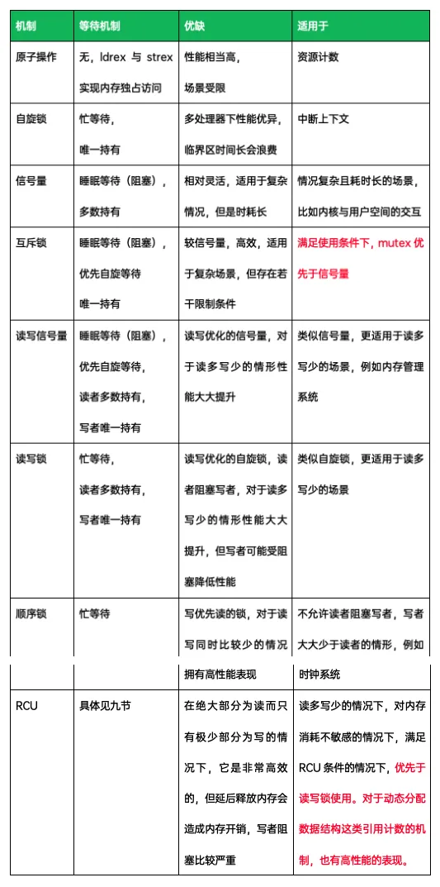

# 主线剧情07.4-Linux驱动编程-内核线程相关API

[在 Github 上的原版文章日后可能会更新](https://github.com/Staok/ARM-Linux-Study)，但这里不会跟进。[文章的 Gitee 仓库地址，Gitee 访问更流畅](https://gitee.com/staok/ARM-Linux-Study)。

网搜相关教程、手册，对 Linux内核线程相关API 内容做总结、备查。

主要包括在 内核驱动 编写中 使用 内核线程、和 其间的同步机制 的编程：

- Linux内核线程 的创建、取消等。
- Linux内核线程 的 同步与互斥机制，包括：
  - 原子操作（atomic）。
  - 锁（lock，又分为互斥锁/互斥量（mutex）、读写锁（rwlock）、自旋锁（spinlock）、顺序锁（seqlock））。
  - 信号量（semaphore），读写信号量（rw_semaphore）。
  - RCU（Read-Copy-Update）。
  - 等待队列（waitqueue）。

本文的 `参考 & 同步机制之间的比较` 放在最后。

------

## Linux内核线程使用

## Linux内核线程同步机制

Linux内核线程 的 同步与互斥机制，包括：

- 原子操作（atomic）。
- 锁（lock，又分为互斥锁/互斥量（mutex）、读写锁（rwlock）、自旋锁（spinlock）、顺序锁（seqlock））。
- 信号量（semaphore），读写信号量（rw_semaphore）。
- RCU（Read-Copy-Update）。
- 等待队列（waitqueue）。

### 原子操作

### 锁

#### 互斥锁

#### 读写锁

#### 自旋锁

#### 顺序锁

### 信号量

#### 信号量

#### 读写信号量

### RCU

### 等待队列

## 参考 & 同步机制之间的比较

参考：

- [linux内核编程_内核线程kthread_run_kthread_run 头文件_csdnwujunlin的博客-CSDN博客](https://blog.csdn.net/wujunlin880102/article/details/96455513)。
- [Linux内核API 进程调度|极客笔记 (deepinout.com)](https://deepinout.com/linux-kernel-api/linux-kernel-api-process-scheduling/linux-kernel-api-process-scheduling.html)。

- [linux内核中的锁_linux内核锁_【星星之火】的博客-CSDN博客](https://blog.csdn.net/fengyuwuzu0519/article/details/126739964)。
- [一文搞懂Linux内核的同步机制（原子操作、信号量、读写量） - 知乎 (zhihu.com)](https://zhuanlan.zhihu.com/p/527181686)。

- [linux锁有哪几种 - 自由资讯 (558idc.com)](http://news.558idc.com/374747.html)。
- [Linux内核中的各种锁_linux 锁_Luke_Lx的博客-CSDN博客](https://blog.csdn.net/Bruce_Lee_R/article/details/121527062)。

- [Linux内核之waitqueue机制_内核wait_queue_jrglinux的博客-CSDN博客](https://blog.csdn.net/qq_23662505/article/details/126782558)。
- [Linux等待队列（Wait Queue） - huey_x - 博客园 (cnblogs.com)](https://www.cnblogs.com/hueyxu/p/13745029.html)。
- [Linux Wait Queue 等待队列_mb607022e25a607的技术博客_51CTO博客](https://blog.51cto.com/u_15162069/2735634)。

- [ATOMIC (biscuitos.cn)](http://www.biscuitos.cn/blog/ATOMIC/)。

- [linux进程同步机制，五个常用的 - 知乎 (zhihu.com)](https://zhuanlan.zhihu.com/p/475924726)。

  同步机制之间的比较：

  

