# 超快 STM32 系统入门指南

计算机类的教程多，框架和 API 用法讲的全面，成系统的教程很多，CSDN上、知乎上很多个人学习记录和全面的成书的教程，而且生动形象有甚至有动画讲解，回过头来看嵌入式的教程，又臭又长。本文 [Github 地址](https://github.com/Staok/ARM-Linux-Study/blob/main/%E8%B6%85%E5%BF%AB%20STM32%20%E7%B3%BB%E7%BB%9F%E5%85%A5%E9%97%A8%E6%8C%87%E5%8D%97/%E8%B6%85%E5%BF%AB%20STM32%20%E7%B3%BB%E7%BB%9F%E5%85%A5%E9%97%A8%E6%8C%87%E5%8D%97.md)。

------

两种学习模式，一种是从底层开始看大厚书学习，但这只适合那些理解能力和前后关联能力强甚至有天赋的人来看，说白了不是设计给新人看的，而是给熟练的人当字典来看的，现在学校的课本一上来直接怼抽象的概念和公式，可能导致的在网上写教程的也有这毛病，不人性化。另一种学习是面向应用来学，就是下面要说的，是 “真-面向应用”，对于超快 STM32 入门来说就是：听正常人能理解的句子来了解外设概念和意义，然后直接从 API 入手。

这篇文章需要有 基本数模电和单片机的概念、C 语言基础和良好英文（或翻译）。

## 第一个外设

这时候可以备好 STM32 编程手册《STM32F10xxx参考手册》。

GPIO（General-purpose input/output）为通用目的输入输出口，所谓通用即不只可以用软件控制高低电平的变化，还有输入、开漏等功能，根据不同应用场景配置成不同功能。以下是该外设的内部数字电路的电路框图。


该图就是 STM32 芯片 里面 GPIO 外设部分的真实存在的电路的框图。

下面两个 P-MOS 和 N-MOS 就是控制输出 I/O 口的高低电平，如果 P-MOS 导通，则输出高电平，这称为 “推挽输出” 模式，输出有一定的驱动能力，输出高电平为 芯片供电电压，即 3.3V，低电平为接地，即 0V，可以先这么理解。

如果 下面两个 P-MOS 和 N-MOS 均不导通，那就是 “浮空输入” 模式，外接的高低电平可以读入，外部接上按键，就可以用按键控制东西。

如果 输出的时候是 P-MOS 一直处于关闭状态，而只有 N-MOS 打开或关闭，那就是 “开漏输出” 模式，在该口上拉一个电阻到 Vref 电压，那么输出高电平就是 Vref 电压，这么做可以改变输出高电平的电压，可以任定，而不是上面 “推挽输出” 时候固定的 3.3V。

图中还有还有上、下拉电阻，还有复用功能，就是配置别的外设比如 SPI、PWM 等的输出要从此 I/O 输出，这些功能组合可以得到这些模式：输入浮空、输入上拉、输入下拉、模拟输入、开漏输出、推挽式输出、推挽式复用功能、开漏复用功能。

## 进入主题

下载、安装和会用 STM32CubeMX 软件。

STM32CubeMX 新建一个工程，选择 STM32F103C8T6，将 PA8 设为 推挽输出模式，如下图。

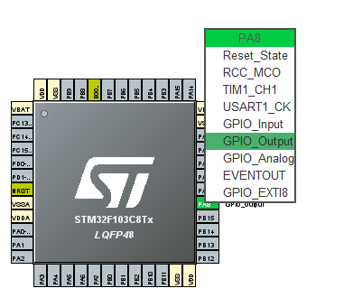

导出工程。路径不要有中文和空格，IDE 选择 MDK（即 Keil 5），右上角生成。

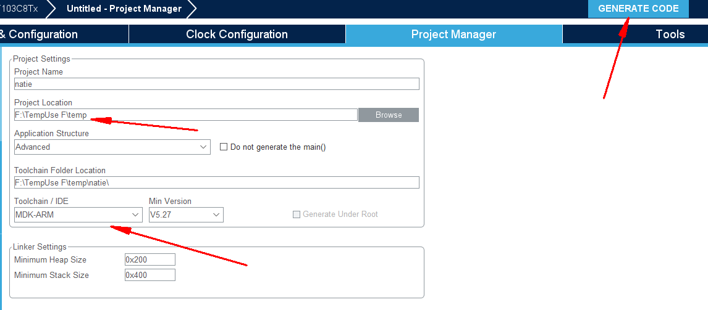

打开 MDK 工程。

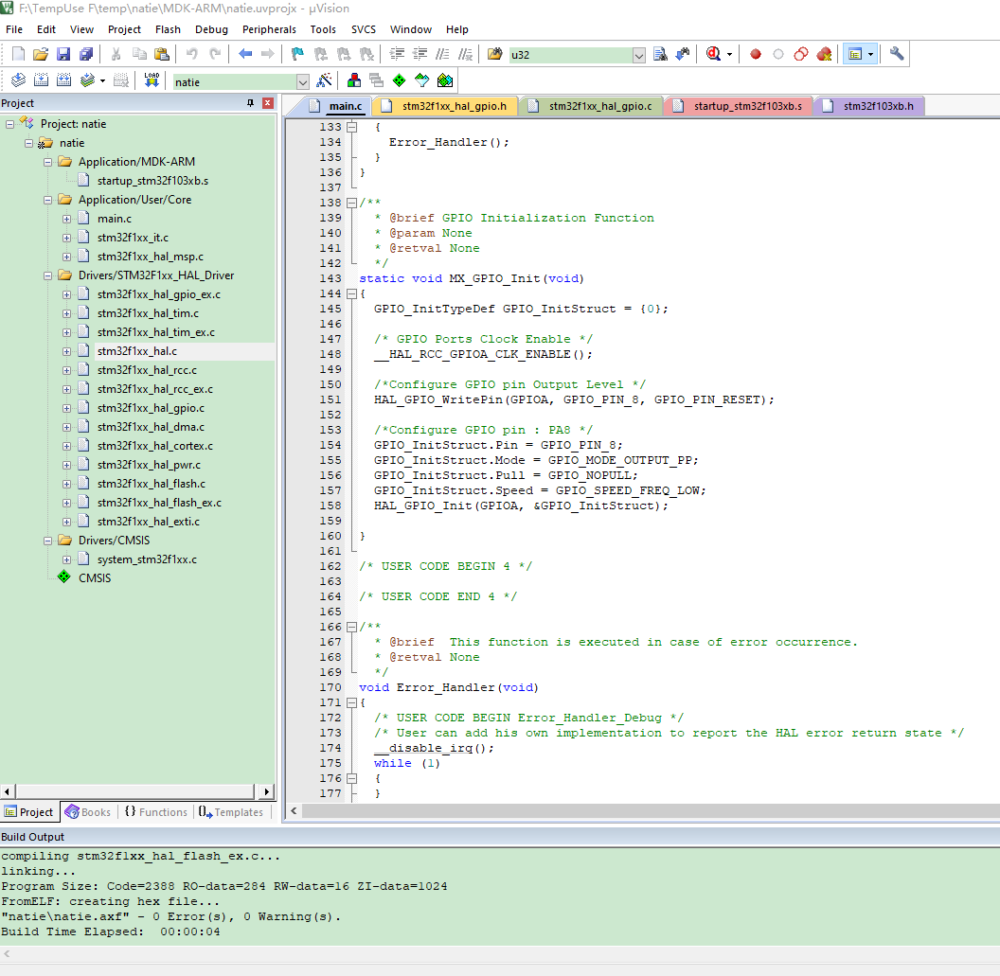

打开 main.c 即看到写用户程序的地方，我们在 STM32CubeMX 软件里面图形化的配置了一个推挽输出模式的 PA8 引脚，所以现在工程中有了一个 `MX_GPIO_Init()` 函数，里面就是通过 HAL 库配置该 I/O 的程序。下面添加上注释来说明。

```c
  /* 声明一个 GPIO_InitTypeDef 类型的结构体 名叫 GPIO_InitStruct，该结构体打包了配置 I/O 的所有参数，填这个结构体即可 */
  GPIO_InitTypeDef GPIO_InitStruct = {0};

  /* 使能 GPIO 的时钟，STM32 中，每个外设都要有时钟信号做驱动，数字电路尤其是时序、同步逻辑电路，当然都需要时钟 */
  /* GPIO Ports Clock Enable */
  __HAL_RCC_GPIOA_CLK_ENABLE();

  /* 预先设置该 I/O 的输出电压。在初始化之前，I/O 是浮空的，当初始化完毕之后 I/O 立马变为设置的高或低电平 */
  /*Configure GPIO pin Output Level */
  HAL_GPIO_WritePin(GPIOA, GPIO_PIN_8, GPIO_PIN_RESET);

  /* 配置 I/O，结构体 GPIO_InitStruct 共有 Pin、Mode、Pull 和 Speed 这几个参数，分别填为 I/O口 8、推挽输出、没有上下拉电阻、翻转速度为低
   然后调用 HAL_GPIO_Init() 函数，填入 结构体 GPIO_InitStruct 的指针，该函数会根据结构体 GPIO_InitStruct 里面的参数配置 I/O 的寄存器 */
  /*Configure GPIO pin : PA8 */
  GPIO_InitStruct.Pin = GPIO_PIN_8;
  GPIO_InitStruct.Mode = GPIO_MODE_OUTPUT_PP;
  GPIO_InitStruct.Pull = GPIO_NOPULL;
  GPIO_InitStruct.Speed = GPIO_SPEED_FREQ_LOW;
  HAL_GPIO_Init(GPIOA, &GPIO_InitStruct);
```

那么问题就来了，`结构体 GPIO_InitStruct 共有 Pin、Mode、Pull 和 Speed 这几个参数`，除此之外，库里面外设那么多，每个外设都有好几个结构体和那么多 API，我怎么知道怎么用？

先进行全编译，如下图。不全编译不能做下一步的 “跳转”。

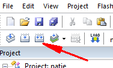

在 `GPIO_InitTypeDef` 上面右击，选择 `Go To Definition Of 'GPIO_InitTypeDef'`，即可跳转到 `stm32f1xx_hal_gpio.h` 文件里面 该结构体类型定义的地方。

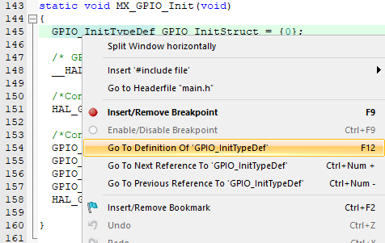

在这里面，一目了然，该结构体都有哪些参数，每一个参数都是做什么的，如下图。

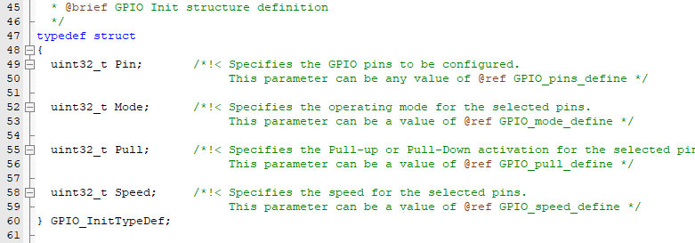

那么每一个参数可以填写的值，HAL 库也有定义，每一项后面都有注释，比如上图的 Mode 参数，注释说 可填入的值 参考 `GPIO_mode_define`这里，那么就 按快捷键 ctrl+f 调出搜索框，填入`GPIO_mode_define`搜索，如下图，找到这些宏定义。其中`GPIO_MODE_INPUT`就是浮空输入模式，`GPIO_MODE_OUTPUT_OD`就是开漏输出模式，`GPIO_MODE_ANALOG`就是模拟输入模式（用于 ADC 模数转换外设引脚），带有 AF 字样的就是复用功能，带有 IT 字样的就是中断功能。

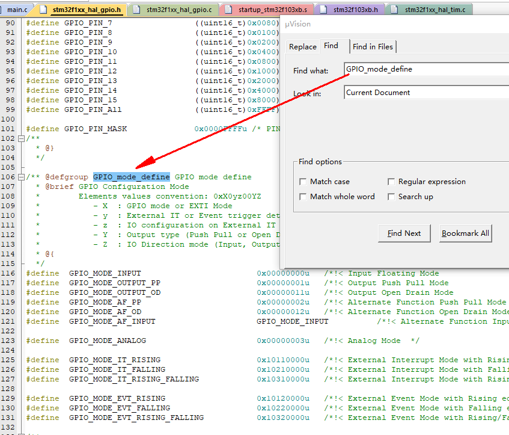

HAL 库好就好在，每个外设的配置流程和结构体、宏定义的命名非常规范，命名有意义而且有规律。结构体知道怎么填写了，那么想知道一个外设有哪些 API，就在每一个外设的 .h 文件里面。还在`stm32f1xx_hal_gpio.h`里面，如下图所示，就是 GPIO 外设所有的可供用户调用的函数，即`Exported functions`部分。其中`HAL_GPIO_Init()`为初始化函数，`HAL_GPIO_ReadPin()`为读 I/O 电平函数，`HAL_GPIO_WritePin()`为写 I/O 电平函数，等等。

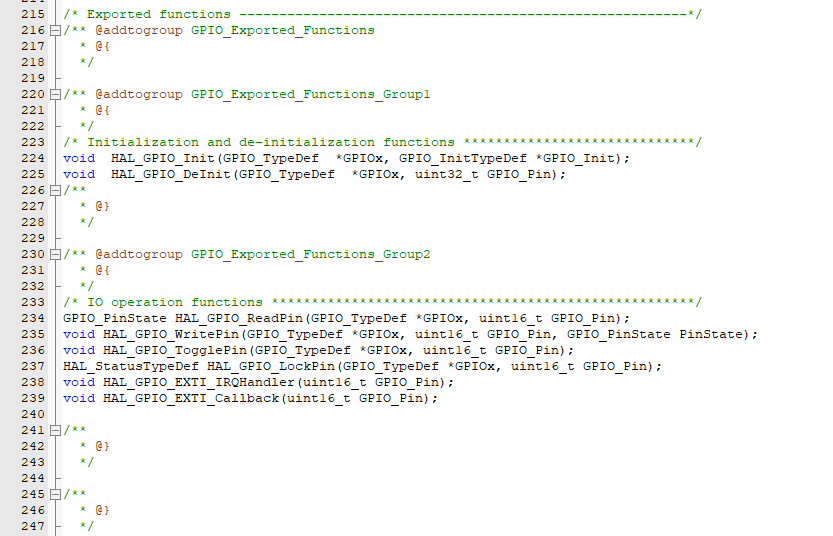

还有最后一件事，这些 API 在哪里使用，比如初始化时候先用什么后用什么，这些也在源码注释里有详细的介绍，请打开`stm32f1xx_hal_gpio.c`文件，拉到最上面，如下图。两大块，第一个`GPIO Peripheral features`就是介绍该外设的特性，即能做什么，另一个`How to use this driver`就是细致介绍如何使用这些 API，即怎么做，需要会英文或者用翻译哈。这里介绍的是 GPIO 外设，HAL 库具有一贯性，对于每一个外设的源文件和组织形式都是这样的哈，比较人性化。

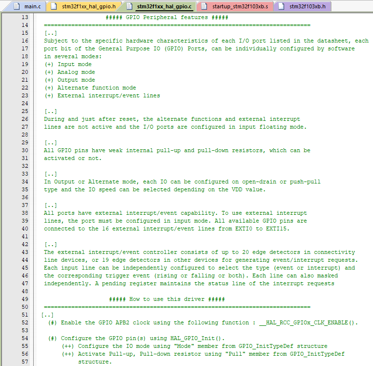

我跟你讲，大多数第一个写教程的，基本都是看源码、看源码注释和看官方手册，再加上不断测试、验证想法而得到足够多经验的时候才学会的，所以我这里把这个从源头获取技能的流程介绍一遍，是更有用的。

该工程还包括的函数`SystemClock_Config()`用于 STM32 时钟（RCC）初始化，其它还包括 STM32 的众多外设，在此不多做介绍，渔已经演示了。还有一些底层概念需要了解，接着往下看。

看看 MDK 界面中左边的各种源文件：

- `main.c`：就是用户写主程序的地方。

- `startup_stm32f103xb.s`：该文件是官方用汇编写成的启动文件，MCU 是微处理器，处理器就是一个复杂的数字电路，该电路的核心有很多寄存器（处理器寄存器）需要初始化，启动文件就是把这些初始化程序固定下来，用户不用管也不用改动，主要内容有初始化中断向量表、定义堆栈空间、准备 C 语言环境和跳转到 `main()` 函数等等。

  ARM Cortex-M 系列处理器在函数跳转的时候有硬件自动的使用栈来保存现场和恢复现场：

  ARM 系列系列详细看这篇文章[【主线剧情 番外01】ARM & SOC 系列快速鸟瞰 - 知乎 (zhihu.com)](https://zhuanlan.zhihu.com/p/369245951)，

  栈和跳转等可以看 [【主线剧情01】ARM & i.MX6ULL 基础学习记录 - 知乎 (zhihu.com)](https://zhuanlan.zhihu.com/p/362115513) 这篇文章最后的 “ARM异常处理 & 启动文件的示例” 章节，虽然这些知识点对于新人有点超前了。

- `stm32f1xx_hal_gpio.h` 和 `stm32f1xx_hal_gpio.c` ：这类文件就是 HAL 库的源文件，操作外设就调用这些文件里面的 API 即可，所有 API 和详细使用方法 在 .h 和 .c 文件的注释里均有详细说明。

- `stm32f103xb.h`：该文件定义 stm32f103xb 系列 MCU 的所有 外设的寄存器，给各个外设的寄存器地址上面加个结构体，以便访问和修改，下文会帮助理解这段话。

MCU 的外设的寄存器都被映射到内存的各个地址上（物理连接），在 C 语言中读/写该寄存器，就是读该外设的状态和控制外设行为，外设本质都是数字电路，外设只会根据寄存器内 0 / 1 二进制值去做对应的行为。

以下例子，比如要对内存中 0x20E0084 位置开始的四个字节进行复位（写 0）和置位（写 1）的操作，C 语言写法如下（程序引自 [Staok/coding-style-and-more](https://github.com/Staok/coding-style-and-more)）：

```c
static volatile unsigned int *reg_temp = (volatile unsigned int *)(0x20E0084);

/* 置位的标准写法 */
/* 下句表示把 内存中 0x20E0084 位置的 第1、2、5、14位进行置1，其他位不变 */
*reg_temp |= ( (1 << 14) | (1 << 5) | (1 << 2) | (1 << 1) );

/* 清位的标准写法 */
/* 下句表示把 内存中 0x20E0084 位置的 第0、3位进行清0，其他位不变 */
*reg_temp &= ( ~( (1 << 3) | (1 << 0) ) );

 /* 读寄存器 */
volatile unsigned int val = *reg_temp;
```

进一步，MCU 有上千个寄存器，这么一个一个定义肯定不行，下面就是 HAL 库里面的方法，将结构体的地址赋值为相应寄存器的地址，即创建内存地址上连续区域的结构体，该方法常用于嵌入式开发。如下例子（程序引自 [Staok/coding-style-and-more](https://github.com/Staok/coding-style-and-more)）：

```c
typedef struct 
{
    volatile unsigned int  URXD;            /**< UART Receiver Register, offset: 0x00 */
    volatile unsigned char RESERVED_0[60];
    volatile unsigned int  UTXD;            /**< UART Transmitter Register, offset: 0x40 */
    volatile unsigned int  UCR1;            /**< UART Transmitter Register, offset: 0x44 */
} Periph_x_Type;

/* Periph_x 这个外设的寄存器的基地址为 0x2020000 */
#define Periph_x_BASE      (0x2020000u)

/* 设置结构体 Periph_x 的地址为 Periph_x_BASE */
#define Periph_x           ((Periph_x_Type *)Periph_x_BASE)

/* 读取和设置寄存器（这里以置位举例） */
Periph_x->UCR1 |= (1 << 2);
```

接着打开`stm32f103xb.h`文件，看看是不是所有外设的寄存器都被打包成了结构体，然后把结构体的地址赋值为对应寄存器的地址。

比如 TIM2（定时器 2） 外设的寄存器地址定义如下，外设基地址 + 外设偏移地址。

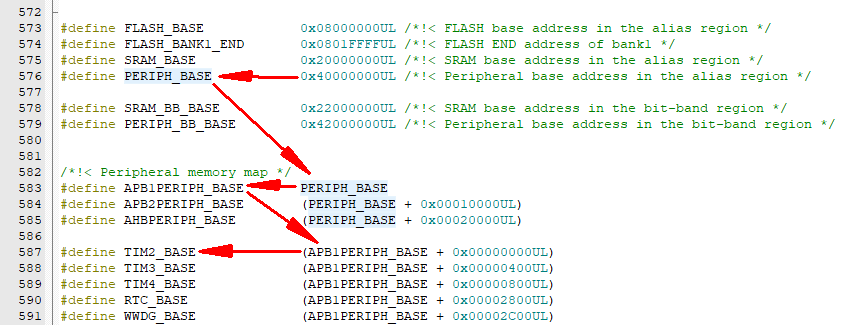

然后定义将所有 TIM 外设有关的寄存器打包的结构体，如下图所示。

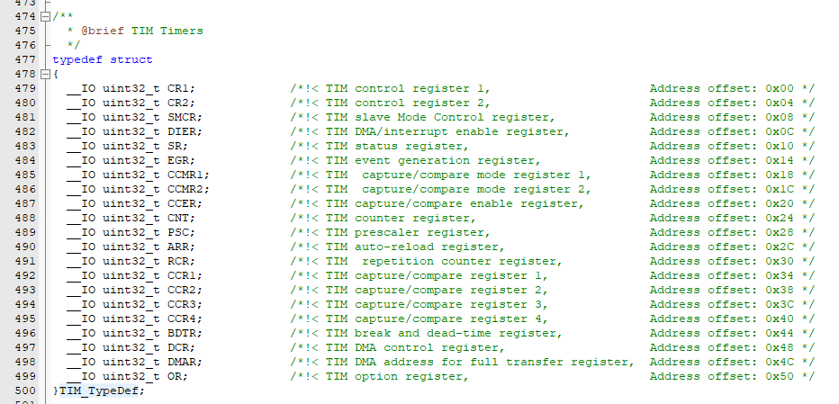

然后将 TIM2 的地址（`TIM2_BASE`）强转为`TIM_TypeDef`指针类型，然后将这个整体重命名为 TIM2，如下图。

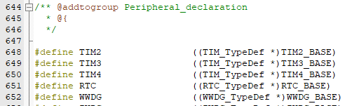

到此，该外设寄存器地址与该结构体绑定完成，以后访问结构体 TIM2 下面的参数，都是直接访问对应的实体寄存器。

STM32 HAL 库将这些对寄存器的操作封装成了函数，调用函数即可操控外设。

STM32 的库函数有两个，标准库 和 HAL 库，前者早在 2011 年停止更新维护， HAL 库是现行主流的，STM32CubeMX 软件生成的工程就是使用 HAL 库的，不过我不太信任用该软件生成的工程，而且该软件产生的工程所用的 HAL 库与单独下载 HAL 库在 API 上竟有出入，所以一般我习惯拿它来产生驱动配置程序，然后手动移植到自己的工程，这样心里有底。

以上描述的过程是自己探索与发现的形式，就像探索世界，但可能也会遇到很多新东西和困难，有参考总归比没有强，推荐可以同时参考一个手册来学，比如正点原子的 STM32 的 HAL 库的手册，开源的可以免费下载，下面就是各大厂的资料网址汇总。

## 资源站

各大厂家对 STM32 出了特别特别特别丰富的教程和例程，如果比较熟悉外设，直接看他们的例程源码即可，快速掌握各种技巧。各大家的官网和资料下载地址如下：

正点原子：

- [OpenEdv-开源电子网-正点原子论坛](http://www.openedv.com/forum.php) 有问题可以在这里找，也可以平时没事逛一逛；
- [正点原子官方的个人空间_ 哔哩哔哩 _bilibili](https://space.bilibili.com/394620890) 所有教学视频；
- [原子哥教学平台，专注电子技术教学 (yuanzige.com)](https://www.yuanzige.com/)；
- [正点原子资料下载中心 — 正点原子资料下载中心 1.0.0 文档 (openedv.com)](http://www.openedv.com/docs/index.html) 各种开发板的电路原理图、例程和教程 统统薅走！

野火：

- [野火电子论坛 - (firebbs.cn)](https://www.firebbs.cn/) 论坛；
- [野火_ firege的个人空间 _ 哔哩哔哩 _bilibili](https://space.bilibili.com/356820657) 所有教学视频；
- [野火产品资料下载中心 — 野火产品资料下载中心 文档 (embedfire.com)](http://doc.embedfire.com/products/link/zh/latest/index.html#) 薅羊毛。

安富莱：

- [硬汉嵌入式论坛 - Powered by Discuz! (armbbs.cn)](http://www.armbbs.cn/) 论坛；
- [武汉安富莱电子有限公司官方网站。STM32开发板,无线IO模块,H7-TOOL工具,嵌入式系统 (armfly.com)](http://www.armfly.com/) 官网；
- [【安富莱】各种开发板和模块的资料下载汇总贴（2021-08-30） - 安富莱电子 - 博客园 (cnblogs.com)](https://www.cnblogs.com/armfly/p/11270280.html) 资料下载站。

硬石：

- [硬石电子 - 社区 (ing10bbs.com)](http://www.ing10bbs.com/forum.php) 论坛；
- [硬石科技的个人空间_ 哔哩哔哩 _bilibili](https://space.bilibili.com/324575605) 教学视频；
- [硬石开源资料下载链接(该帖总是最新资料) - 硬石资料更新 - 硬石社区社区 (ing10bbs.com)](http://www.ing10bbs.com/forum.php?mod=viewthread&tid=1458&extra=page%3D1) 资料下载站。

原子、野火、安富莱和硬石各有侧重，可以广泛借鉴：野火、正点原子 非常全面；安富莱偏 M4F 的 DSP 使用；硬石偏电机控制，有步进电机、有、无刷电机。

STM32 官网资料下载站，是源头，可以找到任何官方的东西，包括选型手册，好好把握：

- 中文站：[STM32 | 产品 | STM32/STM8 | MCU单片机 | 意法半导体STM | 意法半导体STM | STM32/STM8微控制器 | MCU单片机 (stmcu.com.cn)](https://www.stmcu.com.cn/Product/pro_detail/cat_code/PRODUCTSTM32/family/81/layout/product)；
- ST 官方：[微控制器与微处理器 - STMicroelectronics](https://www.st.com/zh/microcontrollers-microprocessors.html)。

## 总结

上述方法一句话总结。外设的概念，比如 FSMC、DMA 等，可以先上网查，知道它是做什么的（比如 UART 外设是串口来收发数据，I2C、SPI，重点看明白时序图，FSMC 是 SRAM 接口外设，DMA 是数据在内存间通过硬件传输的途径且不占用处理器资源，等等），然后用 STM32CubeMX 生成例程，看外设如何初始化（看例程学习是最快的），然后看源码注释了解 API 详细使用（当成字典随用随查），就用起来一个外设了，然后按此法循环每一个外设，外设都依照此方法一个一个击破，精神集中的话没几天就掌握不少外设的使用了。

这里有一个 STM32 程序模板 [Staok/stm32_framework (github.com)](https://github.com/Staok/stm32_framework)，其几乎写好了大部分外设的驱动，大块复制的时候要注意其开源协议。这里有一个 C 语言的编写规范 [Staok/coding-style-and-more (github.com)](https://github.com/Staok/coding-style-and-more)，其几乎 “无所不包”。

要知道适合大多数人的上道的学习，是先会用（会快速获得成就感，如同游戏般及时获得反馈），然后再去了解架构和细节方面的东西（有兴趣、有信心了之后才会面对这些而不犯怵），当用的比较熟了之后，有了一些自己的感悟和理解，然后去 干 大部头的教程，比如几十个小时的视频或者上千页的 PDF（推荐只看 PDF 文字教程而不去看视频教程）。


—— 我一直觉得，应该减少人们走弯路，这也是 [“二项玻”定则](https://github.com/Staok/Please-stay-in-the-future) 中 “简化之能够简化” 的一个重要延申理念。peace。